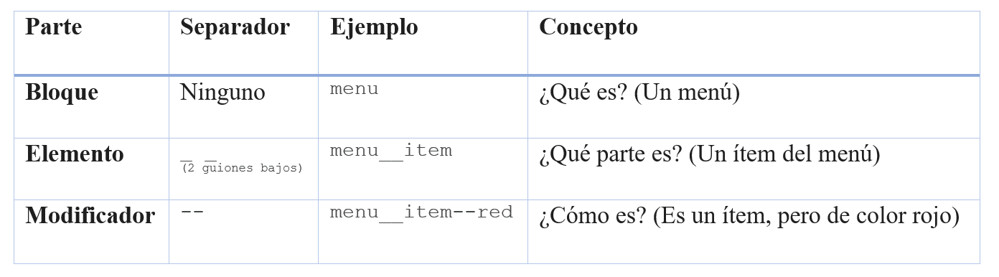

## Pasos para implementacion.
Ademas de crear el archivo html tambien aplicamos la tecnica de nombrar las las class con el metodo BEM ( Block-Element-Modifier) lo cual permite identificar mucho mejor ( a mi juicio) la aplicacion de estulos CSS al archivo HTML.  

Haremos una  **"Tarjeta Interactiva"**

1. Creamos un archivo HTML
    La estructura basica se hace new file ( nuevo archivo ) y en el codigo colocamos ! [tab] y esto crea la estructura basica.

---
```xml
<!DOCTYPE html>
<html lang="es">
    <head>
        <meta charset="UTF-8">
        <meta name="viewport" content="width=device-width, initial-scale=1.0">
        <title>Animaciones/Transiciones y Transformaciones</title>
    </head>
    <body>
        <main class="container">
            <article class="card">
                <div class="card__image-container">
                    
                </div>
                <div class="card__content">
                    <h2 class="card__title">Título Nivel 5</h2>
                    <p class="card__text">Explorando Transiciones y Animaciones.</p>
                    <button class="card__button card__button--active">Saber más</button>
                </div>
            </article>
        </main>
    </body>
</html>
</pre>
```
---  

2. Guardar el archivo como `index.html`

## CLASES SEMANTICAS USADAS EN EL HTML
   main y article

## BEM EN EL HTML
* El main clase container
* article con la clase  card
    div con clase       card__image-container ( block+Element)

# EXPLICACION DEL BEM ( BLOCK-ELEMENT-MODIFIER) EN NOMBRE DE CLASES CSS
1. El Bloque (Block)
Es la entidad de nivel superior, una pieza de la interfaz que tiene sentido por sí misma (podrías moverla a otra página y seguiría funcionando).

Nombre en el ejemplo: .card

Por qué es un bloque:  
Porque es una "tarjeta" de contenido completa. No depende de estar dentro de un main o un section para ser una tarjeta.

Regla de construcción:  
Es simplemente una palabra (o palabras unidas por un guion: card-profile).

2. El Elemento (Element)
Es una parte del bloque que no tiene significado fuera de él. Ayuda a formar la estructura interna.

Nombres en el ejemplo: .card__image, .card__title, .card__content.

Regla de construcción:  
Se une al Bloque mediante dos guiones bajos (__).

[Bloque]__[Elemento]

Lógica aplicada:  
Una "imagen" (image) o un "título" (title) en este contexto son partes específicas de esa tarjeta. No los llamamos solo .title porque eso causaría conflictos si tienes otro título en el pie de página. Al llamarlo .card__title, el estilo queda "encapsulado".

3. El Modificador (Modifier)
Se usa para cambiar la apariencia, estado o comportamiento de un bloque o un elemento.

Nombre en el ejemplo: .card__button--active

Regla de construcción:  
 Se une al bloque o elemento mediante dos guiones medios (--).

[Bloque]--[Modificador] o [Bloque]__[Elemento]--[Modificador]

Lógica aplicada:  
 El botón es un elemento (.card__button). Pero si quieres que ese botón específico sea azul, o esté resaltado, le añades el modificador --active.

Ojo: En el HTML siempre debes poner ambas clases:`<button class="card__button card__button--active">`. La primera da la estructura y la segunda el cambio visual.  

RESUMEN DE SINTAXIS PARA LOS NOMBRES 



Nota: El nombre de la parte (Bloque, Elemento ó Modificador) puede ser una sola palabra o dos, separadas con guion medio.

Ejemplo: card__image-container : card es el bloque y image-container es el nombre del elmento.
Nombres de Bloques  :    [Nombre Bloque]  ó [Nombre Bloque]-[Complemento]
Nombre Elemento     : __ [Nombre Elemento]  ó __[Nombre Elemento]-[Complemento]
Nombre Modificador  : --[Nombre Modificador]  ó --[Nombre Modificador]-[Complemento]


# CREAMOS LOS ESTILOS CSS

2. El CSS (Paso a paso)
Crea un archivo styles.css. Aquí implementaremos los tres conceptos:

### A. Transiciones (El "Cómo cambia")
La transición suaviza el cambio de un estado a otro. La aplicamos al botón.

---
```CSS
.card__button {
    background-color: #3498db;
    color: white;
    padding: 10px 20px;
    border: none;
    cursor: pointer;
    /* PASO 1: Definir qué cambia, cuánto dura y la curva */
    transition: background-color 0.3s ease-in-out, transform 0.2s ease;
}

.card__button:hover {
    background-color: #2980b9;
    transform: scale(1.05); /* Esto es una transformación */
}
```
---

### B. Transformaciones (El "Qué forma toma")
Las transformaciones modifican el espacio visual (mover, rotar, escalar) sin afectar el flujo de los demás elementos. Vamos a aplicarla a la imagen al hacer hover sobre la tarjeta.

---
```CSS
.card__image {
    width: 100%;
    transition: transform 0.5s ease; /* Para que la transformación sea fluida */
}

.card:hover .card__image {
    /* PASO 2: Rotamos y escalamos la imagen */
    transform: scale(1.2) rotate(5deg);
}

.card__image-container {
    overflow: hidden; /* Para que la imagen no se salga al crecer */
}
```
---

### C. Animaciones (El "Movimiento autónomo")
A diferencia de la transición, la animación no necesita que el usuario haga nada; puede empezar sola y tener muchos pasos. Vamos a hacer que la tarjeta "flote" al cargar.

---
```CSS
/* PASO 3: Definir los fotogramas (Keyframes) */
@keyframes float {
    0% { transform: translateY(0px); }
    50% { transform: translateY(-10px); }
    100% { transform: translateY(0px); }
}

.card {
    width: 300px;
    border-radius: 8px;
    box-shadow: 0 4px 15px rgba(0,0,0,0.1);
    /* Aplicar la animación: nombre, duración, ciclo infinito */
    animation: float 4s ease-in-out infinite;
}
```
---

Explicación técnica:
#### Transición:  
Es reactiva. Necesita un disparador (como :hover). Solo va de un punto A a un punto B.

#### Transformación:  
Es geométrica. Cambia la apariencia visual (coordenadas X, Y, Z) de manera muy eficiente porque usa la GPU.

#### Animación (@keyframes):  
Es proactiva. Permite estados intermedios (25%, 50%, 75%) y control total sobre el bucle.

¿Cómo proceder ahora?
iNTEGRAR todo el CSS en un solo archivo style.css y llamarlo desde el head en el html.


Haz un commit: git add . y luego git commit -m "feat: ejercicio base de animaciones y BEM".


