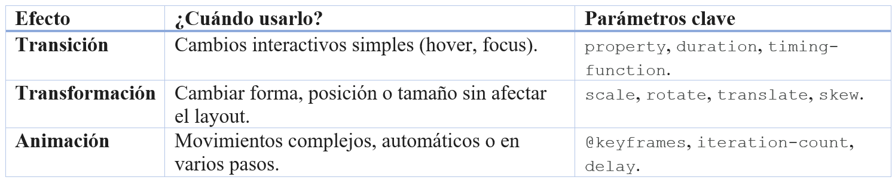

## 1. La Animación (Animation)
Dónde ocurre:  
En el bloque .card.
La magia: La animación es autónoma. No necesita que el usuario toque nada; se ejecuta sola en bucle.

animation: float 4s ease-in-out infinite;:
---
```xml
 /* ANIMACIÓN: La tarjeta flota sola */
    animation: float 4s ease-in-out infinite;
```
---
float: El nombre del "guion" (@keyframes) que debe seguir.

4s: La duración de un ciclo completo.

ease-in-out: Hace que el movimiento empiece lento, acelere en medio y frene al final (la clave para que parezca natural).

infinite: Reinicia el ciclo para siempre.

@keyframes float: Aquí defines los pasos. Usamos transform: translateY() porque mover elementos en el eje Y (vertical) mediante transformaciones es ultra eficiente para la tarjeta gráfica (GPU).

Parámetros a considerar:

Siempre usa transform u opacity para animaciones continuas. Si usaras margin-top para mover la tarjeta, el navegador tendría que recalcular el diseño de toda la web 60 veces por segundo, lo que causaría tirones.

2. La Transformación (Transform)
Dónde ocurre: En la imagen .card__image.
La magia: La transformación es un cambio geométrico del estado visual del elemento.

transform: scale(1.1) rotate(2deg);:

scale(1.1): Agranda la imagen un 10%.

rotate(2deg): Le da una pequeña inclinación.

El activador: .card:hover .card__image. Nota que el hover se pone en la tarjeta padre. Esto hace que la imagen reaccione en cuanto el ratón entra en cualquier parte de la tarjeta, no solo sobre la foto.

Parámetros a considerar:

Las transformaciones no "empujan" a los vecinos. Si escalas algo al doble, se encimará sobre los otros elementos sin moverlos. Por eso usamos overflow: hidden en el contenedor padre, para que el crecimiento de la imagen quede "recortado" dentro de la tarjeta.

3. La Transición (Transition)
Dónde ocurre: En la imagen .card__image y en el botón .card__button.
La magia: La transición es el puente entre el estado normal y el estado modificado (como el hover). Sin ella, el cambio sería instantáneo y brusco.

transition: transform 0.6s cubic-bezier(...):

Le dice al navegador: "Si la propiedad transform cambia, no lo hagas de golpe, tarda 0.6 segundos".

cubic-bezier: Es una curva personalizada que define la aceleración. Da ese efecto de "suavidad premium" que ves en las apps de Apple o Google.

Parámetros a considerar:

Propiedad específica vs all: Es mejor poner transition: transform 0.3s que transition: all 0.3s. Con all, el navegador tiene que vigilar cada pequeña propiedad (color, borde, sombra), lo que consume más recursos.


