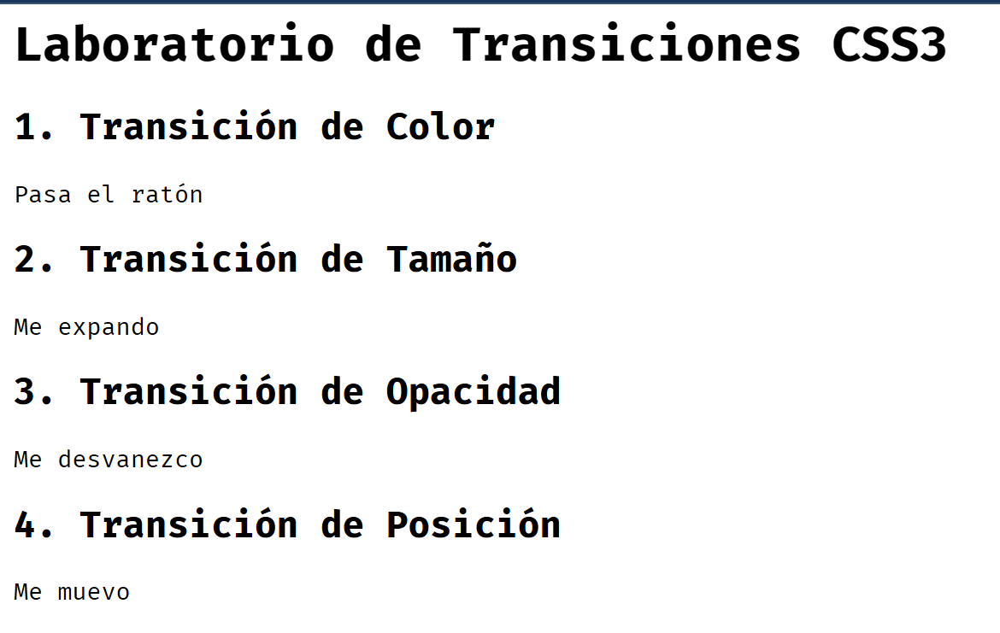

1. Cree la carpeta 02_EjemplosTransicionesCSS3 para albergar estemini-proyecto.
2. Cree el archivo index.html, que mostrara los ejemplos de cada transicion.
* Los nombres de clases se asignaron usando BEM ( Block - Eklment - Modifier )

Corrida del archivo index.html sin los estilos


Archivo index.html

```xml
<!DOCTYPE html>
<html lang="es">
<head>
    <meta charset="UTF-8">
    <meta name="viewport" content="width=device-width, initial-scale=1.0">
    <link rel="stylesheet" href="styles.css">
    <title>Transiones en CSS</title>
</head>
<body>
    <main class="container">
        <h1 class="main-title">Laboratorio de Transiciones CSS3</h1>
    
        <section class="lab">
            <div class="lab__item">
                <h2 class="lab__title">1. Transición de Color</h2>
                <div class="lab__box lab__box--color">Pasa el ratón</div>
            </div>
    
            <div class="lab__item">
                <h2 class="lab__title">2. Transición de Tamaño</h2>
                <div class="lab__box lab__box--size">Me expando</div>
            </div>
    
            <div class="lab__item">
                <h2 class="lab__title">3. Transición de Opacidad</h2>
                <div class="lab__box lab__box--opacity">Me desvanezco</div>
            </div>
    
            <div class="lab__item">
                <h2 class="lab__title">4. Transición de Posición</h2>
                <div class="lab__box lab__box--position">Me muevo</div>
            </div>
        </section>
    </main>
    
</body>
</html>
```

Paso 2: Estilos Base y Propiedades Individuales
En tu style.css, primero definiremos la estructura y luego aplicaremos las 4 propiedades de transición (property, duration, timing-function y delay) de forma desglosada para que se entienda el efecto de cada una.

---
```xml
/* Estilos de maquetación */
.container {
    max-width: 900px;
    margin: 40px auto;
    text-align: center;
    font-family: 'Segoe UI', Tahoma, Geneva, Verdana, sans-serif;
}

.lab {
    display: grid;
    grid-template-columns: repeat(auto-fit, minmax(200px, 1fr));
    gap: 30px;
    margin-top: 40px;
}

/* Bloque: lab__box (Base) */
.lab__box {
    width: 150px;
    height: 150px;
    background-color: #34495e;
    color: white;
    display: flex;
    align-items: center;
    justify-content: center;
    margin: 0 auto;
    border-radius: 8px;
    cursor: pointer;
}

/* --- APLICACIÓN DE PROPIEDADES DE TRANSICIÓN --- */

/* 1. Modificador COLOR: Uso de transition-property y transition-duration */
.lab__box--color {
    /* transition-property: Define qué propiedad se anima (en este caso el fondo) */
    transition-property: background-color;
    /* transition-duration: Cuánto tarda el cambio (0.5 segundos) */
    transition-duration: 0.5s;
}
.lab__box--color:hover {
    background-color: #e74c3c;
}

/* 2. Modificador TAMAÑO: Uso de transition-timing-function */
.lab__box--size {
    transition-property: width, height;
    transition-duration: 0.4s;
    /* transition-timing-function: Controla la aceleración (efecto elástico con cubic-bezier) */
    transition-timing-function: cubic-bezier(0.68, -0.55, 0.265, 1.55);
}
.lab__box--size:hover {
    width: 180px;
    height: 180px;
}

/* 3. Modificador OPACIDAD: Uso de transition-delay */
.lab__box--opacity {
    transition-property: opacity;
    transition-duration: 0.3s;
    /* transition-delay: Espera 0.2 segundos antes de empezar a desaparecer */
    transition-delay: 0.2s;
}
.lab__box--opacity:hover {
    opacity: 0.2;
}

/* 4. Modificador POSICIÓN: Uso de la propiedad abreviada (Shorthand) */
.lab__box--position {
    /* Sintaxis: property | duration | timing-function | delay */
    transition: transform 0.6s ease-in-out 0s;
}
.lab__box--position:hover {
    /* Usamos transform para moverlo de forma fluida */
    transform: translateX(50px);
}
```
---

Análisis del ejercicio:
Observa que en la caja de tamaño puse width, height. Es vital ser específico para no obligar al navegador a vigilar propiedades que no van a cambiar.

transition-timing-function:   
En la caja 2 usamos una curva manual. Esto hace que el tamaño no cambie de forma lineal, sino que parece que "rebota".

transition-delay:  
En la caja de opacidad, notarás un pequeño "lag" intencional. Es útil para menús desplegables donde no quieres que la transición se dispare por un roce accidental del ratón.

BEM:  
Fíjate cómo .lab__box contiene lo común (tamaño, color de texto, centrado) y los modificadores (ej. --color) solo contienen la lógica de la transición.


# CAJAS 5 Y 6:
La caja 5 y la 6 las hice uniendo los 4 atributos de las primeras 4 cajas ( se colocaron todas las clases de esas cajas ) mientra que la caja 6 se hizo creando una nueva clase en CSS ( tambien para el hover) que tiene los atributos unidos. 

La diferencia es que la caja 5 parece crecer desde el inicio ( al colocar el mouse sobre ella) y luego se desplaza mientras que la 6 parece ir creciendo y en simultaneo se mueve. Se ve mejor el efecto.

## Explicacion de la diferencia entre caja 5 y 6:

Es por la diferencia entre los conceptos de Sincronización vs. Orquestación.

Lo que ocurre es que en la caja 5, al estar las clases "separadas", el navegador tiene que procesar cada transición como un hilo distinto. En la 6, al usar una sola propiedad transition con la lista de valores, le estamos enviando al navegador un único paquete de instrucciones sincronizado.

Ttécnicamente por qué la 5  se siente como si "primero hiciera una cosa y luego otra" y la 6  ocurre en paralelo absoluto:

1. El "Efecto Cascada" en las clases (El "Crece y luego se mueve")
Cuando pones varias clases modificadoras en el HTML (--size --position), aunque creas que se suman, en CSS la última regla que encuentra el navegador suele tener prioridad sobre la propiedad transition.

Si el navegador detecta un conflicto de tiempos o de propiedades, a veces aplica una de forma instantánea y la otra con suavizado, o espera a terminar de calcular el "layout" (tamaño) antes de empezar el "paint" (movimiento). Por eso sientes que hay un orden secuencial.

2. La "Sincronización Atómica" (El "Todo a la vez")
En la versión con .lab__box--all ( Caja 6), estamos usando un solo contexto de renderizado. Al declarar todas las propiedades dentro de la misma línea de transition, el navegador hace una sola "foto" del estado inicial y una del estado final, y calcula los 60 fotogramas por segundo de todas las propiedades simultáneamente.