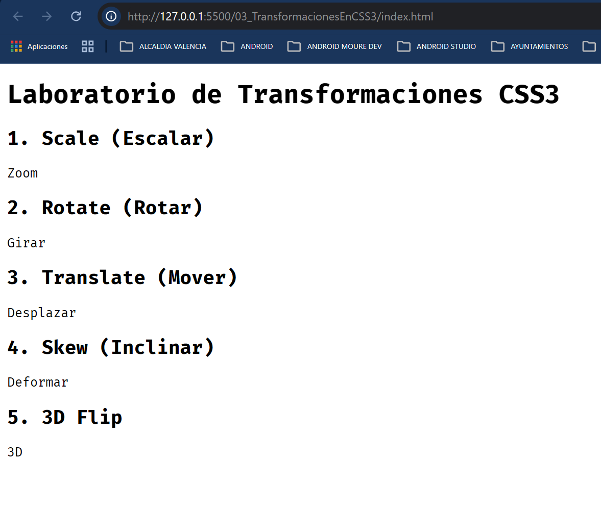

Mientras que las transiciones manejan el tiempo, las transformaciones manejan el espacio. Con ellas podemos alterar la geometría de un elemento: moverlo, rotarlo, escalarlo o inclinarlo.

Para este ejercicio, crearemos un "Catálogo de Transformaciones Geométricas" siguiendo la metodología BEM.

El archivo basico html es :

```xml
Paso 1: Estructura HTML
Crea una nueva sección o archivo. Usaremos el bloque transform-lab.

HTML
<main class="container">
    <h1 class="main-title">Laboratorio de Transformaciones CSS3</h1>

    <section class="transform-lab">
        <div class="transform-lab__item">
            <h2 class="transform-lab__subtitle">1. Scale (Escalar)</h2>
            <div class="transform-lab__box transform-lab__box--scale">Zoom</div>
        </div>

        <div class="transform-lab__item">
            <h2 class="transform-lab__subtitle">2. Rotate (Rotar)</h2>
            <div class="transform-lab__box transform-lab__box--rotate">Girar</div>
        </div>

        <div class="transform-lab__item">
            <h2 class="transform-lab__subtitle">3. Translate (Mover)</h2>
            <div class="transform-lab__box transform-lab__box--translate">Desplazar</div>
        </div>

        <div class="transform-lab__item">
            <h2 class="transform-lab__subtitle">4. Skew (Inclinar)</h2>
            <div class="transform-lab__box transform-lab__box--skew">Deformar</div>
        </div>

        <div class="transform-lab__item">
            <h2 class="transform-lab__subtitle">5. 3D Flip</h2>
            <div class="transform-lab__box transform-lab__box--3d">3D</div>
        </div>
    </section>
</main>

```



Paso 2: El CSS Explicado
Aquí es donde ocurre el cambio geométrico. Usaremos una transición base para que podamos apreciar cómo el elemento se transforma.

---
```css
/* Bloque Base: transform-lab__box */
.transform-lab__box {
    width: 120px;
    height: 120px;
    background-color: #9b59b6; /* Púrpura */
    color: white;
    display: flex;
    align-items: center;
    justify-content: center;
    margin: 40px auto;
    border-radius: 12px;
    font-weight: bold;
    /* Transición base obligatoria para ver el movimiento de la transformación */
    transition: transform 0.5s cubic-bezier(0.175, 0.885, 0.32, 1.275);
}

/* --- MODIFICADORES DE TRANSFORMACIÓN --- */

/* 1. SCALE: Cambia el tamaño visual sin afectar a los vecinos */
.transform-lab__box--scale:hover {
    /* scale(x, y): 1 es el tamaño original. 1.5 es 150% */
    transform: scale(1.3);
}

/* 2. ROTATE: Gira el elemento sobre su eje central (por defecto) */
.transform-lab__box--rotate:hover {
    /* deg = grados. Puede ser positivo o negativo */
    transform: rotate(45deg);
}

/* 3. TRANSLATE: Mueve el elemento en los ejes X (horizontal) e Y (vertical) */
.transform-lab__box--translate:hover {
    /* translateX(px): Mueve a la derecha. translateY(px): Mueve abajo */
    transform: translate(30px, -20px);
}

/* 4. SKEW: Inclina o "estira" las esquinas del elemento */
.transform-lab__box--skew:hover {
    /* skewX(deg): Inclina los lados verticales */
    transform: skewX(-20deg);
}

/* 5. COMBO 3D: Uso de perspectiva y rotación en ejes específicos */
.transform-lab__box--3d {
    /* Preparamos el contenedor para profundidad */
    perspective: 1000px;
}
.transform-lab__box--3d:hover {
    /* rotateY: Gira como una puerta. rotateX: Gira como un columpio */
    transform: rotateY(180deg) scale(1.1);
    background-color: #8e44ad;
}
```
---

Conceptos Clave de este Ejercicio:
transform-origin (Propiedad Oculta): Por defecto, todo rota o escala desde el centro. Si añadieras transform-origin: top left;, el cuadro giraría desde su esquina superior izquierda.

Rendimiento (GPU):   
A diferencia de cambiar width o top, las transformaciones no obligan al navegador a recalcular el espacio de los demás elementos (no hay reflow). Es como si el elemento se levantara de la página y se moviera en una capa superior.

Sintaxis Múltiple:  
Puedes encadenar varias en una sola línea: transform: scale(2) rotate(90deg) translate(10px);. El orden importa: no es lo mismo rotar y luego mover, que mover y luego rotar.
