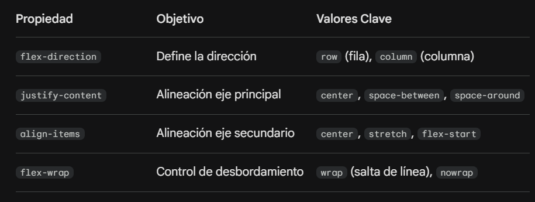

Aquí tienes una propuesta de estructura rápida siguiendo tu estilo de aprendizaje:
y hay un buen video sobre las propiedades de flexbox en : https://www.youtube.com/watch?v=rOQTEQkM96A

1. El HTML: El Contenedor y sus Ítem

---
```xml

<section class="flex-lab">
    <div class="flex-lab__container">
        <div class="flex-lab__item flex-lab__item--1">1</div>
        <div class="flex-lab__item flex-lab__item--2">2</div>
        <div class="flex-lab__item flex-lab__item--3">3</div>
       
    </div>
</section>
```
---


2. Las 4 Propiedades "Maestras" que debes probar:


Ejercicio Práctico: El "Centrado Perfecto"
Antes de Flexbox, centrar algo vertical y horizontalmente era una pesadilla. En tu laboratorio, añade este código para ver la magia:

---
```css
/* Bloque: El contenedor se convierte en flexible */
.flex-lab__container {
    display: flex;             /* Activamos el modo Flexbox */
    height: 400px;             /* Altura fija para notar el centrado vertical */
    background-color: #ecf0f1;
    
    /* Las dos líneas mágicas de centrado */
    justify-content: center;   /* Centra horizontalmente */
    align-items: center;       /* Centra verticalmente */
    
    gap: 20px;                 /* Espacio uniforme entre hijos (muy útil) */
}

/* Elemento: Los hijos */
.flex-lab__item {
    width: 80px;
    height: 80px;
    background-color: #e74c3c;
    color: white;
    display: flex;             /* Flexbox dentro de Flexbox para centrar el número */
    justify-content: center;
    align-items: center;
    font-weight: bold;
    border-radius: 8px;
}
```
---

¿Por qué es el complemento ideal para tus Media Queries?
Porque en tu ejercicio de la Hero Card, ya estás usando Flexbox:

En Móvil, usas flex-direction: column para apilar la imagen sobre el texto.

En Desktop, cambias a flex-direction: row para ponerlos de lado.

Hacer un laboratorio específico te permitirá jugar con valores como space-between (para crear barras de navegación) o flex-grow (para que una caja crezca más que las otras).


# IMPORTANTE SOBRE ALIG-ITEM Y JUSTIFY-CONTENT EN FLEBOX

## align-item y justify-content son siempre la alineacion respecto al eje vertical y horizontal o dependen del eje que se seleccione?

Esa es la pregunta del millón en Flexbox. La respuesta corta es: `Dependen totalmente del eje que selecciones.`

Mucha gente se confunde porque piensa que justify-content es "izquierda/derecha" y align-items es "arriba/abajo", pero eso solo es verdad cuando el contenedor está en modo fila (row).

### La regla de oro de Flexbox
justify-content:   
Alinea los elementos **a lo largo del Eje Principal (Main Axis).**
GUIA : La palabra Justify ( Justificar ) , pensarlo en terminos de un texto que se justifica horizontal ( por ser la forma standard) 

align-items:  
Alinea los elementos **a lo largo del Eje Cruzado (Cross Axis).**

¿Cómo cambian según el flex-direction?
Aquí es donde ocurre la "magia" (y a veces el lío). Al cambiar la dirección, los ejes rotan 90 grados:

1. Con flex-direction: row (Por defecto)
Eje Principal: Horizontal (de izquierda a derecha).

Eje Cruzado: Vertical (de arriba a abajo).

Resultado: justify-content mueve las cajas de lado a lado y align-items las mueve de arriba a abajo.

2. Con flex-direction: column
Eje Principal: Vertical (de arriba a abajo).

Eje Cruzado: Horizontal (de izquierda a derecha).

Resultado: ¡Se intercambian! Ahora justify-content mueve las cajas de arriba a abajo y align-items las mueve de lado a lado.

¿Por qué se diseñó así?
Imagina que estás diseñando un menú de navegación:

En Desktop lo quieres horizontal. Usas justify-content: space-between para separar los links de izquierda a derecha.

En Móvil lo quieres vertical. Cambias a flex-direction: column. Gracias a que justify-content sigue el eje principal, los links ahora se separarán de arriba a abajo automáticamente sin que tengas que cambiar la propiedad de alineación.
