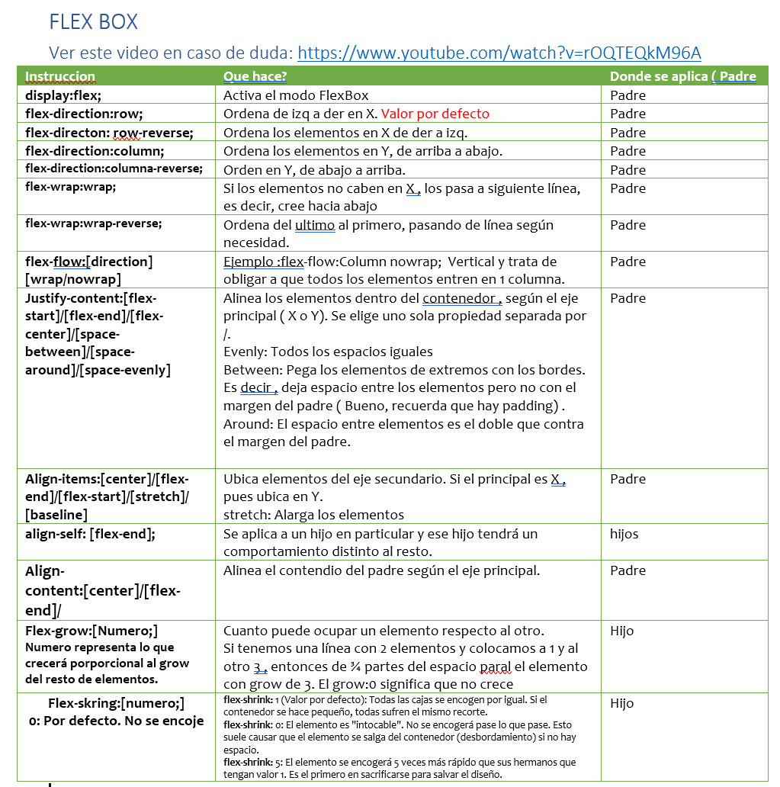
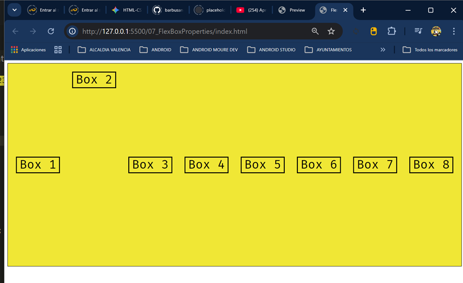

# APLICACION DISPLAY FLEX

Contenedor principal debe tener la propiedad:  
display:flex;

Explicación adicional sobre algn-self:
Haciendo una analogía con Word: si align-items es cómo se alinean todas las letras en el renglón, align-self es como si una sola letra decidiera estar más arriba o más abajo que sus compañeras.
________________________________________
1. Atributos que recibe align-self
Los valores son prácticamente los mismos que los de align-items, porque actúan sobre el mismo eje (el Eje Cruzado).
auto (Por defecto): 
Hereda el valor que tenga el padre en align-items. Si el padre dice center, el hijo hace center.
flex-start: 
El elemento se alinea al inicio del eje cruzado (arriba si es row).
flex-end: 
El elemento se va al final del eje cruzado (abajo si es row).
center: 
El elemento se centra solo a sí mismo.
stretch: 
El elemento se estira para ocupar todo el alto del contenedor (siempre que no tenga un height fijo).
baseline: 
•	Se alinea según la línea base del texto.
________________________________________
2. ¿Qué otros "self" existen?
En el mundo de Flexbox, el único "self" que existe es align-self. No existe algo como justify-self.
¿Por qué? Porque en Flexbox, el espacio en el Eje Principal (el de justify-content) se reparte de forma global entre todos los elementos. Si un elemento pudiera "justificarse a sí mismo" hacia la derecha, rompería la distribución de espacio (space-between o space-around) de los demás.
Dato para el futuro: En CSS Grid (que es otro sistema de diseño más avanzado que verás más adelante), sí existen justify-self y place-self, pero en Flexbox, solo tenemos el control individual para el eje cruzado.
________________________________________
3. Ejemplo 
Imagina que tienes 3 cajas centradas por el padre, pero quieres que la número 2 se vaya al "techo":
CSS del Padre:
CSS
/* Padre */
.flex-lab__scene {
    display: flex;
    align-items: center; /* Todos al centro por defecto */
    height: 300px;
}
CSS del Hijo "Rebelde":
CSS
/* CSS para la caja 2 */
.flex-lab__item--2 {
    align-self: flex-start; /* Esta caja ignora el centro y se va arriba */
}
________________________________________

Este es el resultado de aplicar align-self: flex-start; para el Box 2 , mientras que el resto sigue lo que el Padre les mando: align-items: center;  y por eso el resto esta alineado verticalmente en el centro.  

Resumen de jerarquía
1.	Contenedor Padre: Usa justify-content (Eje Principal) y align-items (Eje Cruzado) para dar órdenes generales.
2.	Hijo Individual: Usa align-self para sobrescribir la alineación del eje cruzado que le impuso el padre.

Asi, el CSS

* {
    box-sizing: border-box;
    margin: 0;
    padding: 0;
}

.container{
background-color: rgb(240, 231, 53);

padding: 5px;
border: 1px solid black;
display: flex;
flex-flow: row wrap;
width: 412px;
}

.box {
    border: 3px solid black;
    font-size: 30px;
    margin:0px;
    width: 100px;

    flex-shrink: 0;  /* Solo se usa en los hijos */
    flex-grow: 0;   /* Solo se usa en los hijos */
}

Las 4 estas en la misma linea con width:412px ...con 411 pasa una para abajo...

¡Exacto! Acabas de encontrar el límite físico real de tu diseño. Es un momento de "clic" matemático perfecto.

Lo que estás viendo es la armonía entre el código y los píxeles. Vamos a desglosar por qué 412px es el número exacto donde todo encaja como un tetris:

El Cálculo Final (Con border-box)
Al usar box-sizing: border-box, el ancho que tú defines es la ley absoluta. El navegador ya no suma nada por fuera.

1. Espacio disponible dentro del contenedor:

Ancho total: 412px.
Menos el borde del contenedor (1px izquierda + 1px derecha): 2px.
Menos el padding del contenedor (5px izquierda + 5px derecha): 10px.
Espacio libre para las cajas: 412−2−10=400px.

2. Espacio que ocupan tus 4 cajas:

Aquí está la clave del border-box: como también se aplica a las cajas (.box), ese width: 100px ahora incluye los bordes de 3px.

Cada caja mide 100px exactos de borde a borde.

Total de 4 cajas: 100×4=400px.

El veredicto:
Con 412px: Tienes 400px de espacio y 400px de cajas. ¡Encajan al milímetro! Por eso las ves todas en una línea.

Con 411px: Tienes 399px de espacio. Como tus cajas tienen flex-shrink: 0 (tienen prohibido encogerse), la cuarta caja dice: "Lo siento, me falta 1px para entrar", y el wrap la manda a la siguiente fila.

Un par de notas sobre tu código:
Propiedades en el sitio equivocado: He visto que pusiste flex-grow: 0 y flex-shrink: 0 dentro de .container. Cuidado aquí: esas propiedades son para los hijos (los .box), no para el contenedor. El contenedor no se encoge ni crece respecto a sí mismo de esa forma; él solo obedece al width.

La limpieza del *: Al usar el selector universal *, has eliminado los márgenes y rellenos aleatorios que los navegadores (Chrome, Edge, etc.) ponen por defecto. Eso es lo que te ha permitido tener ese control tan milimétrico.

