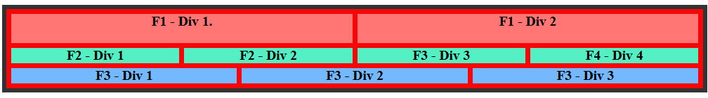

DETALLES GLOBALES SOBRE EL ARCHIVO:

Basicamente es crear un layout ( Grid ) para la pagina web.

El grid esta formado por 3 filas y 2 columnas.

Se define en:

```css
.container{
    display: grid; 
	grid-template-rows: 100px 150px; /*Dos filas de 100px y 200px respectivamente  */
	grid-template-columns: 1fr 2fr;     /* Dos columnas con un ancho flexibles (fracción) */ 

    /* grid-auto-rows: 150px; /* Añade filas de 150px*/
    grid-auto-rows: minmax(50px,auto);
}
```
Con  `display:grid; ` damos la indicacion de contruccion de un grid dentro de `container`

Definimos la cantidad y altura de las filas con:
`grid-template-rows: 100px 150px;` /*Dos filas de 100px y 200px

ó  

`grid-auto-rows: minmax(150px,auto);`   

Podemos quitar la instruccion `grid-template-rows:` y sustituirla por `grid-auto-rows:` , solo que asi seran todas de la misma altura.

Para las columnas se establece:

`grid-template-columns: 1fr 2fr;`    

  que dice que la columna 1 tendra una fraccion de la pantalla y la 2 , tendra 2 fracciones.

ó tambien podemos definirla con `grid-template-columns: repeat(12, 1fr);`,  
donde le estamos diciendo que verticalmente tendremos 1 fraccion de 12 divisiones y que estas se podran repartir en columnas de diferentes anchos:



en el ejemplo tenemos 3 filas donde:
fila 1 : 2 columnas =>grid-column: span 6; /* 12/2= 6 divisiones cada uno */
Fila 2 : 4 columnas =>grid-column: span 3; /* 12/3= 4 divisiones cada uno */
Fila 3 : 3 columnas =>grid-column: span 4; /* 12/4= 3 divisiones cada uno */

Que se definen: En el HTML podemos ver que de row-2 hay 2 items porque son 2 columnas.
De row-4 hay 4 items porque son 4 columnas y de row-3, 3 items porque son 3 columnas.

---
```xml
<body>
    <div class="parent-grid">
        <div class="grid-item item-row-2"><p class="texto">F1 - Div 1. </p></div>
        <div class="grid-item item-row-2">F1 - Div 2</div>
    
        <div class="grid-item item-row-4">F2 - Div 1</div>
        <div class="grid-item item-row-4">F2 - Div 2</div>
        <div class="grid-item item-row-4">F3 - Div 3</div>
        <div class="grid-item item-row-4">F4 - Div 4</div>
    
        <div class="grid-item item-row-3">F3 - Div 1</div>
        <div class="grid-item item-row-3">F3 - Div 2</div>
        <div class="grid-item item-row-3">F3 - Div 3</div>
    </div>
</body>
```
---

## Consejo de Pro para tu laboratorio:
Casi nunca usamos alturas fijas (como 200px) en filas que llevan texto, porque no sabemos si el usuario tiene la letra más grande o si el contenido cambiará. Lo más seguro es usar:

---
```css
grid-template-rows: repeat(2, minmax(100px, auto));
```

Esto dice: "Hazme dos filas que midan como mínimo 100px cada una, pero si el contenido crece, deja que la fila se estire".


