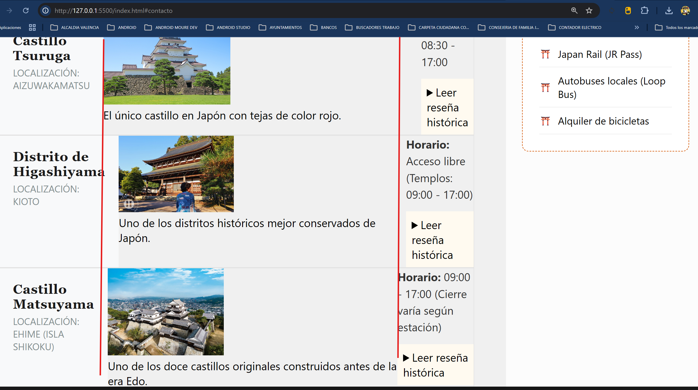

# DEALINEACION VERTICAL EN LA ZONA DE FOTOS
 En la imagen se aprecia caramente.



Esos desajustes en las líneas rojas son el "momento de la verdad" para cualquier desarrollador. Lo que estás viendo en tus capturas es el comportamiento por defecto de los elementos inline y block cuando el contenido tiene diferentes anchos.

¿Por qué sucede esto?
Actualmente, dentro de cada artículo (.castle-card), los elementos (título, imagen, info) simplemente fluyen hacia abajo. Si el texto de la izquierda es muy largo, empuja el resto. Si la imagen tiene un ancho natural, se queda ahí. No hay nada que obligue a los elementos internos a alinearse entre sí en columnas.

Para solucionar esto, necesitamos aplicar Grid (o Flexbox) dentro de la ficha. Esto se llama Grids Anidados.

## La Solución: Grid Interno para la Ficha
Vamos a modificar el estilo de .castle-card para que, en pantallas anchas, se divida internamente en columnas.

Añade este código dentro de tu Media Query de desktop (al final del archivo):

Copiar la parte interna del Media Query pues la etiqueta min min-width: 768 ya existe.
---
```css
@media (min-width: 768px) {
    /* ... otros estilos que ya tienes ... */

      .castle-card {
        display: grid;
        /* Creamos 3 columnas internas: 1 para el nombre, 1 para la foto, 1 para la info */
        grid-template-columns: 200px 1fr 200px; 
        align-items: start; /* Alinea todo al principio de la fila */
        gap: 20px;
        padding: 20px;
    }

    /* Ajustamos los elementos para que no ocupen todo el ancho por defecto */
    .castle-card__header {
        border-bottom: none; /* Quitamos la linea en este modo */
        padding: 0;
    }

    .castle-card__figure {
        margin: 0;
    }

    .castle-card__image {
        height: 150px; /* Reducimos altura para que encaje en la fila horizontal */
        width: 100%;
        object-fit: cover;
    }
}
```
---

¿Qué corregimos con esto?
Alineación Vertical: Al definir grid-template-columns: 200px 1fr 200px, todas las fotos de todos los artículos empezarán exactamente a los 200px del borde izquierdo. Las líneas rojas ahora serán perfectamente rectas.

Aprovechamiento de espacio: En lugar de tener mucho espacio en blanco arriba y abajo, aprovechamos el ancho de la pantalla para poner la info al lado de la foto.

Independencia del contenido: Da igual si el nombre del castillo es corto o largo, siempre respetará su columna de 200px.

Un detalle importante sobre las imágenes
Mencionaste que tus fotos son de 1200x800. Con el código de arriba, el CSS las "domará" para que encajen en el espacio asignado sin importar su tamaño original.

# COMO SABER EL ANCHO ACTUAL DE LA PANTALLA:
Es una excelente práctica querer ver el dato real para ajustar tus Media Queries. En el desarrollo profesional, a veces las herramientas de desarrollador del navegador (F12) nos engañan un poco con el zoom o el scroll, así que tener un "chivato" en pantalla es muy útil.

Aquí tienes dos formas de hacerlo: una rápida con CSS (para rangos) y una exacta con un poco de JavaScript.

1. El método "Chivato" con CSS (Solo rangos)
Si solo quieres saber en qué Media Query estás entrando, puedes añadir un elemento temporal al HTML y cambiar su contenido con CSS.

En tu HTML (al principio del body):

---
```CSS
<div class="screen-size-helper"></div>
```
---


En tu CSS:

---
```CSS
/* Estilo base (Móvil) */
.screen-size-helper::after {
    content: "Ancho: Menor a 500px (Móvil)";
    position: fixed;
    top: 10px;
    right: 10px;
    background: rgba(0,0,0,0.8);
    color: white;
    padding: 5px 10px;
    z-index: 9999;
    font-family: monospace;
}
```
---


/* Cambia el texto según tus Media Queries */
@media (min-width: 501px) {
    .screen-size-helper::after { content: "Ancho: Entre 501px y 767px (Tablet)"; }
}

@media (min-width: 768px) {
    .screen-size-helper::after { content: "Ancho: Mayor a 768px (Desktop)"; }
}
2. El método Exacto con JavaScript (Recomendado)
Para ver el número exacto de píxeles mientras encoges la ventana, pega este pequeño bloque al final de tu index.html (antes de cerrar </body>):

HTML
<div id="px-counter" style="position:fixed; top:0; left:0; background:red; color:white; padding:5px; z-index:10000; font-family:monospace;"></div>

<script>
    const counter = document.getElementById('px-counter');
    function updateWidth() {
        counter.innerText = window.innerWidth + 'px';
    }
    window.onresize = updateWidth;
    updateWidth();
</script>
¿Qué está pasando hasta los 500px? (Análisis del error)
Si dices que el problema se "trasladó" a pantallas menores de 500px, es probable que la imagen o el texto estén intentando mantener el layout de columnas en un espacio donde ya no caben, o que el padding que añadimos esté comprimiendo demasiado el contenido.