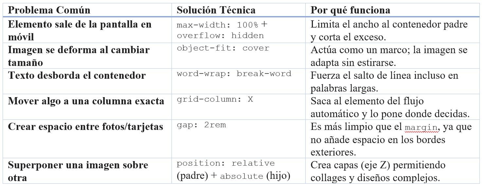

## ⛩️ Resumen de Ingeniería CSS: El Camino del Bushido
## 1. Flexbox: El Maestro del Alineamiento Interno
Usamos Flexbox para el Header, el Footer y el contenido de las tarjetas.

La Magia del Header:  
Usamos justify-content: center y gap: 30px para que el logo y los samuráis se mantuvieran unidos como un equipo, evitando que se "fugaran" a los extremos en pantallas grandes.

Encogimiento Inteligente:  
Aplicamos `min-width: 0` y `flex: 1` en el contenido del header. Esto rompe la rigidez natural de los elementos y permite que el título se encoja sin empujar a los demás fuera de la pantalla.

Centrado Perfecto:  
El uso de `margin: auto` en elementos flex-items es el truco definitivo para distribuir el espacio sobrante de forma automática.

## 2. CSS Grid: El Arquitecto del Layout
Mientras Flexbox maneja una dimensión (filas o columnas), Grid maneja ambas, permitiéndonos crear la "rejilla" de principios.

grid-template-columns: repeat(3, 1fr):  
Crea tres columnas que se reparten el espacio disponible equitativamente.

Posicionamiento Manual (grid-column):  
Esta es la verdadera "magia". En lugar de dejar que las tarjetas caigan donde quieran, les dijimos: "Tú, Yu, vete a la columna 3". Esto crea los huecos (espacio negativo) que dan elegancia al diseño.

El Salto de Fila (grid-row):  
Lo usamos para asegurar que Chugi y la Imagen Final no se amontonaran y respetaran el orden de jerarquía visual.

grid-column: 1 / span 3:  
Fundamental para los Separadores ( Fotos entre tarjetas). Le dice a la imagen: "Ignora las columnas y cruza toda la pantalla de lado a lado".

## 3. Técnicas de "Escudo" (Responsividad Extrema)
El reto de lograr que se vea bien la pagina, incluso con 70px de ancho nos obligó a usar herramientas de precisión:

clamp(min, ideal, max):  
Aplicado al título. Evita que el texto sea gigante en PC o tan pequeño que no se lea en móvil. Es una fuente que "respira".

object-fit: cover / contain:  
Imprescindible para imágenes. Evita el efecto de "foto estirada" o "aplastada", manteniendo la dignidad de la estética japonesa.

box-sizing: border-box:  
El reset universal. Asegura que si añades padding a una tarjeta, esta no crezca hacia afuera rompiendo tu rejilla.

# 📜 Hoja de Consulta para Futuros Proyectos
En la tabla tenemos el problema comun y las posibles soluciones.

La aplicación de la metodología BEM (bloque__elemento--modificador), hará que, si dentro de 6 meses queremos cambiar solo el color de las tarjetas, sepas exactamente que debes ir a .principle-card  asi que el código ahora no es solo bonito, es mantenible.

