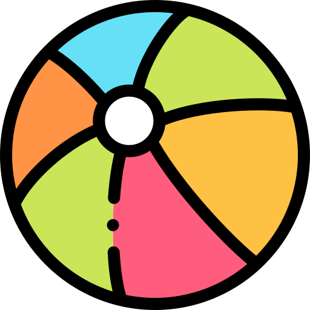

# EXPLICACION DEL REBOTE LOCO. ( Pelota Magica  de Beisball) y MAS ABAJO EXPLICACION DE ANIMACION DE PELOTA DE PLAYA.
Para lograr un rebote realista que se mueva en dos ejes ($X$ e $Y$) y cambie de tamaño (efecto de "aplastamiento" al tocar el suelo), combinaremos varias funciones de transform.Aquí tienes el código para una pelota que rebota contra las paredes y el suelo de forma dinámica:  

1. El Concepto: Ejes y Escala  
    Para moverla en simultáneo usaremos:translateX: Movimiento horizontal (Eje $X$).translateY: Movimiento vertical (Eje $Y$).scale: Cambio de tamaño (Efecto rebote).
2. El Código CSS  
    Vamos a crear una animación llamada superRebote. Para que el movimiento horizontal sea independiente del vertical y no parezca un rebote "cuadrado", lo ideal es integrarlos así:

    ---
    ```css

    .pelota-magica {
    width: 80px;
    position: relative;
    /* Duración 3s | Ritmo lineal | Infinito | Alternado (va y vuelve) */
    animation: superRebote 3s linear infinite alternate;
}
```
---
```css
@keyframes superRebote {
    0% {
        /* Inicio: Arriba a la izquierda y tamaño normal */
        transform: translate(0, 0) scale(1, 1);
    }
    25% {
        /* Punto medio arriba: se desplaza a la derecha */
        transform: translate(150px, 50px) scale(1, 1);
    }
    50% {
        /* Toca el "suelo": se mueve más a la derecha y se aplasta */
        /* scale(ancho, alto) -> 1.2 es más ancho, 0.8 es más bajo */
        transform: translate(300px, 400px) scale(1.2, 0.8);
        background-color: gold; /* Opcional: brilla al tocar suelo */
    }
    75% {

        /* Rebota hacia arriba y recupera forma, sigue avanzando a la derecha */
        transform: translate(450px, 50px) scale(1, 1);
    }
    100% {
        /* Llega al extremo derecho y vuelve a bajar */
        transform: translate(600px, 400px) scale(1.2, 0.8);
    }
} 
```
--- 

## Explicación de los cambios simultáneos  

## translate(X, Y): 

Es el atajo para mover en ambos ejes a la vez. En el ejemplo, mientras la pelota va bajando (aumenta $Y$), también se desplaza hacia la derecha (aumenta $X$).  

## scale(1.2, 0.8):  
 Este es un truco de animación clásica (Squash and Stretch). Cuando el valor de $Y$ llega al máximo (el suelo), aumentamos el ancho ($1.2$) y disminuimos el alto ($0.8$). Esto da la sensación de que la pelota es de goma y tiene peso.  
 
 ## alternate:  
  Esta palabra en la propiedad animation es vital. Hace que cuando la pelota llegue al final del trayecto ($100\%$), haga el camino de vuelta hacia el $0\%$, creando un efecto de rebote continuo y fluido de derecha a izquierda.  
  

  ## ¿Por qué usar transform y no top/left?  
  Como estás aprendiendo, este consejo te ahorrará dolores de cabeza:  
  Animar top, left, width o height obliga al navegador a recalcular todo el diseño de la página en cada frame (Layout).
  
  Animar transform (translate, scale, rotate) ocurre en una capa distinta que el navegador maneja de forma súper rápida directamente con la tarjeta de video (Composite).  
  
  ¡Es la diferencia entre una animación que se ve "trabada" y una que va a 60 cuadros por segundo!


  # ANIMACION DE PELOTA DE PLAYA.

  Esta animacion es discontina en el sentido de que al terminar la trayectoria la pelota desaparece y aparece en un nuevo lugar, distinto al final de la trayectori y distinto al punto inicial, donde se dibujo por primera vez la pelota.

  La explicacion: 
  Ese salto hacia un punto "nuevo" al azar se debe a cómo se sincroniza el reinicio del ciclo de CSS con la actualización de las variables en JS.  
  La explicación de por qué ocurre ese "brinco" a un tercer punto:  
  El origen del tercer punto (El brinco), Cuando la animación llega al $100\%$, el ciclo termina y, si tienes infinite, el navegador intenta volver al $0\%$ instantáneamente.  
   Esto es lo que sucede en milisegundos:  
   Final del Ciclo ($100\%$): La pelota está en var(--pos-x-final).  
   Reinicio ($0\%$):   
   La animación salta a left: 0; top: 0; (tu punto inicial en el código).  
   Conflicto de JS: Si tu setInterval cambia las variables --pos-x y --pos-x-final en ese mismo instante, la pelota se redibuja basándose en los nuevos valores de las variables, pero posicionada según el porcentaje de la animación.  
   El resultado visual:  
    La pelota desaparece de donde terminó y aparece en un lugar que no es ni el origen real ni el destino anterior, sino una mezcla de la posición inicial del keyframe ($0\%$) con los datos recién actualizados.
    
  En todo caso en esta animacion, SI hemos definido el `@keyframes reboteAzar` en sus diferentes etapas.
  En el 0% , en teoria se ubica en 0,0 y la pelota sigue en la misma escala.
  
  Al 50% la ubicacion definida es :

  left: var(--pos-x);
  top: var(--pos-y);

  Donde --pos-x, --pos-y son variables en CSS, cuyo valor se asigna en el JavaScript: pelotaAlAzar.js
  La escala y el color tambien se basan en variables  var(--escala) y var(--color-azar), que igualmente se generan el el archivo pelotaAlAzar.js

  Al 100% :

  left: var(--pos-x-final);
        top: var(--pos-y-final);

  Las variables se generan en pelotaAlAzar.js

  Como se ve, el js se encarga de generar los valores al azar que luego los usaremos en el CSS para que la pelota sea dibujada.      


---
```css
  @keyframes reboteAzar {
    0% {
        left: 0;
        top: 0;
        transform: scale(1);
    }

    50% {
        /* Aquí usamos las variables que JS llenará */
        left: var(--pos-x);
        top: var(--pos-y);
        transform: scale(var(--escala));
        background-color: var(--color-azar);
    }

    100% {
        /* Un segundo punto al azar para que sea más loco */
        left: var(--pos-x-final);
        top: var(--pos-y-final);
    }
}
```
---

El archivo pelotaAlAzar.js tiene la generacion de valores para las variables anteriores:

Como funciona?
Creamos un objeto **pelota** con:
`const pelota = document.getElementById('pelotaPlaya');`

Del documento HTML, obtenemos el objeto a traves del id="pelotaPlaya"  en el HTML:

---
```html

```
---
Luego creamos la funcion generarValoresAzar(), que no necesita parametros y generara un valores para las cordenadas X, Y hacia donde se movera en el 50% del keyframes y al 100%. 
Las coordenadas X se generan con "Math.floor(Math.random() * 90) + "vw";" 
Esa función generará un número entero aleatorio entre 0 y 89 (ambos incluidos).  
Paso a paso:Math.random(): Genera un número decimal (flotante) entre 0 (incluido) y 1 (excluido). Es decir, puede ser $0$ o $0.999...$, pero nunca llega a ser $1$.  
* 90: Multiplica ese decimal por 90. El resultado estará en el rango de 0 a 89.999....  
* Math.floor(): Redondea ese resultado hacia abajo al entero más cercano.  
* El resultado final:  
  * Si el azar da el valor más bajo ($0$): Math.floor(0) = 0.  
  * Si el azar da el valor más alto posible ($0.999...$): Math.floor(89.91) = 89.

Para los valores de Y se usa: Math.floor(Math.random() * 90 - 20)

Esta fórmula generará un número entero aleatorio entre -20 y 69.  
El desglose matemático de qué sucede en cada paso:  
Math.random() * 90: Esto genera un decimal entre 0 y 89.999....  
- 20: A ese resultado se le restan 20. Por lo tanto, el rango ahora se desplaza y queda entre -20 y 69.999....  
- Math.floor(): Redondea hacia abajo al entero más cercano.  
- Los valores límite:El valor más bajo posible: Si el azar es $0$, entonces $0 - 20 = -20$.   
- Al aplicar Math.floor, obtienes -20.  
- El valor más alto posible: Si el azar es casi $90$ (por ejemplo $89.9$), entonces $89.9 - 20 = 69.9$.   
- Al aplicar Math.floor, obtienes 69.  
- ¿Qué significa esto para tu pelota?  
  - Si usas este valor para el eje Y (vh):Valores negativos (de -20 a -1): La pelota se moverá hacia arriba, saliéndose un poco por la parte superior de la pantalla (o del contenedor).  
  - Valor 0: La pelota toca el borde superior exacto.  
  - Valores positivos (de 1 a 69): La pelota bajará hasta un máximo del 69% de la altura de la ventana.

Luego que tenemos los valores de X Y se calculan , tambien al azar, los valores de escala y el color.

Para la escala usamos (Math.random() * (1.5 - 0.5) + 0.5).toFixed(2);

Esta fórmula generará un número decimal (**en formato de texto**) entre "0.50" y "1.50", con exactamente dos dígitos después del punto.  
Es la estructura clásica para generar una escala (zoom) aleatoria.   
Cómo funciona:  
1. El Rango: Math.random() * (1.5 - 0.5)  
   1. Primero se resuelve el paréntesis: (1.5 - 0.5) es 1.0.  
   2. Luego se multiplica: Math.random() * 1.0.  
   3. Esto nos da un número decimal entre 0.0 y 0.999....  
2. El Desplazamiento: + 0.5  
   Al sumar 0.5, movemos todo el rango hacia arriba.Mínimo: $0.0 + 0.5 = \mathbf{0.5}$Máximo: $0.999... + 0.5 = \mathbf{1.499...}$3.   
   El Formateo: .toFixed(2)Esta es la parte clave. Toma el número (por ejemplo, 1.12743...) y lo corta a dos decimales, redondeando si es necesario.  
   Ojo: toFixed convierte el número en un String (texto). Para CSS esto no es problema (ej. scale(1.25)), pero para cálculos matemáticos posteriores en JS tendrías que volver a convertirlo a número.  
   Ejemplos de lo que podrías obtener:  
   "0.50" (La pelota se vería a la mitad de su tamaño original).  
   "1.00" (Tamaño original)."1.34" (Un 34% más grande).  
   "1.50" (Un 50% más grande).  
   En resumen: Estás creando un factor de escala que hace que tu pelota de voleibol varíe entre ser pequeñita (lejos) o muy grande (cerca), lo que le da un efecto de profundidad.  


Generacion de Cambio de Color, con la funcion: `hsl(${Math.random() * 360}, 70%, 60%)`;


Esto genera un color aleatorio en formato HSL (Hue, Saturation, Lightness), que en este caso específico dará como resultado un color brillante y equilibrado.

Aquí el desglose:

1. El Tono (Hue): ${Math.random() * 360}
Es el primer valor de HSL y representa el color en la rueda cromática (de 0 a 360 grados):

0 o 360: Rojo.

120: Verde.

240: Azul.

Al multiplicar Math.random() por 360, obtienes cualquier color posible del arcoíris.

2. La Saturación (Saturation): 70%
Este valor es estático (no cambia).

Un 70% significa que el color será bastante intenso y vivo, sin llegar a ser chillón (100%) ni grisáceo (0%).

3. La Luminosidad (Lightness): 60%
Este valor también es estático.

Un 60% está un poco por encima de la mitad (50%), lo que significa que el color será ligeramente claro o "pastel suave", ideal para que se vea bien sobre fondos oscuros o medios.

¿Cuál es el resultado visual?
En lugar de obtener colores totalmente caóticos (como podrías obtener con RGB), esta fórmula garantiza que siempre obtendrás un color:

Vibrante (gracias al 70% de saturación).

Visible (gracias al 60% de brillo).

Diferente en cada ejecución (gracias al tono aleatorio entre 0 y 360).

Ejemplo de lo que verías en el código inyectado:

hsl(45.23, 70%, 60%) → Un amarillo cálido.

hsl(210.5, 70%, 60%) → Un azul cielo intenso.

hsl(330.1, 70%, 60%) → Un rosa fucsia suave.

Es una técnica excelente para que cada pelota tenga su propia "personalidad" manteniendo una estética profesional y coherente.


Finalmente todo se recalcula cada 3 segundo con setInterval(generarValoresAzar, 3000);
    El 3000 = 3s , **debe coincidir con la duracion de la animacion en el CSS**. (  animation: reboteAzar `3s` linear infinite alternate; )

setInterval(generarValoresAzar, 3000);


---
```js

/ ******************** Animmacion Pelota Playa *******************************
// GENERAR VALORES PARA PELOTA DE PLAYA.

// 1. Seleccionamos la pelota
const pelota = document.getElementById('pelotaPlaya');

// 2. Función para generar números aleatorios
function generarValoresAzar() {
    // Valores para el eje X (entre 0 y 70% del ancho de pantalla)
    const x = Math.floor(Math.random() * 90) + "vw";
    const xFinal = Math.floor(Math.random() * 90) + "vw";
    
    // Valores para el eje Y (entre -20 y 50% del alto de pantalla)
    const y = Math.floor(Math.random() * 90 - 20) + "vh";
    const yFinal = Math.floor(Math.random() * 90 - 20) + "vh";
    
    // Escala al azar (entre 0.5 y 1.5)
    const escala = (Math.random() * (1.5 - 0.5) + 0.5).toFixed(2);
    
    // Color al azar
    const color = `hsl(${Math.random() * 360}, 70%, 60%)`;

    // 3. Aplicamos los valores al estilo de la pelota (Variables CSS)
    pelota.style.setProperty('--pos-x', x);
    pelota.style.setProperty('--pos-y', y);
    pelota.style.setProperty('--pos-x-final', xFinal);
    pelota.style.setProperty('--pos-y-final', yFinal);
    pelota.style.setProperty('--escala', escala);
    pelota.style.setProperty('--color-azar', color);
}

// Ejecutar la función al cargar la página
generarValoresAzar();

// Opcional: Cambiar los valores cada 3 segundos para que siempre sea distinta
setInterval(generarValoresAzar, 3000);

```
---


# ANIMACION PELOTA RUGBY ( RUBBY ) CON ANIMATE USANDO WAAPI.

Al usar la Web Animations API (WAAPI), que es una herramienta de JavaScript, la cual te permite controlar animaciones CSS como si tuvieras un control remoto de video (pausar, adelantar, y lo más importante: leer la posición actual).

Aquí la explicacion de cómo funciona la lógica en "memoria" :

### El concepto: Capturar el "Estado"
En lugar de dejar que el CSS se reinicie solo, haríamos lo siguiente:

La pelota termina su primer ciclo.

JavaScript detecta el final y usa una función llamada getComputedStyle.

Captura exactamente dónde quedó la pelota (sus valores de top y left).

Genera una nueva animación donde el 0% es exactamente ese punto capturado.WAAPI

## Aqui el detalle de que hace cada instruccion en el codigo:

---
```js
// **** Animacion Pelota Rugby con WAAPI **********************
// WAAPI = Web Animation API
// Una libreria nativa de JavaScript para animaciones

// Asigna a pelotaRubby el elemento en HTML con el id="pelotaRugby"
const pelotaRubby = document.getElementById('pelotaRugby');

function siguienteSaltoAzar() {
    // 1. LEER: ¿Dónde está la pelota justo ahora?
    const estiloActual = window.getComputedStyle(pelotaRugby);
    const actualX = estiloActual.left;
    const actualY = estiloActual.top;

    // 2. CALCULAR: Nuevo destino al azar
    const nuevoX = Math.floor(Math.random() * 80) + "vw";
    const nuevoY = Math.floor(Math.random() * 60) + "vh";

    // 3. EJECUTAR: Usamos la Web Animations API
    // Definimos los fotogramas (keyframes) en el momento
    pelotaRugby.animate([
        { left: actualX, top: actualY }, // Inicio: donde quedó antes
        { left: nuevoX, top: nuevoY }   // Fin: el nuevo azar
    ], {
        duration: 3000,
        fill: 'forwards', // Importante: se queda en el destino al terminar
        easing: 'linear'
    }).onfinish = siguienteSaltoAzar; // <--- LA MEMORIA: Al terminar, llama a la función de nuevo
}

// Iniciar el primer ciclo
siguienteSaltoAzar();

```
---

Este código es el ejemplo perfecto de cómo JavaScript toma el control total del renderizado, **eliminando la necesidad de escribir @keyframes en el CSS.**  
Aquí, el navegador ya no lee una "receta fija", sino que le dictamos las coordenadas en tiempo real.

A continuación, el detalle de cada instrucción:

1. Captura del Elemento
`const pelotaRubby = document.getElementById('pelotaRugby');`

Qué hace: Busca en el DOM el nodo con ese ID. (`Id=pelotaRugby` , definido en el HTML)

**Dato que obtiene:** Una referencia al objeto del elemento HTML.

**Tipo de objeto: HTMLElement.

**Consulta:** console.log(pelotaRubby); (Verás la etiqueta HTML en consola).

2. Captura del Estado Actual (La Memoria)
`const estiloActual = window.getComputedStyle(pelotaRubby);`

**Qué hace:** Esta es la clave de la continuidad. Lee todos los valores reales que el navegador está aplicando al elemento en ese milisegundo (incluyendo los calculados por animaciones previas).

**Dato que obtiene:** Un mapa gigante de todas las propiedades CSS.

**Tipo de objeto:** CSSStyleDeclaration.

**Consulta:** console.log(estiloActual.getPropertyValue('left'));

**const actualX** = estiloActual.left; y const actualY = estiloActual.top;

**Qué hace:** Extrae específicamente las coordenadas.

**Dato que obtiene:** Un texto (ej. "145.5px"). `Ojo: Siempre devuelve píxeles, aunque hayas usado vw o vh antes.`
Al usar el console.log veras que imprime el valor acompañado de "px", ej. "145.5px"

**Tipo de objeto:** String.

3. Generación de Nuevas Coordenadas
`const nuevoX = Math.floor(Math.random() * 80) + "vw";`

**Qué hace:** Calcula un número al azar y le concatena la unidad de medida.

**Dato que obtiene:** Un string de destino (ej. "54vw").

**Tipo de objeto:** String.

4. El Motor WAAPI (.animate)
`pelotaRugby.animate([ ... ], { ... });`

**Qué hace:** Crea y arranca una animación directamente en el motor de renderizado.

`Dato que obtiene:` Crea un controlador de animación.

`Tipo de objeto:` Animation. Este es el objeto más importante.

`Desglose del objeto Animation:`
Si quieres consultar qué está pasando con la animación, deberías guardar el resultado en una variable:
const miAnimacion = pelotaRugby.animate(...);


|Si consultas...|Obtendrás|
|:---|:---|
|miAnimacion.playState|"running", "finished" o "paused"."|
|miAnimacion.currentTime|El milisegundo exacto en el que va la pelota.|
|miAnimacion.playback|RateLa velocidad (puedes poner 2 para que vaya al doble de rápido).|

5. Las Propiedades del Objeto de Configuración
Dentro de .animate, pasas dos argumentos:

Keyframes (Array): [{...}, {...}]. Define el punto A y el punto B.

Opciones (Object):

duration: 3000: Tiempo en milisegundos (Number).

fill: 'forwards': Evita que la pelota salte al inicio al terminar. Mantiene el estado final (String).

easing: 'linear': Velocidad constante (String).


6. El Evento de Continuidad (onfinish)
.onfinish = siguienteSaltoAzar;

*Qué hace:* Es un "escuchador de eventos". Le dice a la animación: "En cuanto termines el último milisegundo, ejecuta esta función".

*Lógica:* Al llamarse a sí misma (siguienteSaltoAzar), la función vuelve al Paso 2, lee la posición donde acaba de quedar la pelota, y genera un nuevo destino.

**Punto Crítico:** Aquí no usamos paréntesis siguienteSaltoAzar() porque no queremos ejecutarla ya, sino pasarle la referencia de la función para que el objeto Animation la ejecute después.

Resumen para tu bitácora:
Si quieres ver las "entrañas" de lo que está pasando mientras la pelota se mueve, añade esta línea dentro de la función:

---
```js
const miAnim = pelotaRugby.animate([...], {...});
console.log("Estado de la animación:", miAnim.playState);
console.log("Destino:", nuevoX, nuevoY);
miAnim.onfinish = siguienteSaltoAzar;

```
---

LAS LINEAS LAS COLOQUE JUSTO ANTES DE LA ANIMACION PERO HACE MUY PESADA LA ANIMACION. 

# FORMA CORRECTA DE APLICAR EL SEGUIMIENTO SIN QUE COLAPSE LA ANIMACION, PARA EL CASO ANTERIOR ( miAnim )

El colpaso es el "Efecto Acordeón" de las animaciones.

La razón por la que la animación "colapsa" o se hace pesada no es por los console.log, sino por estar disparando la animación dos veces al mismo tiempo dentro de la misma función.

¿Por qué colapsa?
Lo que está pasando en el motor de JavaScript:

Llamas a pelotaRugby.animate(...) en la variable miAnim. La pelota empieza a moverse.

Inmediatamente abajo (en el paso 3), vuelves a llamar a pelotaRugby.animate(...).

Ahora hay dos motores intentando mover la misma pelota a diferentes (o iguales) sitios.

Y lo peor: ambas tienen un .onfinish. Cuando terminen, ¡cada una llamará a siguienteSaltoAzar!

Ciclo 1: 1 animación.

Ciclo 2: 2 animaciones.

Ciclo 3: 4 animaciones...

¡Es un crecimiento exponencial que satura la memoria!

La forma correcta (Limpiando la carga)
Para optimizar la memoria y que la animación sea fluida, hay que declarar la animación una sola vez. Si quieremos inspeccionarla, usamos la variable, pero no repetimos el comando .animate().

Asi , el código optimizado y profesional:
---
```js
function siguienteSaltoAzar() {
    // 1. LEER: ¿Dónde está ahora?
    const estiloActual = window.getComputedStyle(pelotaRugby);
    const actualX = estiloActual.left;
    const actualY = estiloActual.top;

    // 2. CALCULAR: Destino
    const nuevoX = Math.floor(Math.random() * 80) + "vw";
    const nuevoY = Math.floor(Math.random() * 60) + "vh";

    // 3. EJECUTAR: Guardamos en una constante para inspeccionar SIN duplicar
    const miAnim = pelotaRugby.animate([
        { left: actualX, top: actualY }, 
        { left: nuevoX, top: nuevoY }
    ], {
        duration: 3000,
        fill: 'forwards',
        easing: 'ease-in-out' // 'ease-in-out' es más natural que 'linear'
    });

    // --- ZONA DE INSPECCIÓN (Opcional, no pesa nada así) ---
    // console.log("Estado:", miAnim.playState); 
    // console.log("Destino:", nuevoX, nuevoY);
    // ------------------------------------------------------

    // 4. CONTINUIDAD: Usamos la referencia de la variable
    miAnim.onfinish = siguienteSaltoAzar;
}
```
---
Puntos clave para disminuir la carga de memoria:
Evitar duplicidad: Cada .animate() crea un nuevo objeto en el heap de la memoria. Asegúrate de tener un solo .animate() por cada ciclo.

Basura Espacial (Garbage Collection): Al terminar la animación, si no guardaste la referencia de forma global, JS limpiará el objeto automáticamente tras el onfinish.

Usa transform en lugar de top/left (Super Tips de Rendimiento):
Si notas que la pelota "tiembla", es porque cambiar top y left obliga al navegador a recalcular el diseño de toda la página (Reflow).

Consejo de experto: Si usas { transform: ['translate(0,0)', 'translate(100px, 50px)'] }, la animación irá directamente a la tarjeta de video (GPU) y será 10 veces más fluida.

**Regla de oro:**  
 En WAAPI, una variable = una animación activa. Si invocas el método .animate() dos veces sobre el mismo objeto, estás creando una competencia de recursos.

 # Aprendizaje: Con animate() no solo se asigna sino que tambien renderiza. 
 Esa es una de las lecciones más importantes de JavaScript: algunas funciones tienen "efectos secundarios" inmediatos.

 Pensaba que al asignar la animación a la variable ( const miAnim = pelotaRugby.animate.....) era meterla en la variable pero NO verla pero no es asi. La guarda en la variable y renderiza la animacion.

Normalmente, si haces const suma = 2 + 2, nada "pasa" en la pantalla, solo se guarda un 4.  
Pero con WAAPI, el método .animate() hace dos cosas al mismo tiempo:

Dispara la acción: Le ordena al navegador que empiece a mover el elemento ya mismo.

Te entrega el control: Guarda en tu variable (miAnim) el "mando a distancia" para que puedas pausar, detener o saber cuándo termina esa acción que ya empezó.

El "Mando a Distancia" (Objeto Animation)
Imagina que .animate() es como encender una cinta de correr. Al asignarlo a una variable, lo que tienes en la mano es el panel de control de esa cinta.

Si quieres experimentar con ese "mando a distancia" y entender qué hay dentro de la variable, puedes probar estos comandos en tu consola mientras la pelota se mueve:

miAnim.pause(); → La pelota se congela en el aire.

miAnim.play(); → Continúa su camino.

miAnim.reverse(); → La pelota regresa al punto de origen.

miAnim.playbackRate = 2; → La pelota se mueve al doble de velocidad.

¿Por qué colapsaba el código?
Al poner dos veces el animate() , ocurrió lo siguiente:

Línea A: const miAnim = ...animate(...) → Encendi una cinta de correr.

Línea B: ...animate(...) (sin variable) → Encendi otra cinta de correr encima de la primera.

Como el navegador intentaba seguir dos órdenes distintas para el mismo objeto, la memoria se llenaba de procesos "vivos" que nunca terminaban de limpiarse, creando un efecto de cámara lenta o saltos bruscos.

Un consejo para tu camino de aprendizaje:
En JavaScript, siempre que veas un método que se llama directamente sobre un elemento de la pantalla (como .animate(), .focus(), o .click()), asume que la acción ocurrirá en el momento en que se lee la línea, independientemente de si guardas el resultado en una variable o no.

La variable es solo para que tú, como programador, puedas "hablarle" a esa acción más tarde.