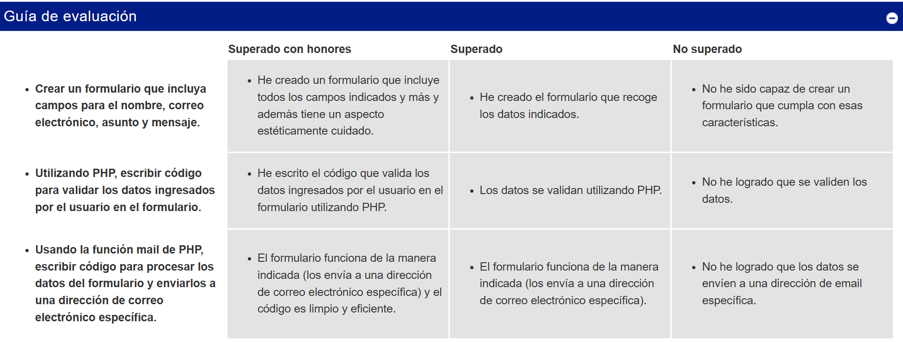

El reto es desarrollar a un formulario de contacto con **PHP**  

La tarea consiste en crear un formulario que incluya campos para el nombre, direccion, telefono, correo electrónico, asunto y un mensaje.

Crear el formulario que incluya todos los campos indicados y con un aspecto estéticamente cuidado. 

Después, utilizando PHP, debes escribir código para validar los datos ingresados por el usuario en el formulario. 

Luego, usando la función mail de PHP, debes escribir código para procesar los datos del formulario y enviarlos a
la dirección de correo electrónico captada por el formulario. El numero de incidencia sera simulado y puede hacerse con un correlativo : [año][mes][dia]+[correlativo de 3 digitos]. Ejemplo: 20260516001

El contenido del mail a enviar, a la direccion captada en el formulario seria algo asi:
"Un saludo cordial [Nombre enviado].  
Hemos recibido su solicitud: [asunto enviado] y ha sido registrada con el numero [numeroIncidencia]
Y su mensaje:
[mensaje enviado]

En maximo 2 dias habiles, nos comunicaremos con usted por esta via y/o telefono : [telefono enviado]

Favor no responda a este mail pues es un servicio automatico.

Hacerlo paso a paso. 
Primero: Plantear la ruta global para alcanzarlo.
No usar BootStrap...solo CSS
Usar metodo BEM para trabajar con las clases. Usar un archivo externo para el CSS.
Validar los campos de la informacion introducida y asegurar, en el frontEnd y BackEnd la aplicacion metodos de seguridad, es decir sanitización ( Evitar inyeccion de codigo malicioso o peligroso )
Comentar el codigo paso a paso.
Comprobaremos que se envia a la dirección de correo electrónico específicada y el código es limpio y eficiente.
Hacerlo a nivel junior - junior+
En resumen: Hacerlo Paso a Paso, Mantener el código organizado, usar BEM, formulario de aspecto profesional, manejar los errores, garantizar la seguridad, buen rendimiento, realizar pruebas de funcionamiento, validaciones, seguridad....
En caso de alguna duda consultame antes de proceder. Cree una carpeta 15_Reto13_Form_Por_Mail_PHP para albergar los archivos del miniproyecto. Usare VS code.

