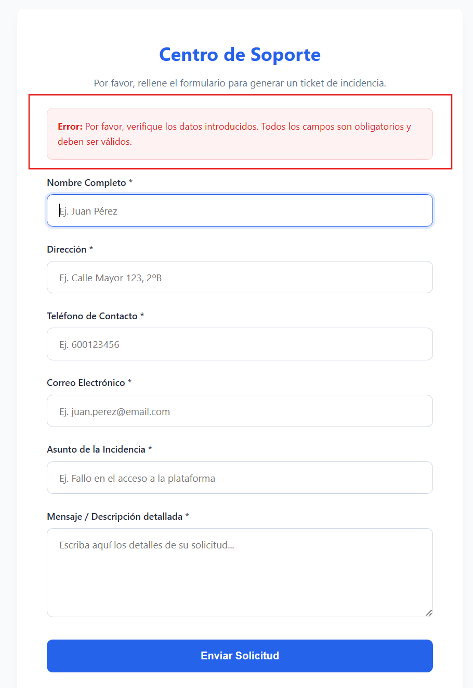
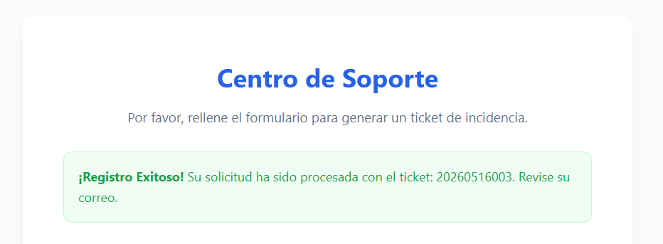

1. Prueba de Campos Obligatorios (Validación del Cliente y Servidor)
Acción: Dejar todos los campos vacíos y pulsar el botón "Enviar Solicitud".

Qué debería pasar (Frontend): El navegador, gracias a los atributos required que pusimos en el HTML, debería frenar el envío y mostrarte un aviso nativo (tipo "Por favor, rellene este campo").



Forzar el Backend: Para probar la seguridad del archivo procesar.php, haz clic derecho en cualquier parte del formulario, selecciona Inspeccionar (F12) y borra el atributo required de uno de los inputs desde el código del inspector. Rellena el resto del formulario, deja ese vacío y dale a enviar.

Resultado esperado: Viajarás a procesar.php, pero este detectará instantáneamente el engaño mediante las validaciones con empty(), te redirigirá de vuelta a index.php y verás arriba la alerta roja de error.

#### Detalle de lo que sucede al quitar el require , en por ejemplo, nombre:
La clave está en la URL y en el método HTTP (GET y POST).

Vamos a ver el viaje que hace el texto del error , paso a paso:

1. El viaje de ida (Del Frontend al Backend)
Cuando pulsas el botón "Enviar", el formulario empaqueta de forma invisible todos los datos dentro del cuerpo de una petición POST y los manda hacia la dirección que colocamos en el atributo action: procesar.php.

Al quitar el required, por ejemplo, del campo nombre: El Frontend se desentiende y deja pasar la petición. 

¿Qué recibe el Backend? procesar.php recibe el campo nombre completamente vacío ("").

2. El control de aduana (En el Backend)
Dentro de procesar.php, se hace su trabajo de aduana con esta línea:

```php
if (empty($nombre) || empty($direccion) || ...)
```

Como quitamos el `require` en el HTML, la función empty($nombre) da como resultado verdadero (true). Al cumplirse esa condición de error, el código ejecuta inmediatamente la redirección:

```php
header('Location: index.php?status=error');
exit;
```

3. El viaje de vuelta (Del Backend al Frontend)
Aquí ocurre la magia de cómo viaja el aviso. El servidor no le manda un texto plano al navegador; le manda una instrucción de redirección HTTP (un código 302) diciéndole: "Oye, muévete de aquí y ve a esta nueva dirección".

Fíjate en lo que va colgado al final de la URL: ?status=error.
A esto se le conoce en desarrollo web como Query Strings o parámetros de URL (una petición GET). El texto del error no viaja como una frase larga, sino como una etiqueta o palabra clave (error) en la barra de direcciones de tu navegador: http://localhost:3000/index.php?status=error.

4. El Frontend lee la URL y pinta el aviso
Cuando el navegador vuelve a cargar index.php, el código PHP que dejamos preparado al principio del archivo se ejecuta antes de que el usuario vea la página:

---
```php
// El Frontend revisa si en la URL viaja la variable 'status'
<?php if (isset($_GET['status'])): ?>
    // Si esa variable es exactamente igual a la palabra clave 'error'
    <?php if ($_GET['status'] === 'error'): ?>
        <!-- Se pinta en pantalla el HTML de la alerta roja con el texto definitivo -->
        <div class="alert alert--danger">
            <strong>Error:</strong> Por favor, verifique los datos introducidos...
        </div>
    <?php endif; ?>
<?php endif; ?>
```
---
En resumen:
El texto del error no viaja flotando por la red. El backend simplemente le pone un "aspa roja" a la URL (?status=error) y el frontend, al leer esa aspa en la URL, sabe exactamente qué caja de texto predefinida tiene que pintarle al usuario en pantalla.

Por eso, tanto si el navegador frena el envío en el frontend como si el backend te rebota, el usuario final experimenta la misma sensación de control. ¡Con ello se implementa un sistema de doble barrera! ( Front y Back, para campos obligatorios).


2. Prueba de Inyección de Código (Sanitización y Seguridad)
Acción: En el campo Mensaje / Descripción, escribimos una etiqueta de JavaScript malicioso para intentar romper la página, por ejemplo:

HTML
<script>alert('Ataque XSS exitoso');</script>
Rellenamos el resto de campos con datos normales y le damos  a Enviar.

Resultado esperado: El sistema procesará el formulario y devolverá un mensaje de éxito con el número de ticket generado en la URL (por ejemplo, ?status=success&ticket=20260516005).



💡 ¿Por qué es seguro? Como usamos FILTER_SANITIZE_SPECIAL_CHARS, si revisas el código interno o si intentáramos pintar ese mensaje en pantalla, el código no se ejecutaría en el navegador porque PHP convirtió los símbolos < y > en texto plano inofensivo (&lt;script&gt;). Tu servidor está a salvo de inyecciones básicas de scripts.

3. Comprobación de la Estructura del Mail y el Correlativo
Acción: Rellena el formulario con datos válidos de prueba (usa tu propio correo en el campo email para simular la captura) y envíalo.

El número de incidencia: Verás que la alerta verde te muestra un número con el formato exacto solicitado: 202605160XX (Año, mes, día + un correlativo de 3 dígitos con ceros a la izquierda gracias a str_pad).

Verificación del mensaje: La extensión PHP Server de VS Code suele usar el binario de PHP puro. Al no tener un servidor de correo real configurado (SMTP), la función mail() internamente devolverá false en tu máquina, pero gracias al "salvavidas" que añadimos al final del archivo procesar.php, el flujo no se rompe y simula el éxito para que puedas ver el resultado en la interfaz, creando el correo en un archivo .txt que se guarda en el directorio base.

Al final de procesar.php, las siguientes lineas se encargan de crear el archivo:

```php
// ==========================================================================
// 6. MODO PRUEBA: Guardar el correo en un archivo local .txt
// ==========================================================================

// Construimos el contenido tal cual se enviaría
$contenidoSimulado = "Para: " . $para . "\n";
$contenidoSimulado .= "Asunto: " . $tituloEmail . "\n";
$contenidoSimulado .= "Cabeceras: \n" . $headers . "\n";
$contenidoSimulado .= "--------------------------------------------------\n";
$contenidoSimulado .= $cuerpoEmail;

// Creamos un archivo llamado 'ultimo_correo.txt' en tu carpeta del proyecto
// Si el archivo ya existe, sobrescribirá el contenido con el último envío
file_put_contents('ultimo_correo.txt', $contenidoSimulado);

// Mantenemos la redirección de éxito idéntica para el frontend
header('Location: index.php?status=success&ticket=' . $numeroIncidencia);
exit;

```

La linea con la instruccion `header('Location: index.php?status=success&ticket=' . $numeroIncidencia);` genera que en la barra del navehador se coloque "http://localhost:3000/" y "index.php?status=success&ticket=20260516001" , es decir:

http://localhost:3000/index.php?status=success&ticket=20260516001

Luego, al recargarse la pagina, en el `index.php` encontraremos :

---
```html
<!-- Bloque de alertas/mensajes de feedback para el usuario -->
                <?php if (isset($_GET['status'])): ?>
                    <?php if ($_GET['status'] === 'success' && isset($_GET['ticket'])): ?>
                        <div class="alert alert--success">
                            <strong>¡Registro Exitoso!</strong> Su solicitud ha sido procesada con el ticket: <?php echo htmlspecialchars($_GET['ticket']); ?>. Revise su correo.
                        </div>
                    <?php elseif ($_GET['status'] === 'error'): ?>
                        <div class="alert alert--danger">
                            <strong>Error:</strong> Por favor, verifique los datos introducidos. Todos los campos son obligatorios y deben ser válidos.
                        </div>
                    <?php endif; ?>
                <?php endif; ?>
```
---

que basicamente vemos que el GET lleva el status( http://localhost:3000/index.php?**status**=success&ticket=20260516001 ) asi que en el if `<?php if (isset($_GET['status'])): ?>` dara true y luego comprobará 
`<?php if ($_GET['status'] === 'success' && isset($_GET['ticket'])): ?>` y nuevamente el GET traer "success" y tambien trae un "ticket" ( no viene vacio) , y por lo tanto muestra el mensaje "¡Registro Exitoso! Su solicitud ha sido procesada con el ticket: 20260516001.