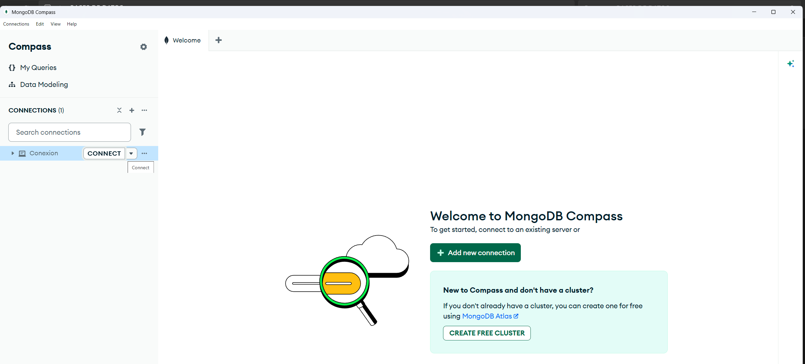
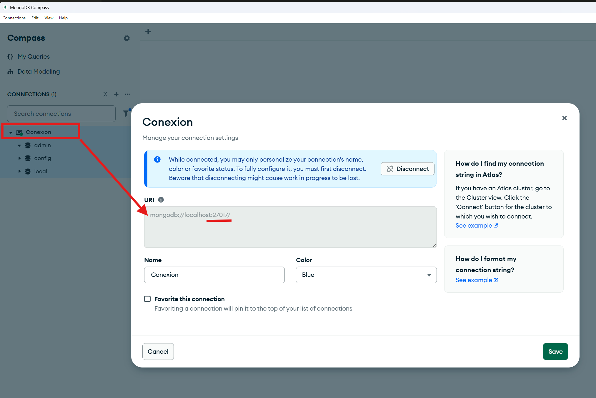
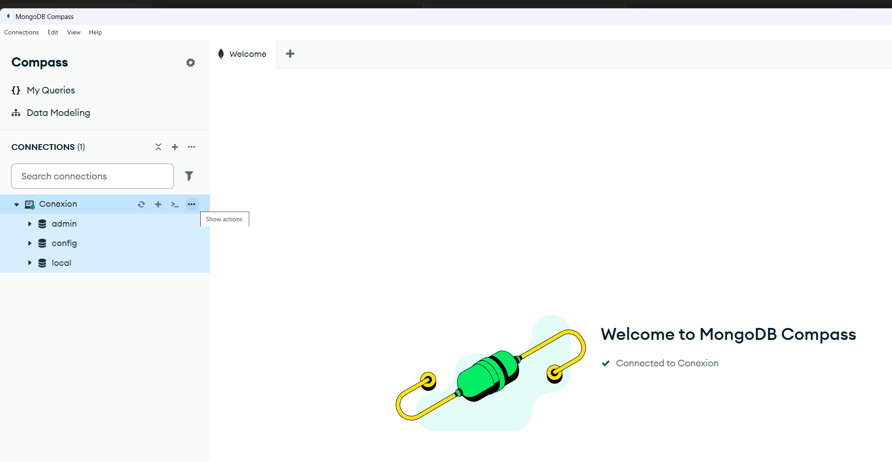
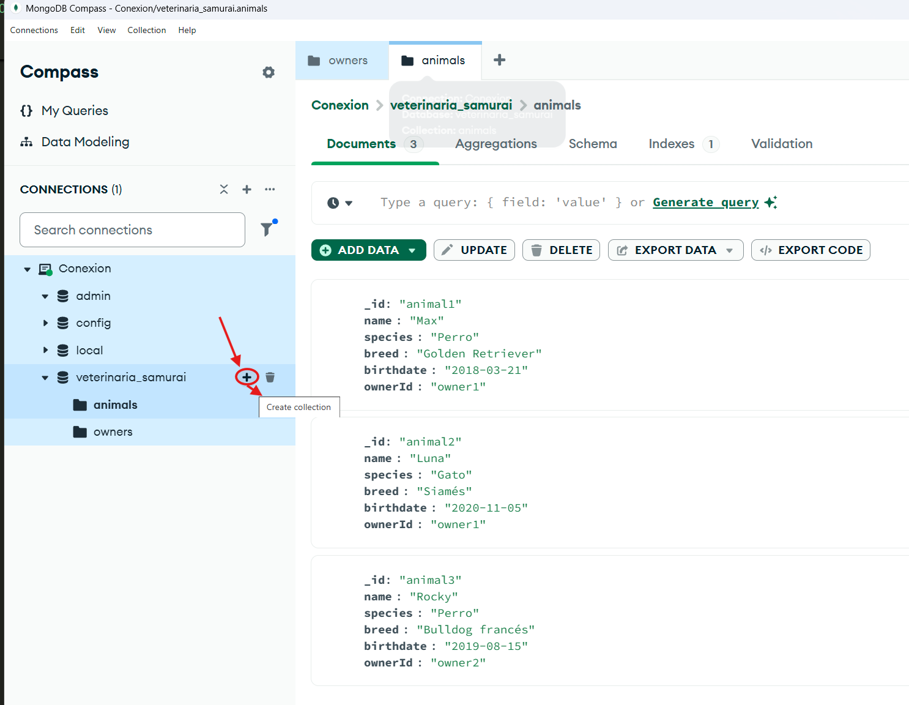
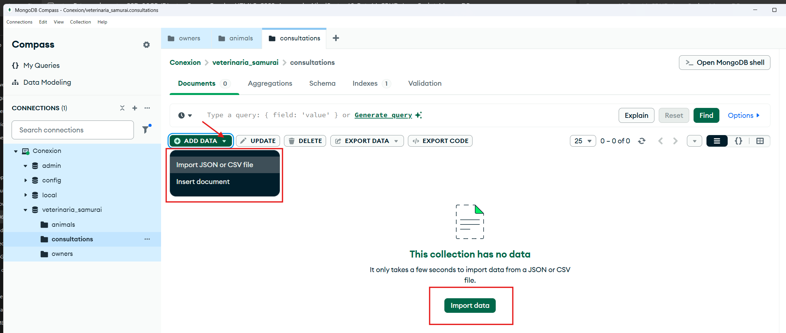

🗺️ Marco de Referencia Global (El Plan de Acción)
Fase 1: Base de Datos (MongoDB) 👈 ¡Estamos aquí!

Instalación/Configuración de MongoDB.

Importación de owners.json, animals.json y consultations.json.

Fase 2: Creación del Proyecto Java + Spring Boot

Generación del proyecto base con las dependencias necesarias.

Explicación de la estructura de carpetas de Spring Boot.

Fase 3: El Modelo de Datos (Entidades)

Creación de las clases Java que representan tus colecciones de Mongo.

Fase 4: La Capa de Persistencia (Repositorios)

Configuración de las interfaces que interactúan con la base de datos.

Fase 5: La Capa de Control (Controladores/API REST)

Creación de los endpoints exigidos por la guía de evaluación.

Fase 6: El Frontend (HTML, CSS Puro con BEM, JavaScript)

Diseño de la interfaz de usuario para consumir tu propia API.

## 🛠️ Fase 1: Importar los archivos JSON a MongoDB (Paso a Paso)
Para gestionar MongoDB de forma visual y ponértelo muy fácil, utilizaremos MongoDB Compass (la herramienta gráfica oficial de Mongo).

Paso 1.1: Descargar e iniciar MongoDB Compass
Si no lo tienes, descarga e instala MongoDB Compass desde la web oficial de MongoDB.
`Antes de MongoDB Compass hay que correr a E:\MongoDB\bin\mongod.exe  (MONGOD) para que se active el puerto 27017.`

Para abrir MongoDB y Mongo Compass genere un archivo .bat asi:

* Se mete en la carpeta E:\MongoDB\bin y  como necesita una carpeta E:\data\db, la cree primero para poder ejecutar el comando mongod.exe --dbpath "E:\data\db" , que se hace con el start para que lo ejecute.
Luego abrimos Mongo Compass , con el start para que lo ejecute: start "" "C:\Users\barbu\AppData\Local\MongoDBCompass\MongoDBCompass.exe".....Demora un ratico para que arranque Mongo y posteriormente Mobo Compass. 

Luego le damos a COB¿NEXION en Mongo Compass y queda establecida conexion a bases de datos.

Aqui el archivo MONGODB_ACTIVACION.bat   ( Se construye como archivo de texto y luego se le cambia la extension de .txt a .bat, para que sea ejecutable.)

ESPERAR HASTA QUE ABRA MONGODB COMPASS
---
```bash
@echo off
chcp 65001 >nul
title Servidor MongoDB y Compass
echo Levantando el servidor de MongoDB en E:\data\db...

:: Cambiamos a la unidad E y arrancamos el servidor en segundo plano
E:
cd E:\MongoDB\bin
start "Servidor MongoDB" mongod.exe --dbpath "E:\data\db"

:: Esperamos 3 segundos para darle tiempo al servidor a arrancar antes de abrir Compass
timeout /t 3 /nobreak >nul

echo Abriendo MongoDB Compass...
:: Arrancamos Compass en su propio proceso independiente
start "" "C:\Users\barbu\AppData\Local\MongoDBCompass\MongoDBCompass.exe"

cls
echo ===================================================
echo   ¡¡¡MongoDB y MongoDB Compass están activados!!!
echo ===================================================
echo Puedes minimizar esta ventana. No la cierres hasta terminar de programar.
pause
```
---

Cuando colocamos el mouse sobre Conexion , aparece mas grande el **CONECT**. Lo pinchamos y hará la conexion.



Para verificar que MongoDB este trabaando podemos aplicar el comando, que al mostrar numeros significa que esta activo. Sino muestra nada significa que MongoDB NO ESTA ACTIVO.:

---
```bash
PS E:\Curso eFundae HTML5_CSS3_Avanzado_Nivel5\16_Reto14_CRUD_Java_Sprint_MongoDB> netstat -ano | findstr 27017
  TCP    127.0.0.1:27017        0.0.0.0:0              LISTENING       26324
  ```
  ---

Para ver el puerto de la conexion , damos boton derecho sobre conexion y mostrara un menú emergente con la conexion.

  





Haz clic en el botón verde "Connect". (Si usas Docker o un servicio en la nube, la URI cambiará, pero si lo tienes local por defecto, esa es la tuya).

Paso 1.2: Crear la Base de Datos y las Colecciones
Una vez dentro de Compass:

En el menú lateral izquierdo o en la pestaña central, busca y haz clic en "Create database" (o el icono del botón +).

Te pedirá dos nombres:

Database Name: Escribe veterinaria_samurai.

Collection Name: Escribe owners (empezaremos por la colección de dueños).

Haz clic en "Create Database".

Paso 1.3: Importar el archivo owners.json
Asegúrate de estar dentro de la base de datos veterinaria_samurai y haz clic sobre la colección owners que acabas de crear.

Verás la pantalla vacía. Busca un botón que dice "Add Data" y selecciona "Import JSON or CSV file".

Selecciona tu archivo owners.json en tu ordenador.

Compass detectará el formato automáticamente. Asegúrate de que la opción JSON está marcada y haz clic en "Import". ¡Listo! Ya tienes tus 2 registros de dueños dentro de Mongo.

Paso 1.4: Crear e importar animals y consultations

Ahora repetiremos el proceso para las otras dos colecciones:

Al lado del nombre de tu base de datos veterinaria_samurai, haz clic en el icono del + (Create Collection).

Nómbrala animals y dale a crear. Entre en ella, dale a Add Data -> Import file y sube animals.json.


Repite el proceso una vez más: crea la colección consultations e importa el archivo consultations.json.

Al terminar, deberías ver en tu Compass la base de datos veterinaria_samurai con tres colecciones independientes y sus respectivos documentos dentro, manteniendo los campos ownerId y animalId como textos conectores.


