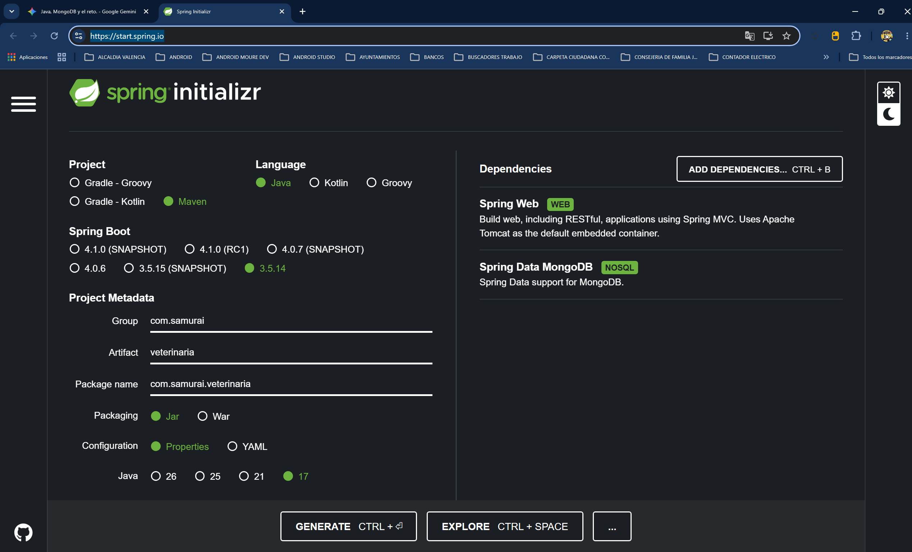
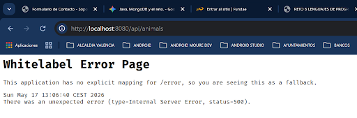
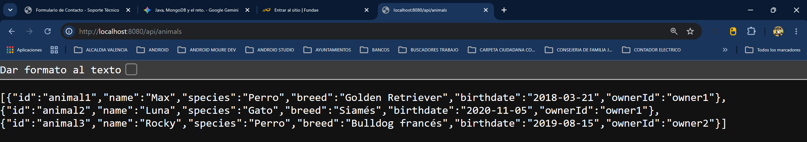
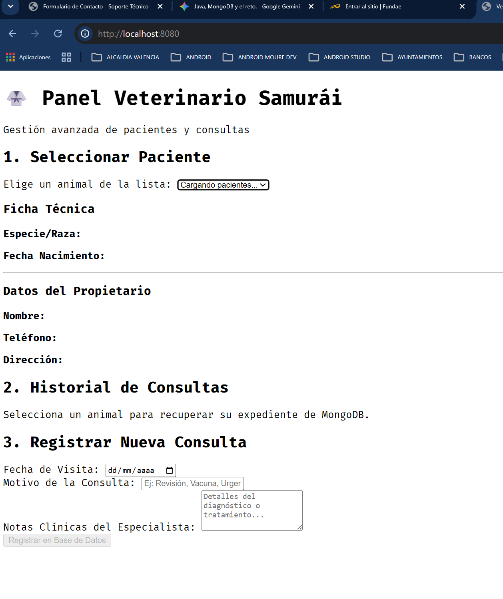
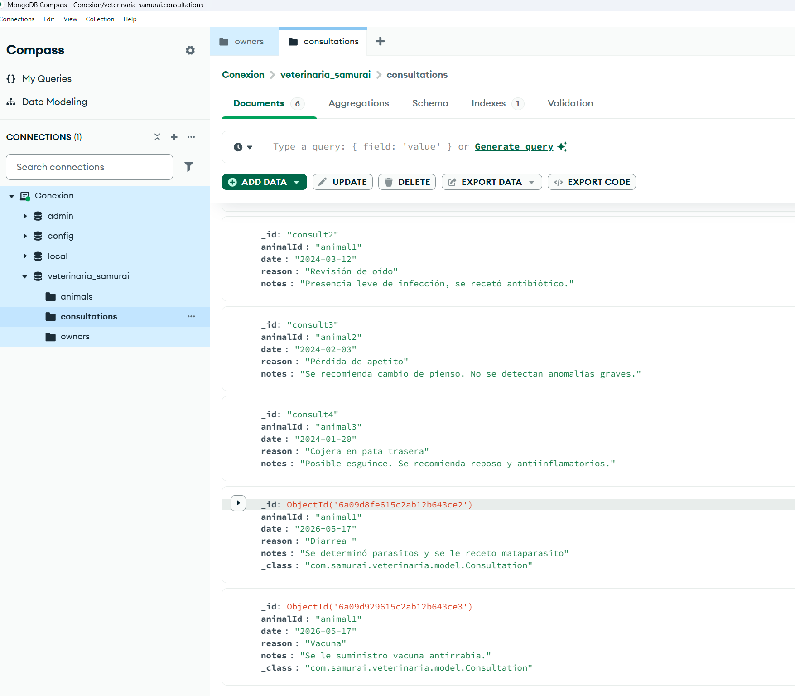

# Fase 2: Creación del proyecto base.

Trabajaremos con Java 17 (LTS) y Visual Studio Code para desarrollar microservicios con Spring Boot.

Para crear un proyecto de Spring Boot desde cero, la comunidad de Java utiliza una herramienta oficial en la nube llamada **Spring Initializr**. Esta web actúa como un "configurador de plantillas" que genera un archivo comprimido .zip con toda la estructura de carpetas estándar y las dependencias listas para abrir en tu editor.

Vamos a configurar el proyecto paso a paso.

## 🛠️ Fase 2: Creación del Proyecto Spring Boot (Paso a Paso)
### Paso 2.1: Configurar Spring Initializr
Abre tu navegador web y entra en: start.spring.io ( https://start.spring.io/)

Configura los campos del panel izquierdo exactamente con estos valores para adaptarlos a tu sistema:

**Project:** Maven (Es el gestor de dependencias estándar en Java).

**Language:** Java.

**Spring Boot:** Elige la versión estable más reciente que NO tenga texto como "(SNAPSHOT)" o "(M1)". Por ejemplo, una versión del estilo 3.2.x o 3.3.x irá perfecta con Java 17.

Project Metadata:

Group: com.samurai (Representa el paquete raíz de tu organización).

Artifact: veterinaria (El nombre de tu aplicación).

Name: veterinaria

Description: API REST para la Veterinaria del Samurái.

Package name: com.samurai.veterinaria

Packaging: Jar.

Java: 17 (Obligatorio seleccionar 17 para que coincida exactamente con tu versión instalada).

Paso 2.2: Añadir las dependencias (Panel Derecho)
En la sección de la derecha verás un botón que dice "ADD DEPENDENCIES...". Haz clic en él y busca y añade estas dos herramientas que necesitaremos obligatoriamente para cumplir con el reto:

Spring Web: Añade todo lo necesario para crear una API REST, manejar los endpoints (como GET /animals) y levantar un servidor interno (Tomcat) en el puerto 8080.

Spring Data MongoDB: El conector oficial que nos facilitará la vida para leer y escribir en tus colecciones de Mongo de forma nativa sin configurar código complejo.

Aqui la configuracion elegida:


Paso 2.3: Generar y Abrir en VS Code
Una vez revisado que todo coincide con la lista anterior, haz clic en el botón inferior grande que dice "GENERATE" (o presiona Ctrl + Enter).

Se descargará un archivo llamado veterinaria.zip.

Descomprime ese archivo .zip en la carpeta de tu disco donde suelas organizar tus proyectos de programación (por ejemplo, en E:\Proyectos\veterinaria).

Abre Visual Studio Code, ve a File > Open Folder... (Archivo > Abrir carpeta) y selecciona la carpeta raíz que acabas de descomprimir.

📁 Entendiendo la Estructura de Carpetas
Al abrir el proyecto en VS Code, verás que Spring Boot ha creado bastantes carpetas. No te asustes, es una estructura limpia y jerárquica muy fácil de entender. La ruta donde pasaremos el 99% de nuestro tiempo programando es:
src/main/java/com/samurai/veterinaria/

Para mantener el proyecto bien organizado , utilizaremos la Arquitectura por Capas. Antes de generar archivos, vamos a crear las 4 carpetas que albergarán nuestro código dentro de la ruta principal.

Por favor, haz clic derecho sobre la carpeta com.samurai.veterinaria en VS Code y crea los siguientes subdirectorios (paquetes):

📁 model: Contendrá las clases Java que representan los datos (las entidades de MongoDB: Animal, Dueño, Consulta).

📁 repository: Contendrá las interfaces encargadas de comunicarse directamente con MongoDB para hacer las consultas (la capa de persistencia).

📁 controller: Contendrá los controladores REST encargados de recibir las peticiones HTTP externas (las rutas del reto) y devolver las respuestas JSON.

Debería quedarte un árbol de directorios con este aspecto visual:

---
```bash
src/
└── main/
    ├── java/
    │   └── com/
    │       └── samurai/
    │           └── veterinaria/
    │               ├── controller/
    │               ├── model/
    │               ├── repository/
    │               └── VeterinariaApplication.java  <-- (Clase principal autogenerada)
    └── resources/
        └── application.properties  <-- (Archivo de configuración global)
```
---

## ✋ Siguiente decisión: Enlazar con tu base de datos
Ya tenemos el esqueleto listo en el editor. El siguiente paso técnico es decirle a Spring Boot dónde encontrar tu servidor de MongoDB que automatizaste con el archivo .bat.

Antes de empezar a codificar las entidades de la Fase 3, abre el archivo application.properties (lo encontrarás dentro de la carpeta src/main/resources/). Está completamente vacío.

Para que el framework sepa conectarse, añade estas tres líneas de configuración:

---
```
# Nombre de la base de datos que creaste en MongoDB Compass
spring.data.mongodb.database=veterinaria_samurai

# Dirección local del servidor de Mongo
spring.data.mongodb.host=localhost

# Puerto estándar que verificamos que estaba escuchando en tu CMD
spring.data.mongodb.port=27017
```
---

Guarda el archivo. Cuando lo tengas listo y las carpetas creadas en tu VS Code, pasamos a diseñar la primera clase Java en la Fase 3 (El Modelo).

# Fase 3: El Modelo de Datos (Entidades).

En esta fase vamos a crear las clases Java que representarán de forma exacta los documentos que importamos en MongoDB. Como estamos utilizando Spring Data MongoDB, usaremos un mapeo directo a través de anotaciones (palabras clave con @ que le dan superpoderes a nuestras clases).

A diferencia de las bases de datos relacionales tradicionales (donde se usa @Entity), en MongoDB usaremos la anotación @Document. Esto le dice a Spring: "Oye, esta clase de Java equivale a una colección entera en nuestra base de datos No Relacional".

**Vamos a crear las tres entidades una a una dentro de la carpeta model.**

## Paso 3.1: Entidad Dueño (Owner.java)
Crea un archivo llamado Owner.java dentro de la carpeta src/main/java/com/samurai/veterinaria/model/ y añade el siguiente código. Fíjate bien en los comentarios explicativos:

---
```java
package com.samurai.veterinaria.model;

import org.springframework.data.annotation.Id;
import org.springframework.data.mongodb.core.mapping.Document;

// Le indicamos a Spring que esta clase representa a la colección "owners" de MongoDB
@Document(collection = "owners")
public class Owner {

    // La anotación @Id le dice a MongoDB que esta propiedad es el campo clave "_id"
    @Id
    private String id; 
    
    private String name;     // Coincide con "name" del JSON
    private String address;  // Coincide con "address" del JSON
    private String phone;    // Coincide con "phone" del JSON

    // --- CONSTRUCTORES ---
    // Constructor vacío obligatorio para que Spring pueda deserializar el JSON de Mongo
    public Owner() {
    }

    // Constructor completo útil para cuando queramos crear objetos manualmente
    public Owner(String id, String name, String address, String phone) {
        this.id = id;
        this.name = name;
        this.address = address;
        this.phone = phone;
    }

    // --- GETTERS Y SETTERS ---
    // Permiten a Spring Web y Spring Data leer y escribir en los campos privados
    public String getId() {
        return id;
    }

    public void setId(String id) {
        this.id = id;
    }

    public String getName() {
        return name;
    }

    public void setName(String name) {
        this.name = name;
    }

    public String getAddress() {
        return address;
    }

    public void setAddress(String address) {
        this.address = address;
    }

    public String getPhone() {
        return phone;
    }

    public void setPhone(String phone) {
        this.phone = phone;
    }
}
```

## Paso 3.2: Entidad Animal (Animal.java)
Ahora crea el archivo Animal.java en la misma carpeta. Aquí es donde empezamos a ver cómo se manejan las relaciones No Relacionales en el código. En lugar de hacer una relación compleja, guardamos el identificador del dueño directamente como una propiedad de tipo texto (ownerId).

---
```java
package com.samurai.veterinaria.model;

import org.springframework.data.annotation.Id;
import org.springframework.data.mongodb.core.mapping.Document;

@Document(collection = "animals")
public class Animal {

    @Id
    private String id; // Mapea con el "_id" del JSON (ej: "animal1")
    
    private String name;
    private String species;
    private String breed;
    private String birthdate;
    
    // Relación lógica: Guardamos simplemente el String del ID del dueño.
    // No usamos claves foráneas del motor, la consistencia la manejará nuestra API.
    private String ownerId;

    // --- CONSTRUCTORES ---
    public Animal() {
    }

    public Animal(String id, String name, String species, String breed, String birthdate, String ownerId) {
        this.id = id;
        this.name = name;
        this.species = species;
        this.breed = breed;
        this.birthdate = birthdate;
        this.ownerId = ownerId;
    }

    // --- GETTERS Y SETTERS ---
    public String getId() {
        return id;
    }

    public void setId(String id) {
        this.id = id;
    }

    public String getName() {
        return name;
    }

    public void setName(String name) {
        this.name = name;
    }

    public String getSpecies() {
        return species;
    }

    public void setSpecies(String species) {
        this.species = species;
    }

    public String getBreed() {
        return breed;
    }

    public void setBreed(String breed) {
        this.breed = breed;
    }

    public String getBirthdate() {
        return birthdate;
    }

    public void setBirthdate(String birthdate) {
        this.birthdate = birthdate;
    }

    public String getOwnerId() {
        return ownerId;
    }

    public void setOwnerId(String ownerId) {
        this.ownerId = ownerId;
    }
}
```
---

## Paso 3.3: Entidad Consulta (Consultation.java)
Por último, crea el archivo Consultation.java en la misma carpeta. Al igual que con el animal, enlazamos esta consulta a su paciente guardando el campo animalId.

---
```java
package com.samurai.veterinaria.model;

import org.springframework.data.annotation.Id;
import org.springframework.data.mongodb.core.mapping.Document;

@Document(collection = "consultations")
public class Consultation {

    @Id
    private String id; // Mapea con el "_id" del JSON (ej: "consult1")
    
    // Relación lógica: Identificador del animal al que se le hace la consulta
    private String animalId;
    
    private String date;
    private String reason;
    private String notes; // Coincide con el campo "notes" de tu JSON

    // --- CONSTRUCTORES ---
    public Consultation() {
    }

    public Consultation(String id, String animalId, String date, String reason, String notes) {
        this.id = id;
        this.animalId = animalId;
        this.date = date;
        this.reason = reason;
        this.notes = notes;
    }

    // --- GETTERS Y SETTERS ---
    public String getId() {
        return id;
    }

    public void setId(String id) {
        this.id = id;
    }

    public String getAnimalId() {
        return animalId;
    }

    public void setAnimalId(String animalId) {
        this.animalId = animalId;
    }

    public String getDate() {
        return date;
    }

    public void setDate(String date) {
        this.date = date;
    }

    public String getReason() {
        return reason;
    }

    public void setReason(String reason) {
        this.reason = reason;
    }

    public String getNotes() {
        return notes;
    }

    public void setNotes(String notes) {
        this.notes = notes;
    }
}
```
---

## Otra Forma Moderna de hacer los modelos.

La estrucura de los modelos planteados ( Animal, Owner...) es  la arquitectura estándar de Spring: usar clases tradicionales con métodos estructurados y es lo más común en proyectos de nivel intermedio.

En Java moderno (a partir de la versión 14), existe una funcionalidad llamada `record` que sirve para simplificar las clases de datos eliminando la necesidad de escribir manualmente los constructores, getters y setters. 

En las bases de datos No Relacionales como MongoDB, el modelo de datos más complejo y avanzado surge cuando decidimos `embeber (anidar) unos datos dentro de otros en lugar de usar IDs sueltos.`

`De las tres entidades que hemos hecho en forma tradicional, la que mejor se presta a esto es Animal, ya que un animal "contiene" de forma natural sus consultas.`

#### Veamos porque animal "contiene" de forma natural sus consultas:
Por qué decimos que un animal "contiene de forma natural" sus consultas y dónde se ve eso exactamente.

1. El concepto de "Contener de forma natural" (La vida real vs. El diseño de software)
Cuando pensamos en el mundo real, una consulta veterinaria no tiene sentido de forma independiente. No puedes tener una "vacunación anual" flotando en el espacio si no pertenece a un perro o un gato concreto. La consulta nace, existe y muere ligada a un animal.

En el modelado de datos, cuando una entidad depende tanto de otra que no tiene identidad propia por separado, `decimos que el padre (Animal) contiene al hijo (Consulta).`

2. ¿Dónde se identifica esto en el Modelo de Datos?
Como estamos en MongoDB (No Relacional), tenemos la libertad de elegir cómo representar esa relación en el software. Y aquí es donde chocan los dos caminos que explicamos antes.

Vamos a ver exactamente dónde se identifica la contención en cada modelo usando la estructura del código y de los datos:

Enfoque A: El Modelo Embebido (Anidado) - [Ver el codigo un poco mas abajo.]
Aquí es donde se ve de forma explícita y directa que el animal contiene las consultas.

Si miramos el código de la clase Java que esta mas abajo, de ejemplo (AnimalAvanzado), la contención se identifica en esta línea:

---
```java
private List<Consultation> consultations;
```
---

En tu modelo de Java, el objeto Animal tiene una propiedad que es una lista real de objetos Consulta. No guarda textos ni números identificadores; guarda las consultas enteras dentro de sí mismo.

Si abriéramos MongoDB Compass con este enfoque, el documento JSON de un animal se vería así:

---
```json
{
  "_id": "animal1",
  "name": "Max",
  "species": "Perro",
  "consultations": [  // <--- ¡AQUÍ ESTÁ LA CONTENCIÓN REAL!
    {
      "date": "2024-01-10",
      "reason": "Vacunación anual",
      "notes": "Todo en orden."
    },
    {
      "date": "2024-05-12",
      "reason": "Corte de uñas",
      "notes": "Se portó bien."
    }
  ]
}
```
---
Como vemos, la colección consultations desaparece de la base de datos. Solo existe la colección de animales, y cada animal lleva su mochila de consultas incrustada dentro.

Enfoque B: El Modelo Referenciado (El que estamos haciendo)
Aquí la contención es "lógica" o "implícita", no física.

En los archivos JSON reales que descargué del curso, los diseñadores decidieron no embeber los datos. Decidieron separar las consultas en su propia colección independiente.

¿Dónde identificamos entonces que la consulta pertenece a un animal? Se identifica en la clase Consultation.java (o en su JSON correspondiente) gracias a este campo:

```Java
private String animalId; // ej: "animal1"
```

En este enfoque, físicamente el animal no contiene sus consultas en la base de datos. **Están en archivos separados.** Pero lógicamente sabemos que le pertenecen porque cada consulta lleva grabado el nombre del animal (animalId) al que se le hizo la consulta.

Para obtener todas las consultas de Max, tu backend de Java tiene que hacer un trabajo de detective: ir a la colección de consultas y buscar todas las que tengan escrito "animalId": "animal1". Por eso en la Fase 4, que veremos un poco mas adelante,  tuvimos que crear el método especial:

---
```Java
List<Consultation> findByAnimalId(String animalId);
```
---
Resumen :
¿Dónde se ve que el animal contiene las consultas?  
En la lógica del negocio (una consulta siempre es de un animal) y, si eliges el modelo embebido, se ve físicamente dentro del JSON del animal como un array de objetos.

¿Cómo lo maneja la forma en que lo estamos haciendo? Mediante el modelo referenciado. El animal y la consulta están separados, pero se reconocen mutuamente gracias a la propiedad animalId que apunta al paciente.

Entonces, con lo anterior, vemos la diferencia entre que un objeto contenga físicamente a otro o que simplemente lo apunte con un "ID" de referencia y en el siguiente punto un ejemplo de como seria el modelo de datos animal incluyendo las consultas en su interior ( NO tener un documento: Una tabla por separado: Solo los documentos Animal y Owner)


### El Modelo Avanzado: Relaciones Embebidas en MongoDB
En el mundo real, si un desarrollador senior diseñara esta base de datos en Mongo puro, probablemente no crearía una colección independiente para las consultas. Como las consultas no tienen sentido si no existen los animales, metería el historial de consultas directamente dentro del documento del animal como una lista (un Array de objetos).

Mira este diagrama para ver visualmente la diferencia entre lo que estamos haciendo (Referenciado) y la alternativa compleja (Embebido):

Así es como se vería el código en Java si usáramos este enfoque avanzado para la entidad Animal:

---
```
package com.samurai.veterinaria.model;

import org.springframework.data.annotation.Id;
import org.springframework.data.mongodb.core.mapping.Document;
import java.util.List; // Importamos las listas de Java

@Document(collection = "animals_avanzado")
public class AnimalAvanzado {

    @Id
    private String id;
    private String name;
    private String species;
    private String breed;
    private String birthdate;
    private String ownerId; // Sigue referenciando al dueño por ID

    // LO COMPLEJO: En lugar de un String con un ID, el animal tiene una 
    // lista real que contiene objetos enteros de tipo Consultation.
    private List<Consultation> consultations;

    // --- CONSTRUCTORES ---
    public AnimalAvanzado() {
    }

    public AnimalAvanzado(String id, String name, String species, String breed, String birthdate, String ownerId, List<Consultation> consultations) {
        this.id = id;
        this.name = name;
        this.species = species;
        this.breed = breed;
        this.birthdate = birthdate;
        this.ownerId = ownerId;
        this.consultations = consultations; // Se asigna la lista completa de consultas
    }

    // --- GETTERS Y SETTERS EXTRA PARA LA LISTA ---
    public List<Consultation> getConsultations() {
        return consultations;
    }

    public void setConsultations(List<Consultation> consultations) {
        this.consultations = consultations;
    }
    
    // El resto de getters y setters de los demás campos irían aquí debajo...
}

```
---

¿Por qué es más complejo este enfoque?
En la Base de Datos: Cuando miras MongoDB Compass, el documento del perro Max tendría un desplegable interno con todas sus visitas al veterinario.

En el Código Java: Para añadir una nueva consulta, primero tendrías que buscar al Animal en la base de datos, extraer su lista de consultas con .getConsultations(), hacerle un .add(nuevaConsulta) en Java y luego volver a guardar el animal entero modificado.

Para nuestro reto no usaremos este modelo avanzado, ya que los archivos JSON vienen separados de forma tradicional (referenciados por ID). Guardare este ejemplo en para cuando vea proyectos de MongoDB más masivos.

# 🗺️ Avanzamos a la Fase 4: La Capa de Persistencia (Los Repositorios)
Ahora que las tres clases de la Fase 3 (Owner, Animal y Consultation) están guardadas con la estructura clásica, vamos a crear el puente de comunicación entre Java y MongoDB.

En Spring Boot, esto se hace creando Interfaces en la carpeta repository. Lo maravilloso de Spring Data Mongo es que no tenemos que escribir las consultas de base de datos a mano; **el framework nos regala todo el CRUD básico si heredamos de una interfaz llamada MongoRepository.**

Vamos a crear tres archivos dentro de tu carpeta src/main/java/com/samurai/veterinaria/repository/:

Paso 4.1: Repositorio de Dueños (OwnerRepository.java)
Crea este archivo e introduce el siguiente código:

---
```java
package com.samurai.veterinaria.repository;

import com.samurai.veterinaria.model.Owner;
import org.springframework.data.mongodb.repository.MongoRepository;
import org.springframework.stereotype.Repository;

// @Repository le dice a Spring que esta clase maneja el acceso a la base de datos
@Repository
public interface OwnerRepository extends MongoRepository<Owner, String> {
    // Al heredar de MongoRepository<Owner, String>, Spring genera automáticamente
    // métodos como: findAll(), findById(), save(), deleteById()... 
    // ¡No hace falta escribir código aquí dentro para el CRUD básico!
}

```
---
Paso 4.2: Repositorio de Animales (AnimalRepository.java)
Crea este archivo de igual manera:

```java
package com.samurai.veterinaria.repository;

import com.samurai.veterinaria.model.Animal;
import org.springframework.data.mongodb.repository.MongoRepository;
import org.springframework.stereotype.Repository;

@Repository
public interface AnimalRepository extends MongoRepository<Animal, String> {
    // Al igual que el anterior, maneja de forma automática la colección "animals"
}
```

Paso 4.3: Repositorio de Consultas (ConsultationRepository.java)
Aquí viene una pequeña excepción. La guía de evaluación nos pide explícitamente un endpoint que sea GET /consultations/:animalId. Es decir, buscar consultas filtradas por el ID del animal. Como este no es un método CRUD estándar general, debemos declararlo explícitamente usando la magia de los Query Methods de Spring.

Crea este archivo:

---
```java
package com.samurai.veterinaria.repository;

import com.samurai.veterinaria.model.Consultation;
import org.springframework.data.mongodb.repository.MongoRepository;
import org.springframework.stereotype.Repository;
import java.util.List;

@Repository
public interface ConsultationRepository extends MongoRepository<Consultation, String> {

    // QUERY METHOD MÁGICO: Spring lee el nombre del método "findByAnimalId".
    // Automáticamente deduce que tiene que hacer un filtro en la colección 
    // "consultations" buscando aquellos documentos donde el campo "animalId" 
    // coincida con el String que le pasemos por parámetro. ¡Y devuelve una lista!
    List<Consultation> findByAnimalId(String animalId);
}
```
---

Revisemos rápidamente: en carpeta src/main/java/com/samurai/veterinaria/repository/ ya deberías tener creados los tres archivos interfaces que actúan como "puentes mágicos" hacia MongoDB:

OwnerRepository.java (Vacío por dentro, heredando todo el CRUD automático).

AnimalRepository.java (Igual que el anterior, enfocado en los animales).

ConsultationRepository.java (Con nuestro método personalizado List<Consultation> findByAnimalId(String animalId);).


# 🛠️ Fase 5: La Capa de Control (Los Controladores / API REST)
Aquí es donde el backend abre sus ventanas al mundo exterior. Vamos a crear un controlador que "escuche" las peticiones HTTP que vengan desde el navegador o desde herramientas como Postman, ejecute la lógica llamando a los repositorios que acabamos de validar, y devuelva las respuestas en formato JSON.

Para cumplir rigurosamente con la guía de evaluación, necesitamos implementar exactamente estas 4 rutas:

GET /animals -> Lista todos los animales.

GET /owners -> Lista todos los dueños.

POST /consultations -> Registra una nueva consulta.

GET /consultations/:animalId -> Devuelve las consultas de un animal específico.

Crea un archivo llamado VetController.java dentro de la carpeta src/main/java/com/samurai/veterinaria/controller/ y añade este código completamente estructurado y comentado:

# ✋ Siguiente decisión: ¡Arrancar y Probar el Backend!
¡Con esto la API REST está 100% completada y escrita! Hemos cerrado las fases del Backend.

Antes de saltar a la Fase 6: El Frontend (HTML, CSS BEM, JS), es una norma sagrada en desarrollo verificar que el motor funciona de verdad. Si el backend falla, el frontend no pintará nada.

Para probarlo:

Asegúrate de tener tu script .bat corriendo de fondo (MongoDB y Compass encendidos).

En VS Code, abre la clase principal del proyecto que se encuentra en la raíz: **VeterinariaApplication.java**.

Verás que encima del método public static void main aparece un botoncito de texto flotante que dice "Run" o "Debug" (gracias a las extensiones de Java de VS Code). Haz clic en Run.

La consola inferior de VS Code se llenará de texto y, si todo va bien, al final dirá algo como Started VeterinariaApplication in X seconds (JVM running...).

¿Cómo prefieres que hagamos la prueba de fuego de los endpoints antes de programar la interfaz visual?

Opción A: Te enseño a usar una extensión rápida dentro del propio VS Code (como Thunder Client o archivos .http) para lanzar las peticiones simuladas y ver las listas de tus JSON en pantalla.

Opción B: Si tienes Postman instalado en tu ordenador (como sugiere Patricia en el vídeo), te guío sobre cómo estructurar las pestañas para testear el GET y el POST.

Al tratar de correr VeterinariaApplication.java generó errores:

---
```bash
"l tratar de correr VeterinariaApplication.java genero errores:

"PS E:\Curso eFundae HTML5_CSS3_Avanzado_Nivel5\16_Reto14_CRUD_Java_Sprint_MongoDB\veterinaria\veterinaria\src\main\java\com\samurai\veterinaria> cd "e:\Curso eFundae HTML5_CSS3_Avanzado_Nivel5\16_Reto14_CRUD_Java_Sprint_MongoDB\veterinaria\veterinaria\src\main\java\com\samurai\veterinaria\" ; if ($?) { javac VeterinariaApplication.java } ; if ($?) { java VeterinariaApplication }

VeterinariaApplication.java:3: error: package org.springframework.boot does not exist

import org.springframework.boot.SpringApplication;

                               ^

VeterinariaApplication.java:4: error: package org.springframework.boot.autoconfigure does not exist

import org.springframework.boot.autoconfigure.SpringBootApplication;

                                             ^

VeterinariaApplication.java:6: error: cannot find symbol

@SpringBootApplication

 ^

  symbol: class SpringBootApplication

VeterinariaApplication.java:10: error: cannot find symbol

                SpringApplication.run(VeterinariaApplication.class, args);

                ^

  symbol:   variable SpringApplication

  location: class VeterinariaApplication

4 errors"
```
---

Este error es súper común cuando se empieza con frameworks como Spring Boot.

¿Por qué ocurre este error? (El análisis)
El error te dice que paquetes como org.springframework.boot no existen. Lo que está pasando es que la consola de VS Code está intentando compilar el archivo suelto usando el comando primitivo de Java (javac VeterinariaApplication.java).

javac solo sabe compilar archivos de Java básicos y planos. No tiene ni idea de qué es Spring Boot, dónde están las librerías que configuramos en Spring Initializr, ni cómo buscar el archivo pom.xml que gestiona todo el proyecto. Al intentar compilar la clase principal de forma aislada, se vuelve loco porque no encuentra el framework por ninguna parte.

La solución: Ejecutar el proyecto a través de Maven
Los proyectos de Spring Boot nunca se compilan con javac a mano. Se gestionan siempre a través de Maven (el motor que descargó Spring Initializr).

Vamos a solucionarlo usando la forma correcta de arrancar proyectos en VS Code. Tienes dos opciones, escoge la que te resulte más cómoda:

Opción A: Usando los comandos de la terminal (La más directa)
En tu VS Code, abre una terminal limpia (Terminal > New Terminal).

Asegúrate de estar en la raíz del proyecto (donde se encuentra el archivo pom.xml). Viendo tu ruta, tendrás que retroceder un par de carpetas usando cd .. o abrir directamente la terminal ahí. Sabrás que estás en el sitio correcto si ejecutas ls o dir y ves el archivo pom.xml.

Ejecuta este comando mágico de Maven que se encarga de descargar las dependencias y arrancar el servidor limpiamente:

```Bash
./mvnw spring-boot:run
```

(Si estás en una consola CMD tradicional de Windows en vez de PowerShell, escribe mvnw spring-boot:run sin el ./ inicial).

Opción B: Usando el botón visual de VS Code (La más cómoda para el día a día)
Para que el botón flotante "Run" de VS Code funcione bien con Spring Boot, necesitas tener instalado el paquete de extensiones oficial de Java.

Ve al menú de Extensiones en el lateral izquierdo de VS Code (el icono de los cuatro cuadraditos).

Busca e instala el pack llamado: Extension Pack for Java (de Microsoft).

Busca e instala también: Spring Boot Extension Pack (de VMware).

Una vez instaladas, cierra y vuelve a abrir VS Code con la carpeta raíz de tu proyecto.

Verás que en el menú lateral izquierdo te aparecerá un nuevo panel abajo llamado "SPRING BOOT DASHBOARD".

Simplemente despliega el menú, verás tu proyecto veterinaria y un icono de "Play" (Arrancar) al lado. Haz clic ahí.

✋ Comprobación
Prueba a lanzarlo con la Opción A (el comando ./mvnw spring-boot:run) que nunca falla. Verás cómo empieza a descargar cosas de internet (la primera vez tarda un poco porque baja todo el framework de Spring) y finalmente se quedará el servidor escuchando sin errores.

Efectivamente probé :


```Bash
./mvnw spring-boot:run
```

que genero muchas lineas en la consola ( ejecutada en la carepta Veterinaria):

```bash
2026-05-17T12:53:23.072+02:00  INFO 8404 --- [veterinaria] [           main] o.s.b.w.embedded.tomcat.TomcatWebServer  : Tomcat started on port 8080 (http) with context path '/'
2026-05-17T12:53:23.077+02:00  INFO 8404 --- [veterinaria] [           main] c.s.veterinaria.VeterinariaApplication   : Started VeterinariaApplication in 1.519 seconds (process running for 1.719)

```
...que al finalizar con "Started VeterinariaApplication in 1.519 seconds (process running for 1.719)" significa que esta trabajando el servidor: 
Spring Boot ha arrancado su servidor interno (Tomcat), ha leído tus configuraciones, se ha conectado con éxito a tu base de datos de MongoDB en el disco E: y se ha quedado escuchando en el puerto estándar 8080. ( Hemos levantado la API REST con Spring Boot) 

# 🧪 La Prueba de Fuego (Testear los Endpoints)
Antes de saltar a diseñar la interfaz visual en la Fase 6, vamos a hacer una comprobación rápida para verificar que Java realmente está extrayendo los datos de MongoDB y devolviendo los JSON correctamente.

Como no me especificaste si preferías usar Postman o algo interno, vamos a usar el método más rápido y universal que existe: tu propio navegador web. Dado que son peticiones GET, cualquier navegador (Chrome, Edge, Firefox) puede actuar como cliente.

Abre una pestaña en tu navegador web y escribe la siguiente dirección:

```bash
http://localhost:8080/api/animals
```

¿Qué deberías ver en la pantalla?
Debería aparecerte en texto plano el contenido exacto de tu archivo animals.json (el perro Max, etc.), pero servido directamente por tu aplicación Java.

Luego, prueba con estas dos direcciones en otras pestañas:

http://localhost:8080/api/owners (Debería mostrar a Laura Gómez y los demás dueños).

http://localhost:8080/api/consultations/animal1 (Debería filtrar y mostrar únicamente las consultas que pertenezcan al animal1).

# ERROR AL TRATAR DE CORRER 
Al colocar en el navegador http://localhost:8080/api/animals me dio error:



Entre en Mongo Compass y NO abria los Documento ( Tablas ). Estaba guindado.
Resetee el computador y volvi a:

Activar MongoDB y Mongo Compass ( Con el archivo .bat que los activa a ambos).

Luego hay que correr en la terminal, en la carpeta veterinaria ( donde esta el archivo pom.xml) el comando :

```bash
PS E:\Curso eFundae HTML5_CSS3_Avanzado_Nivel5\16_Reto14_CRUD_Java_Sprint_MongoDB\veterinaria\veterinaria> ./mvnw spring-boot:run
```

es decir, escribir `./mvnw spring-boot:run` y [Enter]

Veremos muchas x muchas lineas y terminara algo asi:

```bash
....Initializing Servlet 'dispatcherServlet'
2026-05-17T13:29:47.029+02:00  INFO 27000 --- [veterinaria] [nio-8080-exec-1] o.s.web.servlet.DispatcherServlet        : Completed initialization in 0 ms
```
Eso significa que esta inicializado....entonces vamos al navegador y escribimos por ejemplo:

http://localhost:8080/api/animals  y si corre bien mostrara la informacion del documento animals como se ve en la imagen:



Tambien podemos probar en el navegador colocando :  
Luego, prueba con estas dos direcciones en otras pestañas:

http://localhost:8080/api/owners (Debería mostrar a Laura Gómez y los demás dueños).

http://localhost:8080/api/consultations/animal1 (Debería filtrar y mostrar únicamente las consultas que pertenezcan al animal1).


✋ Siguiente Paso: Fase 6 - El Frontend (HTML, CSS Puro con BEM y JS)
Si el navegador te muestra los datos en formato JSON, significa que el puente está perfecto. Ya podemos pasar al último criterio de la guía de evaluación: Crear la interfaz de usuario.

Para cumplir con tus preferencias de desarrollo, lo haremos con:

HTML5 semántico y limpio.

CSS3 Puro (sin frameworks como Bootstrap) utilizando la metodología BEM (bloque__elemento--modificador) para nombrar las clases de forma profesional.

JavaScript nativo (Vanilla JS) con manipulación del DOM para hacer los fetch a tu API.

Para mantener el proyecto bien ordenado, las buenas prácticas de Spring Boot nos dicen que los archivos de la interfaz gráfica deben guardarse dentro de la carpeta del backend, concretamente en:
src/main/resources/static/

# 🎨 Fase 6: El Frontend (HTML5, CSS3 con BEM y JavaScript)
Entramos en la fase final del reto. Para cumplir las buenas prácticas de organización que pide Patricia en el curso, el servidor interno de Spring Boot está configurado para servir archivos estáticos de manera directa si los metemos en la carpeta correcta.

Por favor, ve a la carpeta src/main/resources/static/ en tu VS Code (debería estar vacía por ahora) y crea estos tres archivos esenciales para levantar la interfaz visual:

index.html

styles.css

app.js

Vamos a construir la estructura del documento interactivo paso a paso, empezando por los cimientos: el código estructurado de marcado.

Paso 6.1: El Esqueleto Semántico (index.html)
Abre tu archivo index.html y pega el siguiente código. Está diseñado con etiquetas semánticas claras (<header>, <main>, <section>) y nombres de clases preparados bajo la metodología BEM (bloque__elemento) para que estilarlo sea muy fluido:

```html
<!DOCTYPE html>
<html lang="es">
<head>
    <meta charset="UTF-8">
    <meta name="viewport" content="width=device-width, initial-scale=1.0">
    <title>Veterinaria del Samurái - Panel de Control</title>
    <link rel="stylesheet" href="styles.css">
</head>
<body class="vet-app">

    <header class="vet-header">
        <h1 class="vet-header__title">🥋 Panel Veterinario Samurái</h1>
        <p class="vet-header__subtitle">Gestión avanzada de pacientes y consultas</p>
    </header>

    <main class="vet-main">
        <section class="vet-section card">
            <h2 class="vet-section__title">1. Seleccionar Paciente</h2>
            <div class="control-group">
                <label for="animal-select" class="control-group__label">Elige un animal de la lista:</label>
                <select id="animal-select" class="control-group__select">
                    <option value="">Cargando pacientes...</option>
                </select>
            </div>
            
            <div id="details-box" class="details-box details-box--hidden">
                <h3 class="details-box__subtitle">Ficha Técnica</h3>
                <p><strong>Especie/Raza:</strong> <span id="info-specie"></span></p>
                <p><strong>Fecha Nacimiento:</strong> <span id="info-birth"></span></p>
                <hr class="details-box__divider">
                <h3 class="details-box__subtitle">Datos del Propietario</h3>
                <p><strong>Nombre:</strong> <span id="info-owner-name"></span></p>
                <p><strong>Teléfono:</strong> <span id="info-owner-phone"></span></p>
                <p><strong>Dirección:</strong> <span id="info-owner-address"></span></p>
            </div>
        </section>

        <section class="vet-section card">
            <h2 class="vet-section__title">2. Historial de Consultas</h2>
            <div id="consultations-container" class="history-list">
                <p class="history-list__placeholder">Selecciona un animal para recuperar su expediente de MongoDB.</p>
            </div>
        </section>

        <section class="vet-section card">
            <h2 class="vet-section__title">3. Registrar Nueva Consulta</h2>
            <form id="consultation-form" class="vet-form">
                <div class="vet-form__group">
                    <label for="form-date" class="vet-form__label">Fecha de Visita:</label>
                    <input type="date" id="form-date" class="vet-form__input" required>
                </div>
                
                <div class="vet-form__group">
                    <label for="form-reason" class="vet-form__label">Motivo de la Consulta:</label>
                    <input type="text" id="form-reason" class="vet-form__input" placeholder="Ej: Revisión, Vacuna, Urgencia" required>
                </div>

                <div class="vet-form__group">
                    <label for="form-notes" class="vet-form__label">Notas Clínicas del Especialista:</label>
                    <textarea id="form-notes" class="vet-form__textarea" rows="4" placeholder="Detalles del diagnóstico o tratamiento..." required></textarea>
                </div>

                <button type="submit" id="btn-submit" class="vet-form__button" disabled>Registrar en Base de Datos</button>
            </form>
        </section>
    </main>

    <script src="app.js"></script>
</body>
</html>

```

¿Cómo interactuará este frontend?
Al abrir la web, JavaScript consumirá GET /api/animals para llenar el elemento <select>.

Al elegir un animal (ej: Max), se buscará su correspondencia con los dueños (GET /api/owners) para pintar sus datos personales en la ficha técnica, y paralelamente se llamará al endpoint dinámico de consultas GET /api/consultations/animal1 para listar las visitas médicas existentes.

El formulario permitirá escribir una nueva nota clínica y, al enviarla, disparará un POST /api/consultations para guardarla en caliente en tu base de datos No Relacional de MongoDB.

✋ Siguiente paso: Estilado CSS Puro con BEM
Antes de dotar de vida a la interfaz con JavaScript, necesitamos aplicarle la capa estética utilizando CSS Puro y selectores planos basados en las clases que acabamos de definir, evitando selectores anidados masivos para garantizar un alto rendimiento.

# QUE PASA SI CORREMOS LA APLICACION.
1. Debe estar arrancado MongoDB ( MonDB Compass es opcional para ver los documentos) que yo lo hago con el archivo .bat

2. Luego vamos a la carpeta veterinaria del proyecto, donde esta ubicado el archivo pom.xml y en la terminal escribimos:

---
```bash
./mvnw spring-boot:run
```
---


Ver que al acceder a http://localhost:8080 ya te pinta tu código HTML significa que has colocado el archivo index.html exactamente en el sitio correcto (src/main/resources/static/). ¡Eso está impecable!

Asi se mostrará:


Sin embargo, el motivo por el cual la página se ve "plana" y no reacciona es muy sencillo: el servidor está mostrando el esqueleto, pero todavía no tiene sus trajes (el archivo styles.css) ni sus músculos funcionales (el archivo app.js). Como todavía están vacíos en tu VS Code, el navegador no tiene ninguna orden para ir a buscar los animales a la base de datos ni para cambiar el diseño.

Vamos a resolver primero tus dudas sobre las URLs para que veas cómo se conecta todo, y luego le daremos vida real a la pantalla.

🔍 Aclarando el misterio de las URLs
Es completamente normal líarse un poco con las direcciones al principio. En el desarrollo por capas, el servidor divide las URLs en dos tipos de "caminos":

http://localhost:8080/api/animals (SÍ FUNCIONA): Esta es una ruta de datos pura. Tu controlador de Java (VetController.java) intercepta esta petición, va a MongoDB y te escupe el texto JSON crudo en la pantalla.

http://localhost:8080/GET/api/animals (ERROR WHITELABEL): Da error porque la palabra GET no forma parte de la dirección URL. GET es simplemente el método u orden HTTP que el navegador envía de forma invisible por detrás. Al escribirla explícitamente en la barra de direcciones, Spring Boot la busca como si fuera una carpeta real llamada "GET" y, al no existir, se rompe.

http://localhost:8080 (MUESTRA LA WEB ESTÁTICA): Por defecto, Spring Boot busca en la carpeta static un archivo llamado index.html y lo sirve. Esta es la única URL que usará el usuario final. El truco está en que el archivo app.js se encargará de llamar a la ruta número 1 por detrás, de forma invisible, para rellenar los datos sin que tú tengas que cambiar de página.


# 🛠️ Paso 6.2: El Traje Estético (styles.css)
Para que la web deje de verse como un documento de texto plano y pase a ser un panel profesional e intuitivo (como pide la guía de evaluación), vamos a darle diseño utilizando CSS Puro y la metodología BEM que pactamos.

Abre tu archivo styles.css en la carpeta static y pega este código estructurado:

---
```css
/* ==========================================================================
   1. VARIABLES GLOBALES Y RESETEO
   ========================================================================== */
:root {
    --color-bg: #f4f6f9;
    --color-surface: #ffffff;
    --color-primary: #1a252f;
    --color-accent: #27ae60;
    --color-accent-disabled: #bdc3c7;
    --color-text: #333333;
    --color-text-light: #7f8c8d;
    --color-border: #e2e8f0;
    --shadow: 0 4px 6px -1px rgba(0, 0, 0, 0.1), 0 2px 4px -1px rgba(0, 0, 0, 0.06);
    --radius: 8px;
}

* {
    margin: 0;
    padding: 0;
    box-sizing: border-box;
}

body {
    font-family: 'Segoe UI', Tahoma, Geneva, Verdana, sans-serif;
    background-color: var(--color-bg);
    color: var(--color-text);
    line-height: 1.6;
    padding: 2rem 1rem;
}

/* ==========================================================================
   2. BLOQUE: COMPONENTE PRINCIPAL (vet-app y contenedores)
   ========================================================================== */
.vet-app {
    max-width: 1200px;
    margin: 0 auto;
}

.vet-header {
    text-align: center;
    margin-bottom: 2.5rem;
}

.vet-header__title {
    font-size: 2.5rem;
    color: var(--color-primary);
    margin-bottom: 0.5rem;
}

.vet-header__subtitle {
    color: var(--color-text-light);
    font-size: 1.1rem;
}

.vet-main {
    display: grid;
    grid-template-columns: 1fr;
    gap: 2rem;
}

/* Mediante Media Queries hacemos la vista responsiva para pantallas grandes */
@media (min-width: 768px) {
    .vet-main {
        grid-template-columns: 1fr 1fr;
    }
    .vet-section:nth-child(3) {
        grid-column: span 2;
    }
}

/* ==========================================================================
   3. COMPONENTE REUTILIZABLE: Tarjeta (Card)
   ========================================================================== */
.card {
    background-color: var(--color-surface);
    border-radius: var(--radius);
    padding: 1.5rem;
    box-shadow: var(--shadow);
    border: 1px solid var(--color-border);
}

.vet-section__title {
    font-size: 1.3rem;
    color: var(--color-primary);
    margin-bottom: 1.2rem;
    border-bottom: 2px solid var(--color-bg);
    padding-bottom: 0.5rem;
}

/* ==========================================================================
   4. BLOQUE: GRUPOS DE CONTROL Y FORMULARIOS
   ========================================================================== */
.control-group {
    margin-bottom: 1.5rem;
}

.control-group__label, .vet-form__label {
    display: block;
    font-weight: 600;
    margin-bottom: 0.5rem;
    font-size: 0.95rem;
}

.control-group__select, .vet-form__input, .vet-form__textarea {
    width: 100%;
    padding: 0.75rem;
    border: 1px solid var(--color-border);
    border-radius: var(--radius);
    font-size: 1rem;
    background-color: #fdfdfd;
    outline: none;
    transition: border-color 0.2s;
}

.control-group__select:focus, .vet-form__input:focus, .vet-form__textarea:focus {
    border-color: var(--color-accent);
}

/* ==========================================================================
   5. BLOQUE: CAJA DE DETALLES (Ficha Técnica)
   ========================================================================== */
.details-box {
    background-color: var(--color-bg);
    padding: 1rem;
    border-radius: var(--radius);
    border-left: 4px solid var(--color-primary);
    transition: all 0.3s ease;
}

/* Modificador BEM para ocultar la caja cuando no hay selección */
.details-box--hidden {
    display: none;
}

.details-box__subtitle {
    font-size: 1rem;
    margin-bottom: 0.5rem;
    color: var(--color-primary);
    text-transform: uppercase;
    letter-spacing: 0.5px;
}

.details-box__divider {
    margin: 1rem 0;
    border: 0;
    border-top: 1px dashed var(--color-text-light);
    opacity: 0.3;
}

/* ==========================================================================
   6. BLOQUE: HISTORIAL DE CONSULTAS Y FORMULARIOS
   ========================================================================== */
.history-list__placeholder {
    color: var(--color-text-light);
    text-align: center;
    font-style: italic;
    padding: 2rem 0;
}

.consultation-item {
    background-color: #fff;
    border: 1px solid var(--color-border);
    padding: 1rem;
    border-radius: var(--radius);
    margin-bottom: 1rem;
    box-shadow: 0 2px 4px rgba(0,0,0,0.02);
}

.consultation-item__header {
    display: flex;
    justify-content: space-between;
    font-weight: bold;
    color: var(--color-accent);
    margin-bottom: 0.5rem;
    font-size: 0.9rem;
}

.consultation-item__notes {
    font-size: 0.95rem;
    color: #555;
    background: var(--color-bg);
    padding: 0.5rem;
    border-radius: 4px;
    margin-top: 0.5rem;
}

.vet-form {
    display: grid;
    grid-template-columns: 1fr;
    gap: 1.2rem;
}

.vet-form__button {
    background-color: var(--color-accent);
    color: white;
    border: none;
    padding: 0.75rem 1.5rem;
    font-size: 1rem;
    font-weight: bold;
    border-radius: var(--radius);
    cursor: pointer;
    transition: background-color 0.2s;
}

.vet-form__button:hover:not(:disabled) {
    background-color: #219653;
}

/* Modificador cuando el botón está deshabilitado */
.vet-form__button:disabled {
    background-color: var(--color-accent-disabled);
    cursor: not-allowed;
}
```
---

# CRUD INCOMPLETO

1. ¿Podremos añadir un nuevo Paciente u Owner para completar el CRUD?
Físicamente sí, pero para este reto específico no es necesario implementarlo en la interfaz visual. Te explico el porqué de forma práctica: La guía de evaluación del curso se centra en un flujo muy concreto: asociar nuevos registros dinámicos (Consultas) a entidades que ya existen de forma estática en tu base de datos (Animales y Dueños).

Si quisiéramos añadir formularios para registrar nuevos Animales u Owners desde la web, tendríamos que ir a VetController.java y crear los métodos @PostMapping("/animals") y @PostMapping("/owners"). Aunque es muy fácil de hacer, meter más botones y ventanas en la pantalla nos desviaría del objetivo central y complicaría el código de JavaScript innecesariamente.

💡 La solución elegante: Cuando quieras añadir nuevos pacientes o dueños de prueba para probar tu programa, lo ideal, rápido y profesional es que los metas directamente usando la interfaz gráfica de MongoDB Compass, añadiendo un nuevo documento JSON en la colección correspondiente. Tu API de Spring Boot los leerá en caliente de inmediato al refrescar la web.

# Método más sencillo hay para arrancar el proyecto Java.
Seguir escribiendo **./mvnw spring-boot:run** en la terminal es el estándar de la industria, pero entiendo perfectamente que cansa escribirlo a mano cada vez.

Para no desviarnos del tema con configuraciones complejas, la forma más limpia, nativa y automática de simplificar esto en Windows es crear un segundo archivo .bat exclusivo para el backend. Así arrancarás todo tu entorno con doble clic.

Creación del script de arranque para Java:
En la misma carpeta donde tienes el script de MongoDB, crea un nuevo archivo de texto y nómbralo arrancar_backend.bat.

Introduce las siguientes líneas de código (adaptando la ruta a tu carpeta real del proyecto):

---
```bash
@echo off
chcp 65001 >nul
title Servidor Spring Boot Backend
echo Iniciando API REST de la Veterinaria...
E:
cd "E:\Curso eFundae HTML5_CSS3_Avanzado_Nivel5\16_Reto14_CRUD_Java_Sprint_MongoDB\veterinaria\veterinaria"
call ./mvnw spring-boot:run
pause
```
---

# 🧠 Paso 6.3: El Cerebro Lógico (app.js)
Con los estilos validados es hora de escribir el archivo app.js dentro de la carpeta src/main/resources/static/. Este código se encargará de conectar de forma invisible los elementos de la pantalla con los endpoints de Spring Boot que ya probamos con éxito en el navegador.

Abre tu archivo app.js y pega el siguiente bloque funcional:

---
```java
// ==========================================================================
// CONFIGURACIÓN GLOBAL Y CAPTURA DEL DOM
// ==========================================================================
const API_URL = 'http://localhost:8080/api';

// Captura de elementos de la interfaz
const animalSelect = document.getElementById('animal-select');
const detailsBox = document.getElementById('details-box');
const listConsultations = document.getElementById('consultations-container');
const consultationForm = document.getElementById('consultation-form');
const btnSubmit = document.getElementById('btn-submit');

// Almacenamiento local temporal en memoria de la sesión
let allAnimals = [];
let allOwners = [];

// ==========================================================================
// 1. CARGA INICIAL DE DATOS (Fetiches paralelos)
// ==========================================================================
document.addEventListener('DOMContentLoaded', async () => {
    try {
        // Ejecutamos las llamadas HTTP GET de forma simultánea
        const [animalsRes, ownersRes] = await Promise.all([
            fetch(`${API_URL}/animals`),
            fetch(`${API_URL}/owners`)
        ]);

        allAnimals = await animalsRes.json();
        allOwners = await ownersRes.json();

        // Rellenamos el elemento Select con los animales reales de MongoDB
        populateAnimalSelect(allAnimals);
    } catch (error) {
        console.error('Error al iniciar la aplicación:', error);
        animalSelect.innerHTML = '<option value="">Error al conectar con el servidor</option>';
    }
});

function populateAnimalSelect(animals) {
    animalSelect.innerHTML = '<option value="">-- Elige un paciente --</option>';
    animals.forEach(animal => {
        const option = document.createElement('option');
        option.value = animal.id; // Almacena el ID (ej: animal1)
        option.textContent = `${animal.name} (${animal.species})`;
        animalSelect.appendChild(option);
    });
}

// ==========================================================================
// 2. DETECTOR DE CAMBIO: Mostrar Ficha Técnica e Historial
// ==========================================================================
animalSelect.addEventListener('change', async (e) => {
    const selectedAnimalId = e.target.value;

    if (!selectedAnimalId) {
        // Si no hay selección, ocultamos la ficha y bloqueamos el formulario
        detailsBox.classList.add('details-box--hidden');
        listConsultations.innerHTML = '<p class="history-list__placeholder">Selecciona un animal para recuperar su expediente de MongoDB.</p>';
        btnSubmit.disabled = true;
        return;
    }

    // 2.1 Encontrar datos del animal seleccionado
    const animal = allAnimals.find(a => a.id === selectedAnimalId);
    // Encontrar al dueño haciendo el cruce de datos id_owner === ownerId
    const owner = allOwners.find(o => o.id === animal.ownerId);

    // Pintar los datos en el HTML
    document.getElementById('info-specie').textContent = `${animal.species} / ${animal.breed}`;
    document.getElementById('info-birth').textContent = animal.birthdate;
    
    if (owner) {
        document.getElementById('info-owner-name').textContent = owner.name;
        document.getElementById('info-owner-phone').textContent = owner.phone;
        document.getElementById('info-owner-address').textContent = owner.address;
    }

    // Mostrar el contenedor de la ficha técnica removiendo el modificador BEM de ocultado
    detailsBox.classList.remove('details-box--hidden');
    // Habilitamos el botón para registrar consultas ya que hay un paciente activo
    btnSubmit.disabled = false;

    // 2.2 Cargar el historial clínico llamando al endpoint filtrado
    loadConsultations(selectedAnimalId);
});

async function loadConsultations(animalId) {
    listConsultations.innerHTML = '<p class="history-list__placeholder">Buscando consultas...</p>';
    
    try {
        const res = await fetch(`${API_URL}/consultations/${animalId}`);
        const consultations = await res.json();

        if (consultations.length === 0) {
            listConsultations.innerHTML = '<p class="history-list__placeholder">Este paciente no registra consultas previas.</p>';
            return;
        }

        listConsultations.innerHTML = ''; // Limpiamos el contenedor
        consultations.forEach(con => {
            const div = document.createElement('div');
            div.className = 'consultation-item';
            div.innerHTML = `
                <div class="consultation-item__header">
                    <span>📅 Fecha: ${con.date}</span>
                    <span>🩺 Motivo: ${con.reason}</span>
                </div>
                <div class="consultation-item__notes">${con.notes}</div>
            `;
            listConsultations.appendChild(div);
        });
    } catch (error) {
        listConsultations.innerHTML = '<p class="history-list__placeholder">Error al cargar las consultas.</p>';
    }
}

// ==========================================================================
// 3. ENVÍO DEL FORMULARIO (POST a MongoDB)
// ==========================================================================
consultationForm.addEventListener('submit', async (e) => {
    e.preventDefault(); // Evitamos el refresco clásico de la página

    const selectedAnimalId = animalSelect.value;
    
    // Construimos el objeto JSON estructurado que espera recibir nuestro modelo Java
    const newConsultation = {
        animalId: selectedAnimalId,
        date: document.getElementById('form-date').value,
        reason: document.getElementById('form-reason').value,
        notes: document.getElementById('form-notes').value
    };

    try {
        const response = await fetch(`${API_URL}/consultations`, {
            method: 'POST',
            headers: {
                'Content-Type': 'application/json'
            },
            body: JSON.stringify(newConsultation)
        });

        if (response.ok) {
            alert('¡Consulta registrada con éxito en MongoDB!');
            consultationForm.reset(); // Limpiamos los campos de texto
            
            // Recargamos el historial clínico de inmediato para ver reflejado el cambio
            loadConsultations(selectedAnimalId);
        } else {
            alert('Hubo un problema al guardar en el servidor.');
        }
    } catch (error) {
        console.error('Error en el envío POST:', error);
        alert('No se pudo conectar con la API para registrar la consulta.');
    }
});
```
---

# 🏁 ¡Momento de la Verdad!
Guarda el archivo app.js. Asegúrate de tener corriendo de fondo tu base de datos y la terminal de Spring Boot.

Vuelve a entrar a tu dirección del navegador: http://localhost:8080 y refresca la pantalla.

Si todo se engancha de forma correcta:

El selector debería dejar de decir "Cargando pacientes..." y desplegará automáticamente la lista de tus animales (Max, Luna, etc.).

Al pulsar sobre cualquiera, se desplegará mágicamente su ficha abajo con los datos cruzados del propietario e imprimirá su historial clínico a la derecha.

Intenta rellenar el formulario de la sección 3 y dale al botón de registrar. Deberías ver la alerta de éxito y ver tu nueva consulta aparecer al instante en el panel.

# Funciono bastante bien pero tenemos un detalle:

Nuevas consultas le coloca un id que no corresponde con el formato de las anteriores.


La idea es contar todos los documentos ( registros ) en la Coleccion ( tabla ) consultas para añadir uno mas al formato consult1, consult2.....consultn

# AQUI LA SOLUCION DE CONTAR TODAS LAS CONSULTAS EN LAS BASE DE DATOS

Para lograrlo, solo tenemos que añadir una línea en tu código Java para habilitar el endpoint global de consultas, y luego simplificar el JavaScript. Vamos a dejarlo impecable.

Paso 1: Añadir el Endpoint Global en Java (VetController.java)
Abre tu archivo **VetController.java** (en la carpeta controller). Vamos a añadir un nuevo método GET justo encima o debajo del que ya tenías para las consultas por animal. Este método devolverá la lista completa de todas las consultas que existan en MongoDB sin filtrar por nadie. Hay que hacerlo asi pues tenia la idea de solo contar los registros pero si se borra algun registro y luego se crea otro pues se duplicaran los id de las consultas.

Esto devuelve todos los registros y tendremos que buscar el numero de consulta del ultimo regstro para sumarle 1 y asi crear el nuevo id.

```java 
    // NUEVO ENDPOINT: GET /api/consultations
    // Devuelve la lista completa de todas las consultas de la veterinaria para calcular el ID global
    @GetMapping("/consultations")
    public List<Consultation> getAllConsultations() {
        return consultationRepository.findAll();
    }

```

Paso 2: El algoritmo inteligente en JavaScript (app.js)
Ahora viene la magia en el frontend. Vamos a sustituir el bloque del formulario en tu app.js por un algoritmo que analiza las cadenas de texto (los Strings).

Mapeará la lista, buscará el ID con el número más alto, limpiará la palabra "consult" usando .replace() para quedarse solo con el número puro, lo convertirá a un entero matemático y le sumará 1. ¡Totalmente inmune a borrados intermedios!

Reemplaza la Sección 3 de tu app.js por este bloque definitivo:

---
```java
// ==========================================================================
// 3. ENVÍO DEL FORMULARIO (POST con Algoritmo de ID Consecutivo Real)
// ==========================================================================
consultationForm.addEventListener('submit', async (e) => {
    e.preventDefault();

    const selectedAnimalId = animalSelect.value;
    
    try {
        // 3.1 Traemos todas las consultas existentes
        const res = await fetch(`${API_URL}/consultations`);
        const allConsultations = await res.json();
        
        let nextNumber = 1; // Por defecto, si la base de datos estuviera vacía, empezamos en 1

        if (allConsultations.length > 0) {
            // ALGORITMO ANTIBORRADOS:
            // Extraemos solo los números de todos los IDs existentes (ej: "consult4" -> 4)
            const idNumbers = allConsultations.map(con => {
                // Si el ID por alguna razón no empieza con 'consult', devolvemos 0 para ignorarlo
                if (!con.id || !con.id.startsWith('consult')) return 0;
                
                // Quitamos la palabra 'consult' y convertimos el texto restante a un número entero
                return parseInt(con.id.replace('consult', ''), 10) || 0;
            });

            // Buscamos cuál es el número más alto de la lista usando Math.max
            const maxIdNumber = Math.max(...idNumbers);
            
            // El siguiente código será el máximo real encontrado + 1
            nextNumber = maxIdNumber + 1;
        }
        
        const autogeneratedId = `consult${nextNumber}`;

        // 3.2 Construimos el objeto JSON con el ID blindado
        const newConsultation = {
            id: autogeneratedId, 
            animalId: selectedAnimalId,
            date: document.getElementById('form-date').value,
            reason: document.getElementById('form-reason').value,
            notes: document.getElementById('form-notes').value
        };

        // 3.3 Envío a través de la API
        const response = await fetch(`${API_URL}/consultations`, {
            method: 'POST',
            headers: {
                'Content-Type': 'application/json'
            },
            body: JSON.stringify(newConsultation)
        });

        if (response.ok) {
            alert(`¡Consulta guardada con éxito! ID Consecutivo Seguro: ${autogeneratedId}`);
            consultationForm.reset();
            
            // Recargamos el historial del paciente en pantalla
            loadConsultations(selectedAnimalId);
        } else {
            alert('Error en el servidor al intentar guardar el registro.');
        }
    } catch (error) {
        console.error('Error en el proceso de guardado:', error);
        alert('Error en el sistema de cálculo de ID consecutivo.');
    }
});
```
---


