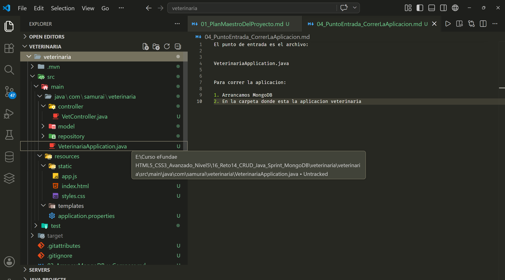

El punto de entrada es el archivo:

VeterinariaApplication.java

Para correr la aplicacion:

1. Arrancamos MongoDB 
2. En la carpeta donde esta la aplicacion veterinaria y como debemos asegurarnos que hagamos el arranque desde el directorio donde esta pom.xml pues simplemente hacemos clic derecho sobre pom.xml y seleccionamos "Open in Integrated Terminal". 

3. En la linea del terminal escribimos : `./mvnw spring-boot:run`

* Aclarando el misterio de <artifactId> en el pom.xml y por que arrnca la aplicacion?
La etiqueta <artifactId>veterinaria</artifactId> no se refiere directamente al archivo físico VeterinariaApplication.java, aunque están íntimamente relacionados.

El <artifactId> en Maven: Es simplemente el nombre técnico oficial de tu proyecto para el gestor de dependencias. Es el identificador que usará Maven si en el futuro empaquetaras este código en un archivo .jar o .war.

Por qué funciona el comando: Cuando tú te sitúas en esa carpeta en la terminal y ejecutas ./mvnw spring-boot:run, la herramienta Maven busca el archivo pom.xml, lee ese <artifactId> para saber cómo se llama el proyecto, y luego el plugin de Spring Boot escanea automáticamente tus carpetas buscando una clase que tenga la anotación `@SpringBootApplication` (que en tu caso es VeterinariaApplication.java). Al encontrarla, arranca el servidor. ¡Por eso tu comando funciona a la perfección desde ahí!
