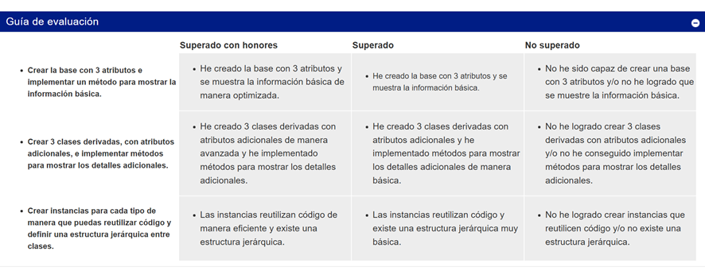

# Reto: Crear una jerarquía con Python POO

El proyecto inicial pedia hacer la jerarquia de Clases en Python, lo cual no requiere web pero para incluir sesiones y Cookies lo haremos web con FlasK y Python.
 
El enunciado original es:

[Inicio del vídeo con el logo del curso Código Samurái y música]
[TRANSICIÓN A RÓTULOS]
RETO 7
[APARECE PATRICIA]
Samurái del código, te doy la bienvenida a un nuevo reto, la actividad que requiere tu
esfuerzo y humildad.
Hemos visto todos los detalles la programación orientada a objetos. No tienes ningún
problema con manejar las sesiones y cookies. También has leído sobre PDO y
consultas a bases de datos. Así, honorable samurái, es hora de poner en práctica toda
la teoría que aprendiste.
[CORTINILLA: Pro uso de IA]
AYÚDATE DE IA
En este desafío, como tu sensei, te recomiendo que utilices la inteligencia artificial
como apoyo. Ya posees la habilidad y el conocimiento necesarios para abordar el
proyecto, pero con la ayuda de la IA, podrás detallar aún más el prompt y solicitar una
solución que puedas evaluar de manera crítica. ¡Tú eres capaz de enfrentar esto y
mucho más!
Ahora sí, te reto a crear una jerarquía con programación orientada a objetos.
[RÓTULOS RETO: Creación de una jerarquía con programación orientada a objetos]
[Cortinilla reto motivadora]
PLANTEAMIENTO RETO
Imagina que estás desarrollando un sistema para el negocio de alquiler de vehículos
de la villa. La empresa ofrece diferentes tipos de vehículos, como, coches,
motocicletas y bicicletas eléctricas. Cada tipo de vehículo tiene características
específicas y comparte algunas propiedades comunes. Aquí están los pasos que
debes seguir:
[RÓTULOS: Requisitos:
Clase base: Vehículo
 marca
 modelo
 año]
Crea una clase base llamada vehículo con los siguientes atributos: marca, que es la
marca del vehículo, modelo, con el modelo del vehículo, y año, que es el año de
fabricación del vehículo.
Implementa un método para mostrar la información básica del vehículo.
[RÓTULOS: Clases derivadas:
 Coche: numero_puertas y combustible
 Motocicleta: cilindrada y tipo
 BicicletaElectrica: capacidad_bateria y velocidad_maxima]
Tu siguiente tarea es crear tres clases derivadas de vehículo. La primera, coche,
tendrá atributos adicionales, como número de puertas y combustible. La clase
motocicleta va a tener atributos adicionales, como cilindrada y tipo. Y la clase bicicleta
eléctrica tendrá atributos adicionales, como capacidad de batería y velocidad máxima.
[RÓTULOS: Métodos específicos]
En cada clase derivada, implementa métodos específicos para mostrar detalles
adicionales según el tipo de vehículo. Por ejemplo, para una motocicleta puedes
mostrar información sobre el motor y para una bicicleta eléctrica puedes mostrar la
autonomía de la batería.
[RÓTULOS: Prueba de herencia]
Ahora, crea instancias de cada tipo de vehículo (coche, motocicleta y bicicleta
eléctrica). Y luego, utiliza los métodos implementados para mostrar la información de
cada vehículo.
Recuerda que la herencia te permite reutilizar código y definir una estructura jerárquica
entre las clases.
CIERRE
Para superar este desafío, recuerda mantener un código bien organizado, manejar los
errores, garantizar la seguridad, optimizar el rendimiento y, por supuesto, realizar
pruebas exhaustivas. Utiliza la guía de evaluación para verificar si has superado el
reto. Si es así, no dudes en subir el código a tu portfolio.
¡Mucho ánimo, mi noble samurái!
[Fin del vídeo con el logo del curso Código Samurái y música que se desvanece]

