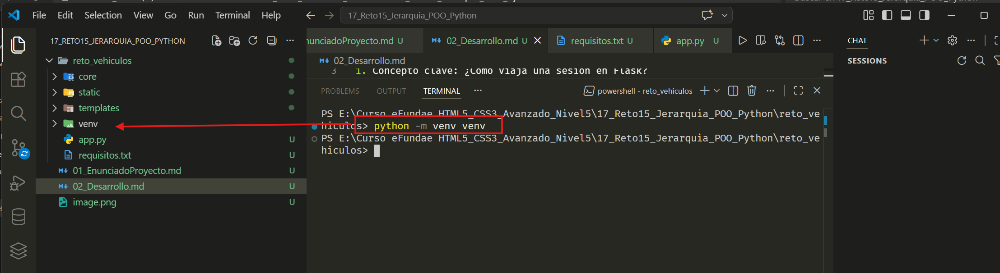
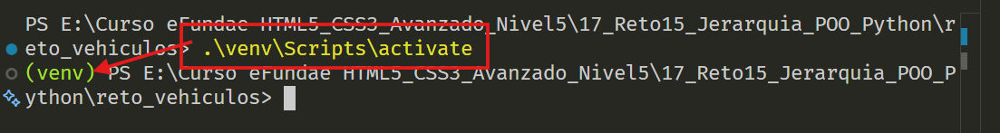
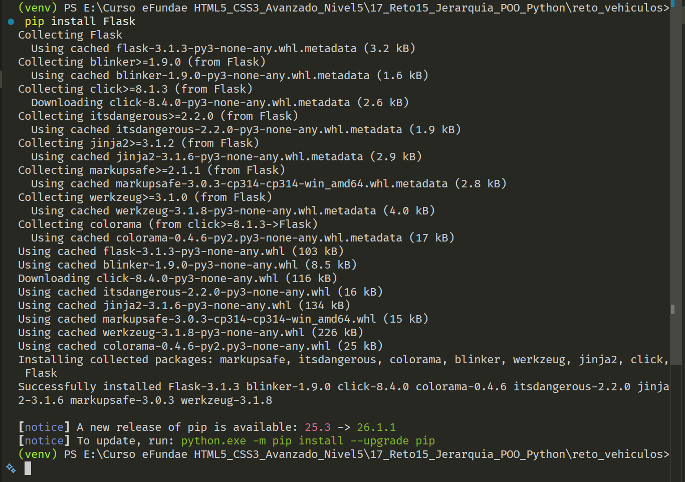
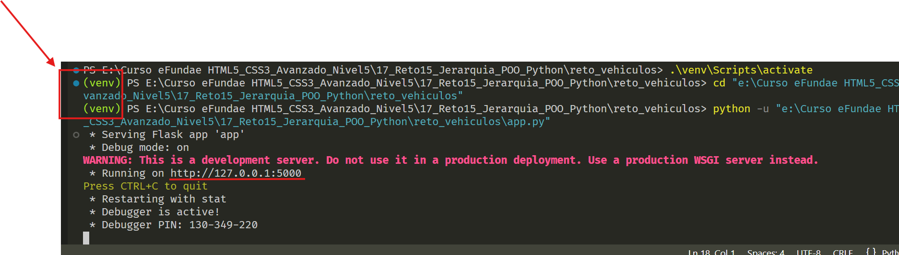
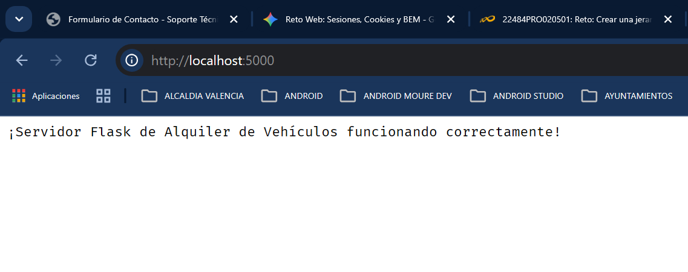
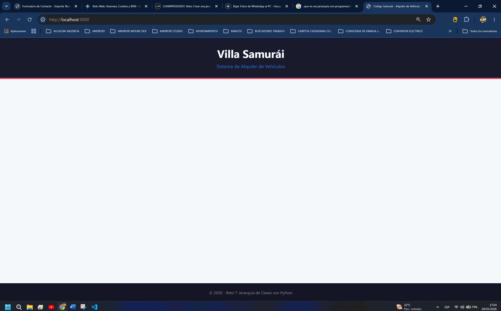
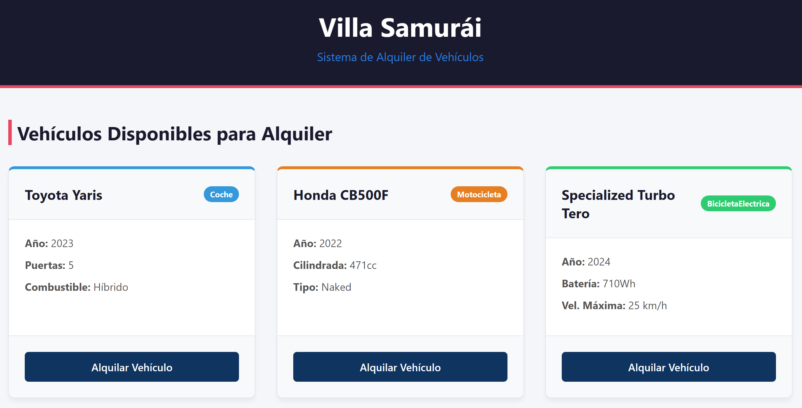
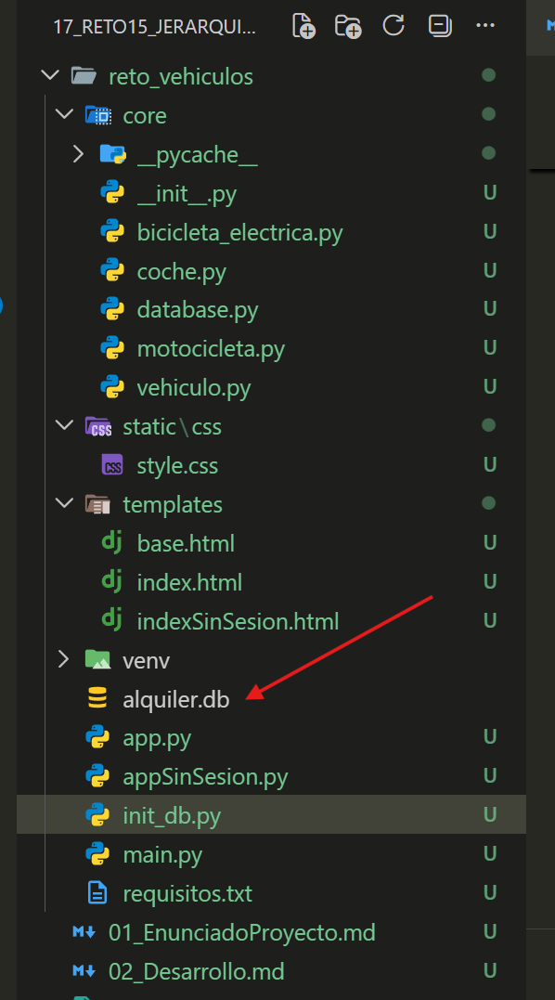
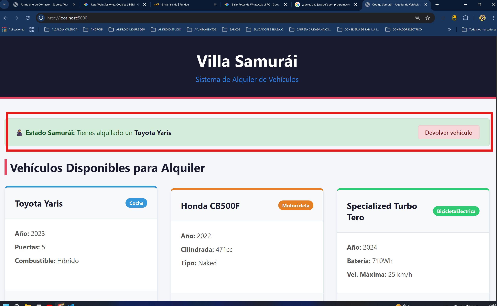

# Paso 1: Configurar el entorno en VS Code y preparar la estructura del proyecto Flask.

## Concepto clave: ¿Cómo viaja una sesión en Flask?
Antes de escribir código, es útil entender qué va a pasar por debajo. Flask utiliza sesiones basadas en cookies firmadas criptográficamente.

El usuario entra en la web y realiza una acción (por ejemplo, "alquilar un coche").

Tu servidor Flask guarda esa información en un diccionario especial de Python llamado session.

Flask coge ese diccionario, lo convierte en texto, lo firma con una clave secreta (para que el usuario no pueda falsificarlo o editarlo) y lo envía de vuelta al navegador del usuario dentro de una cookie.

En la siguiente petición, el navegador envía esa cookie de vuelta, Flask verifica que la firma sea válida y te devuelve el acceso a los datos.

2. Estructura de carpetas actualizada
Como vamos a modularizar el proyecto e incorporar las vistas web y las plantillas HTML (usando la metodología BEM), la estructura en tu espacio de trabajo de VS Code quedará así:

Estas carpetas se crean manualmente en VS code, con adicion de Folders ( Carpetas) o files ( archivos). Los rchivos: Creamos solo los nombres 

---
```bash
reto_vehiculos/
│
├── core/                       # Lógica POO (los módulos que ya creamos)
│   ├── __init__.py
│   ├── vehiculo.py
│   ├── coche.py
│   ├── motocicleta.py
│   └── bicicleta_electrica.py
│
├── templates/                  # Plantillas HTML
│   └── base.html               # Estructura principal
│
├── static/                     # Archivos estáticos (CSS, imágenes)
│   └── css
│       └── style.css           # Estilos maquetados con BEM
│
├── app.py                      # Servidor principal de Flask
└── requisitos.txt              # Dependencias del proyecto
```
---


## Preparación del Entorno (Paso a Paso en la Terminal)
Abre la terminal de VS Code dentro de la carpeta de tu proyecto (reto_vehiculos/) y ejecuta los siguientes comandos:

A. Crear e iniciar el entorno virtual (Recomendado)
Para mantener limpio tu sistema, es mejor aislar las librerías del proyecto.

En Windows (PowerShell o CMD): Uno por uno.

---
```Bash
python -m venv venv
.\venv\Scripts\activate
```
---

Al hacer python -m venv venv se crea una carepta venv. La instruccion indica que Python crea un ambiente virtual ( venv ) con nombre venv, que es el 2do venv de la instruccion...ese nombre puede ser cualquiera.



Al hacer ".\venv\Scripts\activate" en la terminal deberiamos ver que al inicio de la linea de comndos aparece en verde (venv)


B. Instalar Flask
Con el entorno virtual activo (verás un (venv) al inicio de la línea de la terminal), instala Flask:

---
```Bash
pip install Flask
```
---

Al correr `pip install Flask` veremos algo asi. **Pendiente de que este activo el ambiente virtual** ( ".\venv\Scripts\activate" )


## Creación de los Módulos de Clases :Crear las clases y su herencia.

Vamos a escribir el código de cada clase en su propio archivo dentro de la carpeta core/  

### 1. Clase Base: core/vehiculo.py

Esta es la clase madre que contendrá los atributos comunes:  marca   modelo   año   

---
```py

# core/vehiculo.py

class Vehiculo:
    def __init__(self, marca: str, modelo: str, anio: int):
        self.marca = marca
        self.modelo = modelo
        self.anio = anio

    def mostrar_informacion(self) -> str:
        """Muestra la información básica del vehículo."""
        return f"{self.marca} {self.modelo} ({self.anio})"


```
---

### 2. Clase Derivada: core/coche.pyHereda de Vehiculo e introduce numero_puertas y combustible.  Python# core/coche.py

---
```py
from .vehiculo import Vehiculo

class Coche(Vehiculo):
    def __init__(self, marca: str, modelo: str, anio: int, numero_puertas: int, combustible: str):
        super().__init__(marca, modelo, anio)
        self.numero_puertas = numero_puertas
        self.combustible = combustible

    def mostrar_detalles(self) -> str:
        """Muestra los detalles específicos del coche."""
        info_basica = self.mostrar_informacion()
        return f"Coche: {info_basica} | Puertas: {self.numero_puertas} | Combustible: {self.combustible}"
```
---

#### ¿Qué hace exactamente super().__init__(marca, modelo, anio)?  
Lo que hace es guardar los atributos, pero no los guarda la clase Coche por sí misma, sino que le delega esa tarea a su clase madre (Vehiculo).  
Cuando creas un Coche, estás creando un objeto que es un coche, pero que también es un vehículo. Como la lógica para guardar la marca, el modelo y el año ya la escribimos y la resolvimos dentro de la clase Vehiculo , no queremos repetir código escribiendo  

 self.marca = marca   

 otra vez en Coche.  
 super():  
 Es una función especial que le dice a Python: "Quiero mirar la clase que está justo por encima de mí en la jerarquía (la clase madre)".  
 `.__init__(marca, modelo, anio)`: Llama al constructor de esa clase madre y le pasa los datos que necesita.  Al ejecutarse esa línea, la clase Vehiculo hace su trabajo: asienta en la memoria self.marca, self.modelo y self.anio. Una vez que la madre termina, el flujo vuelve al constructor de Coche para guardar sus atributos exclusivos: numero_puertas y combustible.  
 El "Ciclo de Vida" del Constructor  
 Imagina que ejecutas esto en el main.py: 

 mi_coche = Coche("Toyota", "Yaris", 2023, 5, "Híbrido")


El viaje que hacen esos datos es el siguiente:El constructor `__init__` de Coche recibe los 5 parámetros.  Inmediatamente, toma "Toyota", "Yaris" y 2023 y los despacha hacia arriba con super().
`.__init__()`.  La clase Vehiculo recibe esos 3 datos y dice: "Perfecto, yo me encargo de registrarlos en el objeto".  El control regresa a Coche, que dice: "Bien, ahora me toca a mí registrar el 5 y el "Híbrido" en self.numero_puertas y self.combustible".  Si no pusieras la línea de `super().__init__()`, tu objeto Coche tendría número de puertas y combustible, pero no tendría ni idea de cuál es su marca, modelo o año, lanzando un error en cuanto intentaras acceder a ellos.  
Sobre el método mostrar_detalles:  

info_basica = self.mostrar_informacion()  


Como Coche hereda de Vehiculo , tiene acceso directo a todos sus métodos públicos. Al usar `self.mostrar_informacion()`, estás llamando al método que formatea la marca, modelo y año , y luego simplemente le concatenas `(f" | Puertas: {self.numero_puertas}...")` los detalles propios de la subclase. Eso es reutilización de código en su máxima expresión. 

### 3. Clase Derivada: core/motocicleta.pyHereda de Vehiculo e introduce cilindrada y tipo (Scooter, Naked, etc.). 

---
```py
# core/motocicleta.py
from .vehiculo import Vehiculo

class Motocicleta(Vehiculo):
    def __init__(self, marca: str, modelo: str, anio: int, cilindrada: int, tipo: str):
        super().__init__(marca, modelo, anio)
        self.cilindrada = cilindrada
        self.tipo = tipo

    def mostrar_detalles(self) -> str:
        """Muestra los detalles específicos de la motocicleta."""
        info_basica = self.mostrar_informacion()
        return f"Motocicleta: {info_basica} | Cilindrada: {self.cilindrada}cc | Tipo: {self.tipo}"
```
### 4. Clase Derivada: core/bicicleta_electrica.pyHereda de Vehiculo e introduce capacidad_bateria (en Wh o mAh) y velocidad_maxima.  Python# core/bicicleta_electrica.py

---
```py
from .vehiculo import Vehiculo

class BicicletaElectrica(Vehiculo):
    def __init__(self, marca: str, modelo: str, anio: int, capacidad_bateria: int, velocidad_maxima: int):
        super().__init__(marca, modelo, anio)
        self.capacidad_bateria = capacidad_bateria  # Ej: en vatios-hora (Wh)
        self.velocidad_maxima = velocidad_maxima    # Ej: en km/h

    def mostrar_detalles(self) -> str:
        """Muestra los detalles específicos de la bicicleta eléctrica."""
        info_basica = self.mostrar_informacion()
        return f"Bici Eléctrica: {info_basica} | Batería: {self.capacidad_bateria}Wh | Vel. Máx: {self.velocidad_maxima}km/h"

```
--- 

Para comprobar que la herencia y las importaciones modulares funcionan perfectamente antes de meternos en el entorno web, creamos el archivo main.py en la raíz:  

---
```py
# main.py
from core.coche import Coche
from core.motocicleta import Motocicleta
from core.bicicleta_electrica import BicicletaElectrica

def ejecutar_prueba():
    print("--- Probando Jerarquía de Clases (Código Samurái) ---\n")

    # 1. Crear instancias de cada vehículo
    mi_coche = Coche("Toyota", "Yaris", 2023, 5, "Híbrido")
    mi_moto = Motocicleta("Honda", "CB500F", 2022, 471, "Naked")
    mi_bici = BicicletaElectrica("Specialized", "Turbo Tero", 2024, 710, 25)

    # 2. Almacenarlas en una lista para demostrar polimorfismo básico
    flota = [mi_coche, mi_moto, mi_bici]

    # 3. Mostrar la información específica de cada uno
    for vehiculo in flota:
        print(vehiculo.mostrar_detalles())

if __name__ == "__main__":
    ejecutar_prueba()

```
---    


## El archivo principal: app.py
Vamos a crear el esqueleto inicial de nuestro servidor. De momento, solo importaremos nuestras clases y configuraremos una ruta básica para comprobar que todo arranca bien.

Crea el archivo app.py en la raíz del proyecto con el siguiente código:

---
```py
# app.py
from flask import Flask, render_template, session, request, redirect, url_for
from core.coche import Coche
from core.motocicleta import Motocicleta
from core.bicicleta_electrica import BicicletaElectrica

app = Flask(__name__)

# CRUCIAL: Clave secreta para que Flask pueda firmar y asegurar las cookies de sesión
app.secret_key = 'clave_secreta_samurai_para_desarrollo'

# Simulamos una base de datos temporal de vehículos disponibles para alquiler
VEHICULOS_DISPONIBLES = {
    1: Coche("Toyota", "Yaris", 2023, 5, "Híbrido"),
    2: Motocicleta("Honda", "CB500F", 2022, 471, "Naked"),
    3: BicicletaElectrica("Specialized", "Turbo Tero", 2024, 710, 25)
}

@app.route('/')
def inicio():
    # De momento, solo devolvemos un texto de prueba para verificar que funciona
    return "¡Servidor Flask de Alquiler de Vehículos funcionando correctamente!"

if __name__ == '__main__':
    # Ejecutamos en modo depuración (debug) para que se recargue solo al hacer cambios
    app.run(debug=True)
```
---


Al correr este archivo veremos en el navegador, en [localhost:5000](http://localhost:5000/)





Nota: Podemos ver que `http://127.0.0.1` es el equivalente a `localhost`.

Vamos a preparar la interfaz visual de nuestra aplicación Flask.

Para cumplir con lo que planeamos, crearemos la plantilla base del HTML utilizando la metodología BEM (Block__Element--Modifier) y conectaremos nuestro servidor para listar los vehículos en la pantalla.

# Paso 2: Crear la Plantilla Base HTML
En Flask, usamos un sistema de plantillas llamado Jinja2. Esto nos permite crear un archivo base (con el HTML general, cabeceras, CSS) y "heredar" esa estructura en otras páginas para no repetir código.

Crea el archivo templates/base.html y añade la siguiente estructura maquetada con clases bajo la nomenclatura BEM:

---
```html
<!DOCTYPE html>
<html lang="es">
<head>
    <meta charset="UTF-8">
    <meta name="viewport" content="width=device-width, initial-scale=1.0">
    <title>Código Samurái - Alquiler de Vehículos</title>
    <link rel="stylesheet" href="{{ url_for('static', filename='css/style.css') }}">
</head>
<body class="site-layout">

    <header class="main-header">
        <div class="main-header__container">
            <h1 class="main-header__title">Villa Samurái</h1>
            <p class="main-header__subtitle">Sistema de Alquiler de Vehículos</p>
        </div>
    </header>

    <main class="main-content">
        <div class="main-content__container">
            
            
            

        </div>
    </main>

    <footer class="main-footer">
        <p class="main-footer__text">&copy; 2026 - Reto 7: Jerarquía de Clases con Python</p>
    </footer>

</body>
</html>
```
---

#### Explicacion del link usado para acceder al archivo style.css

---
```HTML
<link rel="stylesheet" href="{{ url_for('static', filename='css/style.css') }}">
```
---

En Flask (y en otros frameworks modernos como Django o Laravel), se prefiere utilizar `{{ url_for(...) }}` por varias razones de peso relacionadas con la estabilidad del servidor. Vamos a ver cómo funciona y por qué se hace así.

¿Qué significa la sintaxis?
Las dobles llaves {{ ... }} pertenecen a Jinja2 (el motor de plantillas de Flask). Le dicen al servidor: "Oye, ejecuta este trozo de código Python antes de enviarle el HTML al navegador del usuario".

Dentro de las llaves tenemos `la función url_for()`:

'static': Le dice a Flask que queremos buscar un archivo dentro de la carpeta especial llamada static/ (que es donde guardamos CSS, imágenes y JavaScript).

filename='css/style.css': Especifica la ruta exacta del archivo dentro de esa carpeta.

Cuando Flask procesa la página, transforma automáticamente todo ese bloque de Python en una ruta de texto normal que el navegador pueda entender. Si miras el "Código fuente" de la página en el navegador, verás que Flask lo ha convertido en esto:

HTML
<link rel="stylesheet" href="/static/css/style.css">
¿Por qué no usar la ruta directa y usar url_for?
Aunque escribir la ruta directa funciona en la página de inicio, se rompe fácilmente en aplicaciones reales por dos motivos principales:

1. Rutas relativas dinámicas (Evita que se "rompan" los estilos)
Imagina que estás en la página de inicio (/). La ruta relativa static/css/style.css funciona bien.
Pero, ¿qué pasa si creamos una sección de alquiler para un vehículo específico, por ejemplo: /vehiculo/alquilar/3?
Si usas la ruta directa tradicional, el navegador creerá que el CSS está en /vehiculo/alquilar/static/css/style.css (una carpeta que no existe) y la página web perderá todos los estilos.

url_for() genera siempre una ruta absoluta desde la raíz del servidor (/static/css/style.css), sin importar en qué rincón o subruta de la web se encuentre el usuario. El CSS nunca se romperá.

2. Flexibilidad si cambia la estructura
Imagina que el día de mañana decides cambiar el nombre de la carpeta static a recursos_web. Si tuvieras 50 archivos HTML con rutas directas, tendrías que modificarlos uno a uno.
Con url_for('static', ...), solo tendrías que cambiar la configuración en tu archivo app.py y todo el proyecto se actualizaría solo automáticamente.

En resumen: Es una herramienta de Flask para garantizar que, navegue por donde navegue el usuario en tu aplicación web, los archivos CSS, JavaScript o las imágenes siempre se carguen correctamente y sin fallos de ruta.

# Paso 3: Crear los Estilos CSS (Metodología BEM)
Para que se vea limpio y profesional, vamos a crear el archivo CSS. Aquí aplicamos las reglas de BEM de forma estricta:

main-header es el Bloque.

main-header__title es el Elemento.

Si tuviéramos un botón especial o destacado, usaríamos un Modificador como button--primary.

Crea el archivo static/css/style.css:

---
```CSS
/* static/css/style.css */

/* Reset básico */
* {
    margin: 0;
    padding: 0;
    box-sizing: border-box;
}

body {
    font-family: 'Segoe UI', Tahoma, Geneva, Verdana, sans-serif;
    background-color: #f4f6f9;
    color: #333;
    display: flex;
    flex-direction: column;
    min-height: 100vh;
}

/* --- BLOQUE: main-header --- */
.main-header {
    background-color: #1a1a2e;
    color: #ffffff;
    padding: 2rem 1rem;
    text-align: center;
    border-bottom: 4px solid #e94560;
}

.main-header__title {
    font-size: 2.5rem;
    font-weight: 700;
    margin-bottom: 0.5rem;
}

.main-header__subtitle {
    font-size: 1.1rem;
    color: #0f3460;
    filter: brightness(2.5);
}

/* --- BLOQUE: main-content --- */
.main-content {
    flex: 1;
    padding: 3rem 1rem;
}

.main-content__container {
    max-width: 1200px;
    margin: 0 auto;
}

/* --- BLOQUE: main-footer --- */
.main-footer {
    background-color: #161625;
    color: #8c8c9e;
    text-align: center;
    padding: 1.5rem 1rem;
    font-size: 0.9rem;
}
```
---


## Probemos
Para integrar esto con Flask y ver que renderiza bien la plantilla heredada, vamos a actualizar rápidamente el archivo app.py que hicimos en el paso anterior para que use render_template.

Modifica la ruta raíz en tu app.py:

---
```py
@app.route('/')
def inicio():
    # En lugar de texto plano, renderizamos la plantilla base
    return render_template('base.html')
```
---


Si ejecutas python app.py en tu terminal de VS Code y entras a http://127.0.0.1:5000/, deberías ver la estructura de la página web con los estilos aplicados (el encabezado oscuro, el borde rojo samurái y el pie de página).

# EJECUTAR EL CODIGO O PROGRAMA EN FORMA RAPIDA Y SIN PROBLEMAS DEL BOTON DE PLAY DE VS CODE.

1. Abrir la terminal dentro de VS code, en la carpeta del proyecto ( reto_vehiculos )
2. Activar el entorno virtual escribiendo en la terminal `.\venv\Scripts\Activate.ps1`
3. Correr escribiendo en la terminal: `python app.py`

Nota:
Si al inicio de la linea del terminal, esta empieza por PS: Usa .\venv\Scripts\Activate.ps1.

Si tu terminal es el CMD tradicional: Usa .\venv\Scripts\activate.



# DARLE VIDA AL RENDERIZADO

Ahora que tenemos los cimientos firmes, vamos a meterle vida a ese espacio en blanco central. En este paso vamos a hacer dos cosas:

## Crear una subplantilla (index.html) que herede de base.html.

## Modificar app.py para enviarle los objetos de nuestra jerarquía de clases POO (Coche, Moto, Bici) y renderizarlos dinámicamente con Jinja2 y BEM.

# Paso 4: Crear la subplantilla templates/index.html
Creamos un nuevo nuevo archivo. Usamos  para reutilizar todo lo que ya funciona, y cómo definimos un bloque de tarjetas de vehículos (cards) usando clases BEM:

El bloque principal será vehicle-grid.

Cada tarjeta será un bloque vehicle-card.

Usaremos modificadores como vehicle-card--coche o vehicle-card--moto por si en el futuro quieres darles sutiles toques de color distintos a cada tipo.

# Paso 5: Añadir los estilos CSS para las Tarjetas (BEM)
Abre tu archivo static/css/style.css y añade al final las reglas para el catálogo, las tarjetas y los botones:

---
```CSS
/* --- BLOQUE: catalog --- */
.catalog__title {
    font-size: 1.8rem;
    margin-bottom: 2rem;
    color: #1a1a2e;
    border-left: 5px solid #e94560;
    padding-left: 0.5rem;
}

/* --- BLOQUE: vehicle-grid --- */
.vehicle-grid {
    display: grid;
    grid-template-columns: repeat(auto-fit, minmax(300px, 1fr));
    gap: 2rem;
}

/* --- BLOQUE: vehicle-card --- */
.vehicle-card {
    background-color: #ffffff;
    border-radius: 8px;
    box-shadow: 0 4px 6px rgba(0, 0, 0, 0.05);
    border: 1px solid #e1e8ed;
    display: flex;
    flex-direction: column;
    overflow: hidden;
    transition: transform 0.2s ease;
}

.vehicle-card:hover {
    transform: translateY(-5px);
}

.vehicle-card__header {
    background-color: #f8f9fa;
    padding: 1.5rem;
    border-bottom: 1px solid #e1e8ed;
    display: flex;
    justify-content: space-between;
    align-items: center;
}

.vehicle-card__title {
    font-size: 1.3rem;
    color: #1a1a2e;
}

.vehicle-card__badge {
    background-color: #e94560;
    color: #fff;
    font-size: 0.75rem;
    padding: 0.25rem 0.6rem;
    border-radius: 20px;
    font-weight: bold;
}

.vehicle-card__body {
    padding: 1.5rem;
    flex: 1;
}

.vehicle-card__text {
    margin-bottom: 0.75rem;
    font-size: 1rem;
    color: #555;
}

.vehicle-card__footer {
    padding: 1.5rem;
    background-color: #f8f9fa;
    border-top: 1px solid #e1e8ed;
}

/* --- BLOQUE COMPONENTE: btn --- */
.btn {
    display: inline-block;
    width: 100%;
    text-align: center;
    padding: 0.75rem;
    border-radius: 5px;
    text-decoration: none;
    font-weight: 600;
    transition: background-color 0.2s;
}

/* Modificador del botón */
.btn--primary {
    background-color: #0f3460;
    color: #ffffff;
}

.btn--primary:hover {
    background-color: #162447;
}
```
---
## "TRUCO PARA QUE CADA TARJETA SE VEA CON COLOR DISTINTO"

#### Como indicaba mas arriba :  
"Cada tarjeta será un bloque vehicle-card.

Usaremos modificadores como vehicle-card--coche o vehicle-card--moto por si en el futuro quieres darles sutiles toques de color distintos a cada tipo."

Para aplicar esos colores usando la metodología BEM, utilizaremos los modificadores directamente en el contenedor principal de la tarjeta.

En CSS, un modificador no debe duplicar las reglas del bloque base; solo añade o sobrescribe las propiedades específicas (en este caso, los colores del borde o del encabezado o fondo...).

Aquí tienes cómo implementarlo paso a paso:

1. Modificación en el HTML (templates/index.html)
Vamos a inyectar dinámicamente el modificador en la clase de la tarjeta convirtiendo el nombre de la clase de Python a minúsculas usando el filtro | lower de Jinja2.

Busca la línea donde se abre la tarjeta del vehículo y cámbiala por esto:

```HTML
<div class="vehicle-card vehicle-card--{{ vehiculo.__class__.__name__ | lower }}">
```

Si miras el código generado en el navegador, verás que cada tarjeta tendrá ahora dos clases: class="vehicle-card vehicle-card--coche", class="vehicle-card vehicle-card--motocicleta", etc.

2. Modificación en el CSS (static/css/style.css)
Abre tu archivo CSS y añade estas reglas al final. Vamos a cambiar el color del borde superior de la tarjeta y el fondo de la etiqueta (badge) según el tipo de vehículo:

```CSS
/* --- MODIFICADORES DE VEHICLE-CARD --- */

/* Modificador para Coche (Tonos azules) */
.vehicle-card--coche {
    border-top: 4px solid #3498db;
}
.vehicle-card--coche .vehicle-card__badge {
    background-color: #3498db;
}

/* Modificador para Motocicleta (Tonos naranjas/gualda) */
.vehicle-card--motocicleta {
    border-top: 4px solid #e67e22;
}
.vehicle-card--motocicleta .vehicle-card__badge {
    background-color: #e67e22;
}

/* Modificador para Bicicleta Eléctrica (Tonos verdes ecológicos) */
.vehicle-card--bicicletaelectrica {
    border-top: 4px solid #2ecc71;
}
.vehicle-card--bicicletaelectrica .vehicle-card__badge {
    background-color: #2ecc71;
}
```

¿Por qué se hace así en BEM?
Siguiendo las reglas estrictas de BEM:

El bloque .vehicle-card mantiene toda la estructura común (sombras, bordes laterales, flexbox, fuentes).

Los modificadores .vehicle-card--coche solo se encargan de alterar sutilmente el color de la tarjeta.

Al usar .vehicle-card--coche .vehicle-card__badge, estamos diciendo: "Cambia el color del elemento interno badge solo cuando esté dentro de un bloque modificado como coche".

Guarda los cambios, recarga la página en tu navegador y verás cómo el catálogo cobra vida visualmente identificando cada tipo de vehículo por su color exclusivo. 





# Paso 6: Actualizar la ruta en app.py
Ahora modificamos app.py para que, en lugar de renderizar la base vacía, llame a index.html pasándole nuestro diccionario de objetos VEHICULOS_DISPONIBLES.

Cambia tu función inicio() para que quede así:

---
```py
@app.route('/')
def inicio():
    # Pasamos el diccionario de objetos de Python directos a la plantilla Jinja2
    return render_template('index.html', lista_vehiculos=VEHICULOS_DISPONIBLES)

```
---

Como tienes el debug=True activado, Flask debería detectar el cambio automáticamente al guardar los archivos. Si refrescas la página en tu navegador, deberías ver las tres flamantes tarjetas del Coche Toyota, la Moto Honda y la Bici Specialized con sus respectivos datos mapeados de forma limpia.


# El Siguiente Paso: El Sistema de Alquiler con Sesiones. "divertida y el núcleo avanzado : el manejo de sesiones y cookies.  
La idea es que cuando el usuario haga clic en el botón "Alquilar Vehículo", la aplicación guarde ese vehículo en su "sesión" (un carrito de alquiler). De esta manera, el sistema recordará qué vehículo tiene alquilado el usuario aunque navegue por la web o refresque la página.

## Para lograr esto de forma limpia, estructuraremos el trabajo en tres partes:

### Crear una ruta en app.py que procese la acción de alquilar usando el diccionario session de Flask.

### Actualizar los enlaces del botón de cada tarjeta en index.html para que envíen el ID del vehículo.

### Mostrar un mensaje o sección superior en la web que diga: "Vehículo actualmente alquilado: [Nombre]".

Para verr el efecto de forma inmediata, vamos a hacer este paso en dos partes:

Preparar la lógica en app.py para capturar el alquiler y guardarlo en la sesión.

Modificar el HTML (index.html) para conectar los botones y mostrar arriba qué vehículo tenemos alquilado.

### Parte 1: Modificar la lógica en app.py
Vamos a añadir una nueva ruta llamada /alquilar/<int:vehiculo_id>. Cuando el usuario pulse el botón, viajará a esa ruta, guardaremos el ID en la sesión (session['vehiculo_alquilado_id']) y lo redirigiremos de vuelta a la página principal.

Además, actualizaremos la ruta index (/) para que busque si hay algo alquilado y le pase ese objeto a la plantilla.

Modifica app.py para que quede así: ( Al archivo anterior le coloque `appSinSesion.py`) 

---
```py
# app.py
from flask import Flask, render_template, session, request, redirect, url_for
from core.coche import Coche
from core.motocicleta import Motocicleta
from core.bicicleta_electrica import BicicletaElectrica

app = Flask(__name__)

# Clave secreta para firmar las cookies de la sesión
app.secret_key = 'clave_secreta_samurai_para_desarrollo'

VEHICULOS_DISPONIBLES = {
    1: Coche("Toyota", "Yaris", 2023, 5, "Híbrido"),
    2: Motocicleta("Honda", "CB500F", 2022, 471, "Naked"),
    3: BicicletaElectrica("Specialized", "Turbo Tero", 2024, 710, 25)
}

@app.route('/')
def inicio():
    # 1. Miramos si hay algún ID de vehículo guardado en la sesión de la cookie
    alquilado_id = session.get('vehiculo_alquilado_id')
    vehiculo_alquilado = None
    
    # 2. Si existe, recuperamos el objeto completo de nuestra "base de datos"
    if alquilado_id and alquilado_id in VEHICULOS_DISPONIBLES:
        vehiculo_alquilado = VEHICULOS_DISPONIBLES[alquilado_id]
    
    # Pasamos tanto la lista completa como el vehículo actualmente alquilado
    return render_template('index.html', 
                           lista_vehiculos=VEHICULOS_DISPONIBLES, 
                           alquilado=vehiculo_alquilado)

@app.route('/alquilar/<int:vehiculo_id>')
def alquilar_vehiculo(vehiculo_id):
    # Verificamos que el vehículo realmente exista
    if vehiculo_id in VEHICULOS_DISPONIBLES:
        # GUARDAMOS EN LA SESIÓN: Flask se encarga de meter esto en la cookie cifrada
        session['vehiculo_alquilado_id'] = vehiculo_id
        
    return redirect(url_for('inicio'))

@app.route('/devolver')
def devolver_vehiculo():
    # Eliminamos el registro de la sesión para vaciar el "carrito"
    session.pop('vehiculo_alquilado_id', None)
    return redirect(url_for('inicio'))

```
---

### Parte 2: Modificar las plantillas HTML
A. Mostrar el estado del alquiler en templates/index.html
Vamos a añadir una sección arriba (un panel de estado) que aparezca solo si el usuario tiene un vehículo alquilado, y cambiaremos el enlace del botón de las tarjetas para que apunte a la nueva ruta de Flask usando url_for.

Sustituye el contenido de tu templates/index.html por este: ( El archivo anterior lo renombre por indexSinSesion.html)

---
```html



<section class="catalog">
    
    
    <div class="rental-status">
        <p class="rental-status__text">
            🥷 <strong>Estado Samurái:</strong> Tienes alquilado un 
            <span class="rental-status__highlight">{{ alquilado.marca }} {{ alquilado.modelo }}</span>.
        </p>
        <a href="{{ url_for('devolver_vehiculo') }}" class="rental-status__link">Devolver vehículo</a>
    </div>
    

    <h2 class="catalog__title">Vehículos Disponibles para Alquiler</h2>
    
    <div class="vehicle-grid">
        
        
        <div class="vehicle-card vehicle-card--{{ vehiculo.__class__.__name__ | lower }}">
            <div class="vehicle-card__header">
                <h3 class="vehicle-card__title">{{ vehiculo.marca }} {{ vehiculo.modelo }}</h3>
                <span class="vehicle-card__badge">{{ vehiculo.__class__.__name__ }}</span>
            </div>
            
            <div class="vehicle-card__body">
                <p class="vehicle-card__text"><strong>Año:</strong> {{ vehiculo.anio }}</p>
                
                
                    <p class="vehicle-card__text"><strong>Puertas:</strong> {{ vehiculo.numero_puertas }}</p>
                    <p class="vehicle-card__text"><strong>Combustible:</strong> {{ vehiculo.combustible }}</p>
                
                    <p class="vehicle-card__text"><strong>Cilindrada:</strong> {{ vehiculo.cilindrada }}cc</p>
                    <p class="vehicle-card__text"><strong>Tipo:</strong> {{ vehiculo.tipo }}</p>
                
                    <p class="vehicle-card__text"><strong>Batería:</strong> {{ vehiculo.capacidad_bateria }}Wh</p>
                    <p class="vehicle-card__text"><strong>Vel. Máxima:</strong> {{ vehiculo.velocidad_maxima }} km/h</p>
                
            </div>
            
            <div class="vehicle-card__footer">
                <a href="{{ url_for('alquilar_vehiculo', vehiculo_id=id) }}" class="btn btn--primary">Alquilar Vehículo</a>
            </div>
        </div>
        
        
    </div>
</section>

```
---


B. Añadir estilos CSS para el panel de estado
Abre static/css/style.css y pega al final los estilos del nuevo bloque .rental-status:

```css
/* --- BLOQUE: rental-status --- */
.rental-status {
    background-color: #d4edda;
    border: 1px solid #c3e6cb;
    color: #155724;
    padding: 1rem 1.5rem;
    border-radius: 5px;
    margin-bottom: 2rem;
    display: flex;
    justify-content: space-between;
    align-items: center;
}

.rental-status__highlight {
    font-weight: bold;
    color: #1a1a2e;
}

.rental-status__link {
    color: #721c24;
    background-color: #f8d7da;
    padding: 0.4rem 1rem;
    border-radius: 4px;
    text-decoration: none;
    font-size: 0.9rem;
    font-weight: 600;
    border: 1px solid #f5c6cb;
    transition: background-color 0.2s;
}

.rental-status__link:hover {
    background-color: #f5c6cb;
}
```

## ¡Pruébalo en directo!
Guarda todos los archivos. Como el servidor de Flask se reinicia solo, ve a tu navegador y refresca la página:

Haz clic en el botón "Alquilar Vehículo" de cualquiera de las tarjetas (por ejemplo, la motocicleta Honda).

Verás cómo la página se recarga e instantáneamente aparece arriba el panel verde confirmando tu alquiler.

La prueba de fuego de la sesión: Cierra la pestaña del navegador, abre una nueva pestaña y vuelve a entrar en http://localhost:5000. ¡El panel verde sigue ahí! La sesión está recordando tu elección a través de la cookie.

Haz clic en "Devolver vehículo" y verás cómo el panel desaparece limpiamente al borrar el ID de la sesión.

Prueba el flujo completo y me comentas si logras ver la magia de las sesiones funcionando en tu pantalla. 

# COOKIES
Siguiente Nivel: Persistencia con SQLite  
Como comentamos al principio, para que este proyecto pase de ser un gran ejercicio a ser una aplicación web de nivel producción digna de tu portfolio , nos falta un ingrediente que de hecho se sugería implícitamente en la introducción del reto: la persistencia de datos.  

Justo ahora, si el servidor se reinicia, las clases siguen funcionando porque los vehículos están escritos a fuego (hardcoded) en el diccionario VEHICULOS_DISPONIBLES de tu app.py. En un negocio real, si añadimos un coche nuevo o si queremos registrar el histórico de qué usuario ha alquilado qué cosa de forma permanente, necesitamos una base de datos. 

 ¿Cuál es el plan paso a paso?  
 Crear una base de datos SQLite ligera (no requiere instalar nada en tu ordenador, Python ya la trae de serie).  
 
 Crear una tabla de vehículos e insertar los datos iniciales del Coche, la Moto y la Bici.  
 
 Modificar app.py para que, en lugar de leer el diccionario fijo, se conecte a la base de datos, extraiga los registros y reconstruya los objetos dinámicamente usando las clases de tus módulos (coche.py, motocicleta.py, etc.).

 Para hacerlo de forma limpia y ordenada, seguiremos nuestra filosofía paso a paso. El objetivo de hoy es:

# Crear la base de datos SQLite y su tabla mediante un script automatizado.

## Crear un módulo gestor de base de datos (core/database.py) para aislar las consultas SQL de nuestra aplicación Flask.

### 1. La Estructura de Archivos Actualizada
Añadiremos un archivo para la gestión de la base de datos dentro de core/ y un script en la raíz para inicializarla:

reto_vehiculos/
│
├── core/
│   ├── __init__.py
│   ├── vehiculo.py
│   ├── coche.py
│   ├── motocicleta.py
│   ├── bicicleta_electrica.py
│   └── database.py          <-- NUEVO: Gestor de conexiones y consultas
│
├── init_db.py               <-- NUEVO: Script para crear la Base de Datos
├── app.py
├── templates/
└── static/

### 2. Paso 1: El Script de Inicialización (init_db.py)
SQLite guarda toda la base de datos en un único archivo físico (por ejemplo, alquiler.db). Para crear este archivo y prepararlo con datos de prueba, crearemos un script temporal en la raíz del proyecto.

Crea el archivo init_db.py con el siguiente código:

---
```py
# init_db.py
import sqlite3

def inicializar_base_de_datos():
    # Conecta (y crea si no existe) el archivo de la base de datos
    conexion = sqlite3.connect('alquiler.db')
    cursor = conexion.cursor()

    # 1. Creamos la tabla de vehículos
    # Guardamos los atributos comunes y dejamos campos específicos vacíos según el tipo
    cursor.execute('''
        CREATE TABLE IF NOT EXISTS vehiculos (
            id INTEGER PRIMARY KEY AUTOINCREMENT,
            tipo TEXT NOT NULL,          -- 'coche', 'motocicleta', 'bicicletaelectrica'
            marca TEXT NOT NULL,
            modelo TEXT NOT NULL,
            anio INTEGER NOT NULL,
            numero_puertas INTEGER,      -- Exclusivo de Coche
            combustible TEXT,            -- Exclusivo de Coche
            cilindrada INTEGER,          -- Exclusivo de Motocicleta
            tipo_moto TEXT,              -- Exclusivo de Motocicleta
            capacidad_bateria INTEGER,   -- Exclusivo de Bici Eléctrica
            velocidad_maxima INTEGER     -- Exclusivo de Bici Eléctrica
        )
    ''')

    # 2. Limpiamos la tabla por si acaso ya tenía datos previos en pruebas
    cursor.execute('DELETE FROM vehiculos')

    # 3. Insertamos nuestros tres vehículos iniciales del reto
    vehiculos_iniciales = [
        ('coche', 'Toyota', 'Yaris', 2023, 5, 'Híbrido', None, None, None, None),
        ('motocicleta', 'Honda', 'CB500F', 2022, None, None, 471, 'Naked', None, None),
        ('bicicletaelectrica', 'Specialized', 'Turbo Tero', 2024, None, None, None, None, 710, 25)
    ]

    cursor.executemany('''
        INSERT INTO vehiculos (tipo, marca, modelo, anio, numero_puertas, combustible, cilindrada, tipo_moto, capacidad_bateria, velocidad_maxima)
        VALUES (?, ?, ?, ?, ?, ?, ?, ?, ?, ?)
    ''', vehiculos_iniciales)

    # Confirmamos los cambios y cerramos la conexión
    conexion.commit()
    conexion.close()
    print("¡Base de datos 'alquiler.db' creada e inicializada con éxito con los vehículos del reto!")

if __name__ == '__main__':
    inicializar_base_de_datos()
```
---

### Ejecuta el script:
Abre tu terminal en VS Code (con tu entorno virtual activo) y ejecuta:

```Bash
python init_db.py
```

Verás el mensaje de éxito y notarás que ha aparecido un archivo nuevo llamado alquiler.db en tu explorador de archivos.



3. Paso 2: El Módulo de Persistencia (core/database.py)
Ahora crearemos el módulo encargado de leer esa base de datos y, utilizando la Programación Orientada a Objetos, transformar esas filas de texto de la base de datos en instancias reales de nuestras clases Coche, Motocicleta y BicicletaElectrica. A este proceso técnico se le conoce como mapeo.  

Crea el archivo core/database.py:

```py
# core/database.py
import sqlite3
from .coche import Coche
from .motocicleta import Motocicleta
from .bicicleta_electrica import BicicletaElectrica

DATABASE_PATH = 'alquiler.db'

def obtener_conexion():
    """Establece una conexión con la base de datos SQLite."""
    conexion = sqlite3.connect(DATABASE_PATH)
    # Permite acceder a las columnas por su nombre como un diccionario
    conexion.row_factory = sqlite3.Row
    return conexion

def obtener_todos_los_vehiculos() -> dict:
    """Consulta la BD y devuelve un diccionario de objetos según su clase correspondiente."""
    conexion = obtener_conexion()
    cursor = conexion.cursor()
    
    cursor.execute('SELECT * FROM vehiculos')
    filas = cursor.fetchall()
    
    vehiculos_objetos = {}
    
    for fila in filas:
        id_v = fila['id']
        tipo = fila['tipo']
        
        # Reconstruimos la instancia POO específica mapeando los datos de la fila
        if tipo == 'coche':
            objeto = Coche(
                marca=fila['marca'],
                modelo=fila['modelo'],
                anio=fila['anio'],
                numero_puertas=fila['numero_puertas'],
                combustible=fila['combustible']
            )
        elif tipo == 'motocicleta':
            objeto = Motocicleta(
                marca=fila['marca'],
                modelo=fila['modelo'],
                anio=fila['anio'],
                cilindrada=fila['cilindrada'],
                tipo=fila['tipo_moto']
            )
        elif tipo == 'bicicletaelectrica':
            objeto = BicicletaElectrica(
                marca=fila['marca'],
                modelo=fila['modelo'],
                anio=fila['anio'],
                capacidad_bateria=fila['capacidad_bateria'],
                velocidad_maxima=fila['velocidad_maxima']
            )
            
        # Lo guardamos en nuestro diccionario usando su ID de la base de datos
        vehiculos_objetos[id_v] = objeto
        
    conexion.close()
    return vehiculos_objetos
```
---


### ¿Cómo seguimos?  

Ya tenemos el almacén de datos listo y el módulo inteligente capaz de transformar datos tabulares en objetos Python de nuestra jerarquía.

Ya tenemos creados estos dos archivos y ejecutado el init_db.py. 

En el siguiente paso sera sustituir el diccionario fijo de app.py por la llamada a obtener_todos_los_vehiculos(), completando la integración del ciclo total:   
Base de datos $\rightarrow$ Clases POO $\rightarrow$ Flask $\rightarrow$ Cookies/Sesiones.


Tenemos el archivo alquiler.db creado con los datos y el gestor core/database.py listo para transformar los registros de la base de datos en objetos reales de tus clases (Coche, Motocicleta, BicicletaElectrica).

Ahora vamos a dar el último paso de la persistencia: conectar nuestra aplicación web en app.py para que use la base de datos y eliminar por completo el diccionario fijo (hardcoded).

### Paso Final: Actualizar app.py
Vamos a abrir tu archivo app.py en VS Code y haremos los siguientes cambios estratégicos:

#### Importar el módulo de la base de datos: Añadiremos from core.database import obtener_todos_los_vehiculos.

#### Eliminar el diccionario estático: Borraremos por completo la variable VEHICULOS_DISPONIBLES.

#### Modificar las rutas: Ahora, cada vez que un usuario entre a la página o intente alquilar, llamaremos a la base de datos en tiempo real para obtener los vehículos actualizados.

Modifica tu app.py para que quede con este código limpio:

```py
# app.py
from flask import Flask, render_template, session, redirect, url_for
# Importamos la función de persistencia que creamos en el paso anterior
from core.database import obtener_todos_los_vehiculos

app = Flask(__name__)

# Clave secreta para firmar las cookies de la sesión
app.secret_key = 'clave_secreta_samurai_para_desarrollo'

@app.route('/')
def inicio():
    # 1. Traemos los objetos vivos directamente desde la Base de Datos SQLite
    vehiculos_db = obtener_todos_los_vehiculos()
    
    # 2. Miramos si hay algún ID de vehículo guardado en la sesión
    alquilado_id = session.get('vehiculo_alquilado_id')
    vehiculo_alquilado = None
    
    # 3. Si existe, recuperamos el objeto correspondiente desde los datos de la BD
    if alquilado_id and alquilado_id in vehiculos_db:
        vehiculo_alquilado = vehiculos_db[alquilado_id]
    
    # Pasamos los datos dinámicos a la plantilla Jinja2
    return render_template('index.html', 
                           lista_vehiculos=vehiculos_db, 
                           alquilado=vehiculo_alquilado)

@app.route('/alquilar/<int:vehiculo_id>')
def alquilar_vehiculo(vehiculo_id):
    # Volvemos a consultar la BD para validar que el ID seleccionado sea real
    vehiculos_db = obtener_todos_los_vehiculos()
    
    if vehiculo_id in vehiculos_db:
        # Guardamos en la sesión (cookie cifrada)
        session['vehiculo_alquilado_id'] = vehiculo_id
        
    return redirect(url_for('inicio'))

@app.route('/devolver')
def devolver_vehiculo():
    # Eliminamos el registro de la sesión
    session.pop('vehiculo_alquilado_id', None)
    return redirect(url_for('inicio'))

if __name__ == '__main__':
    app.run(debug=True)
```
---


# 🏁 ¡La prueba de fuego final!
Guarda el archivo app.py. El servidor de Flask se reiniciará automáticamente al detectar el cambio de código.

Ve a tu navegador y refresca http://localhost:5000:

Visualmente todo debe seguir viéndose perfecto: Las tres tarjetas (Coche, Moto y Bici) deben aparecer idénticas a como las tenías antes.

La diferencia "mágica" interna: Si todo carga bien, significa que el sistema ha leído con éxito el archivo físico alquiler.db, ha procesado el código SQL, el módulo database.py ha construido las instancias de tu jerarquía de clases POO (inyectando los parámetros mediante super()), y Flask los ha pintado usando tus estilos BEM.

Prueba a pulsar de nuevo en "Alquilar Vehículo" y verifica que la sesión retenga tu elección perfectamente leyendo desde la base de datos.

# Diferencia de sesion y cookie pues antes de implementar sqlite igual cerre la pagina y vs code y recordo que estaba alquilado un vehiculo...ahora parece que hace lo mismo?

Es la pregunta perfecta para terminar de asentar los conceptos de arquitectura web.

Tanto antes como ahora, el sistema sigue recordando el vehículo alquilado al cerrar el navegador o reiniciar VS Code. 

 ¿Por qué ocurre esto?  
 Porque la sesión y la cookie siguen haciendo exactamente el mismo trabajo que antes. Lo único que ha cambiado es de dónde saca Flask la lista completa de vehículos para pintar la página (antes de un diccionario fijo en el código y ahora de un archivo físico de base de datos SQLite).

Vamos a ver la diferencia exacta entre una Cookie y una Sesión, y por qué son tan resistentes.

La analogía del guardarropa de una discoteca
Para entender la diferencia de golpe, imagina que vas al guardarropa de un club:

Entregas tu chaqueta (tus datos).

El encargado la cuelga en un perchero numerado en el almacén (esto es la Sesión: los datos reales guardados de forma segura).

El encargado te da un resguardo de plástico con el número 42 (esto es la Cookie: una ficha física que tú guardas en tu bolsillo).

Cuando quieres tu chaqueta, vuelves, enseñas tu ficha (42) y te devuelven tu ropa.

Tú no cargas con la chaqueta toda la noche (el navegador no guarda los datos confidenciales).

Tú solo cargas con la ficha (42). Si pierdes la ficha o te la roban, no pueden clonar tu chaqueta, solo el club sabe qué hay en el perchero 42.

¿Qué es exactamente cada una?
1. La Cookie (El resguardo físico en el navegador)
Una cookie es simplemente un pequeño archivo de texto que el servidor (Flask) le ordena guardar al navegador web del usuario.

Dónde vive: En el disco duro de tu ordenador (gestionado por Chrome, Firefox, etc.).

Por qué resiste: Al ser un archivo físico guardado por el navegador en tu ordenador, no le importa en absoluto que apagues o reinicies el servidor de VS Code. Cuando vuelves a abrir el navegador y entras en localhost:5000, el navegador mira su disco duro, ve que tiene una cookie guardada para esa dirección y se la envía automáticamente a Flask en la cabecera de la petición.

2. La Sesión (El concepto del estado del usuario)
La sesión no es una "cosa" física diferente, sino un mecanismo para recordar al usuario a través de varias peticiones HTTP (ya que el protocolo web es "olvidadizo" por naturaleza).

Aquí viene el truco técnico de Flask:
A diferencia de Django o PHP (que guardan la chaqueta en el servidor y te dan solo el número de ficha en la cookie), Flask, por defecto, guarda toda la sesión directamente dentro de la cookie, pero de forma cifrada y firmada con tu app.secret_key.

Cuando en tu código escribiste:

```py
session['vehiculo_alquilado_id'] = vehiculo_id
```

Flask tomó ese ID, lo encriptó para que el usuario no pueda hackearlo ni cambiarlo, y lo metió dentro de la cookie llamada session.

Resumen de tu experimento: ¿Por qué sobrevivió a todo?
Apagaste VS Code: Al servidor Flask le dio igual, porque los datos del alquiler ya habían sido enviados al navegador del usuario dentro de la cookie.

Cerraste el navegador: Chrome/Firefox guardaron la cookie de forma segura en el disco duro de tu ordenador antes de cerrarse.

Volviste a arrancar todo: Al iniciar el servidor y abrir la web, tu navegador le entregó la cookie guardada a Flask. Flask leyó la firma secreta, vio que era válida, extrajo el ID del alquiler y fue a buscar ese ID a la base de datos SQLite para mostrarte el panel verde.


# AL CERRAR CHROME SE BORRO EL COOKIE : CORRECCION.
¿Por qué se borró al cerrar Chrome del todo?
Cuando creamos la sesión en Flask con session['vehiculo_alquilado_id'] = vehiculo_id, Flask genera una cookie en tu navegador. Por defecto, si no le decimos lo contrario, Flask crea una Cookie de Sesión (Session Cookie).

La regla estricta de las cookies de sesión en el desarrollo web es la siguiente:

Si cierras solo la pestaña, el navegador mantiene viva la memoria del sitio.

`Si cierras el navegador por completo (matando el proceso de Chrome), el navegador interpreta que tu visita a la web ha terminado de forma definitiva y, por seguridad, destruye automáticamente todas las cookies de sesión.`

Por eso, al reabrir Chrome, la cookie ya no existía, llegó vacía a Flask y el panel verde no apareció.

## ¿Cómo hacer que sobreviva incluso al cerrar Chrome?
Si quieres que el alquiler sea persistente en el tiempo (como hace Amazon con tu carrito o Netflix para no pedirte la contraseña cada vez que cierras el navegador), tenemos que transformar la cookie en una Cookie Permanente o de Larga Duración.

Para ello, solo tenemos que añadir dos líneas de código en tu archivo app.py. Le diremos a Flask que la sesión debe ser permanente y definiremos cuánto tiempo queremos que el navegador guarde la cookie en el disco duro (por ejemplo, 5 días).

Abre tu app.py y haz esta pequeña modificación:
Importa timedelta arriba del todo junto a tus otras importaciones:

```PY
from datetime import timedelta
```

Configura el tiempo de vida dentro de la configuración de tu app (debajo de app.secret_key):

```PY
app.secret_key = 'clave_secreta_samurai_para_desarrollo'
# Le decimos a Flask que las sesiones permanentes durarán 5 días en el navegador
app.permanent_session_lifetime = timedelta(days=5)
```

Modifica la ruta `/alquilar/<int:vehiculo_id>` para activar explícitamente la permanencia en el momento del alquiler:

---
```PY
@app.route('/alquilar/<int:vehiculo_id>')
def alquilar_vehiculo(vehiculo_id):
    vehiculos_db = obtener_todos_los_vehiculos()
    
    if vehiculo_id in vehiculos_db:
        # NUEVO: Le indicamos a Flask que guarde esta sesión con la duración de larga vida
        session.permanent = True
        session['vehiculo_alquilado_id'] = vehiculo_id
        
    return redirect(url_for('inicio'))
```
---

### La Nueva Prueba de Fuego 🥷
Guarda los cambios en app.py, vuelve a tu navegador y haz la misma prueba:

Alquila un vehículo (saldrá el panel verde).

Cierra la pestaña.

Cierra VS Code.

Cierra Google Chrome por completo (asegúrate de que no quede minimizado en la barra de tareas).

Vuelve a abrir VS Code, arranca el servidor con python app.py y abre Chrome.

Al entrar en http://localhost:5000, verás que ahora sí se mantiene el panel verde. Al marcar session.permanent = True, Flask le ha puesto una "fecha de caducidad" a la cookie en el futuro, obligando a Chrome a escribirla de forma fija en el disco duro en lugar de borrarla al cerrarse.

Efectivamente funciono....alquile un coche y lo mantuvo al cerrar chrome + VS code y luego volver a abrirlo.

